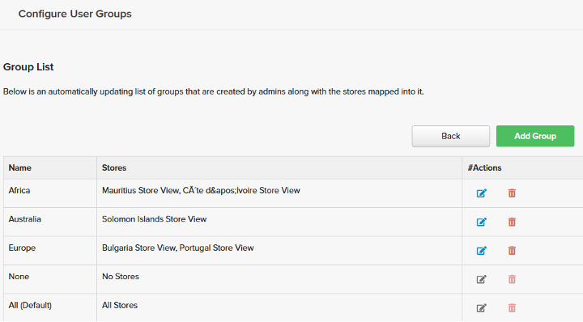
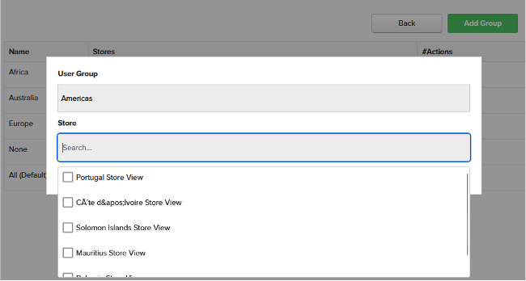
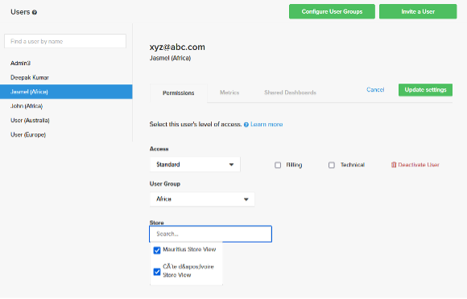
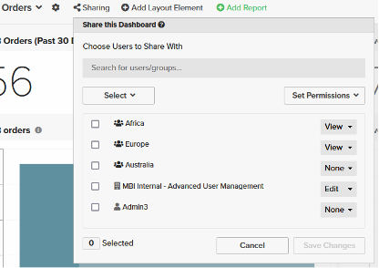
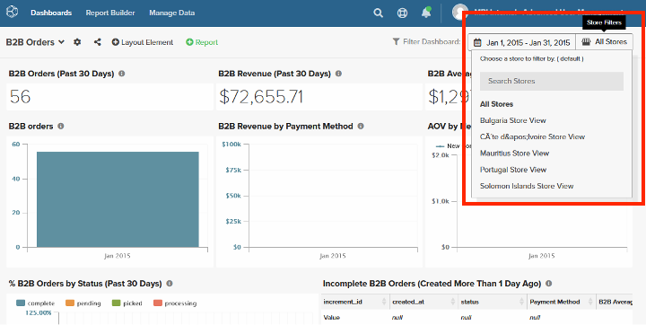
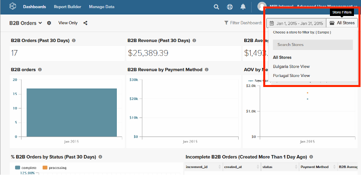
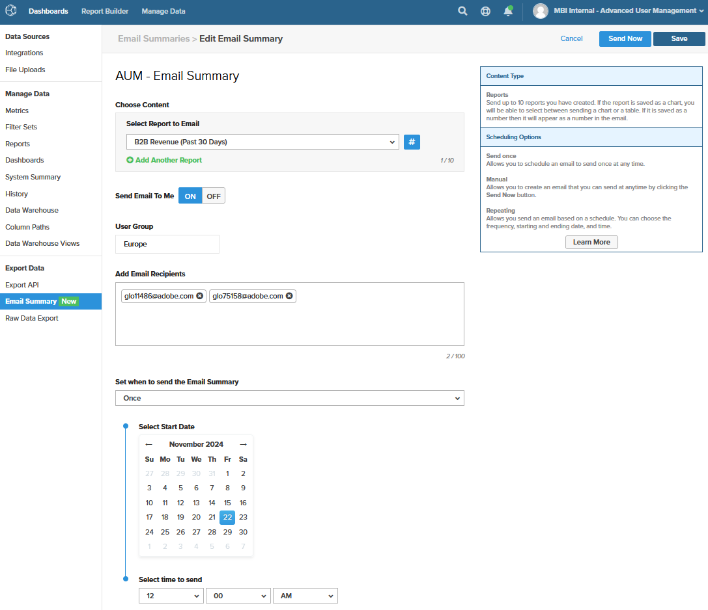

# 進階使用者管理

[!DNL Advanced User Management]功能提供增強的資料可見性控制項，並可根據使用者群組（組織區域）啟用邏輯資料篩選。 它可讓您根據使用者群組量身打造資料可見度，並免除在每次業務擴展至新區域時，建立現有控制面板復本以符合區域特定報告需求的需求。

[!DNL Advanced User Management]簡化儀表板共用和資料可見性，同時確保大型組織的安全性和擴充性。 設定使用者群組、角色和許可權的靈活性讓Commerce Intelligence成為滿足企業級需求的強大工具。

啟用[!DNL Advanced User Management]後，只有管理員使用者才有權設定下列專案：

- 量度
- Visual Report Builder
- 以SQL為基礎的報表
- 電子郵件摘要
- 原始匯出

## 功能矩陣

[!DNL Advanced User Management]影響Commerce Intelligence的多個功能。 下表根據啟用或停用的功能，說明各種角色的功能、許可權及其可用性。

<table><thead>
  <tr>
    <th colspan="3" rowspan="2">Commerce Intelligence功能</th>
    <th colspan="6">進階使用者管理(AUM)功能</th>
  </tr>
  <tr>
    <th colspan="3">已停用</th>
    <th colspan="3">已啟用</th>
  </tr></thead>
<tbody>
  <tr>
    <td>功能群組</td>
    <td>功能</td>
    <td>權限</td>
    <td>管理員</td>
    <td>標準</td>
    <td>唯讀</td>
    <td>管理員</td>
    <td>標準</td>
    <td>唯讀</td>
  </tr>
  <tr>
    <td rowspan="7">管理使用者（所有管理員都可存取並影響所有角色）</td>
    <td>設定使用者群組</td>
    <td></td>
    <td></td>
    <td></td>
    <td></td>
    <td>✓</td>
    <td></td>
    <td></td>
  </tr>
  <tr>
    <td>邀請使用者</td>
    <td></td>
    <td>✓</td>
    <td></td>
    <td></td>
    <td>✓</td>
    <td></td>
    <td></td>
  </tr>
  <tr>
    <td>許可權標籤 — 角色對應</td>
    <td></td>
    <td>✓</td>
    <td></td>
    <td></td>
    <td>✓</td>
    <td></td>
    <td></td>
  </tr>
  <tr>
    <td>許可權標籤 — 使用者群組對應(AUM)</td>
    <td></td>
    <td></td>
    <td></td>
    <td></td>
    <td>✓</td>
    <td></td>
    <td></td>
  </tr>
  <tr>
    <td>許可權標籤 — 儲存子集對應(AUM)</td>
    <td></td>
    <td></td>
    <td></td>
    <td></td>
    <td>✓</td>
    <td></td>
    <td></td>
  </tr>
  <tr>
    <td>量度標籤</td>
    <td></td>
    <td>✓</td>
    <td></td>
    <td></td>
    <td>✓</td>
    <td></td>
    <td></td>
  </tr>
  <tr>
    <td>共用控制面板標籤</td>
    <td></td>
    <td>✓</td>
    <td></td>
    <td></td>
    <td>✓</td>
    <td></td>
    <td></td>
  </tr>
  <tr>
    <td rowspan="2">Report Builder</td>
    <td>Visual Report Builder</td>
    <td></td>
    <td>✓</td>
    <td>✓</td>
    <td></td>
    <td>✓</td>
    <td></td>
    <td></td>
  </tr>
  <tr>
    <td>SQL REPORT BUILDER</td>
    <td></td>
    <td>✓</td>
    <td></td>
    <td></td>
    <td>✓</td>
    <td></td>
    <td></td>
  </tr>
  <tr>
    <td rowspan="2">電子郵件摘要</td>
    <td>建立電子郵件摘要，而不進行資料分割</td>
    <td></td>
    <td>✓</td>
    <td>✓</td>
    <td></td>
    <td>✓</td>
    <td></td>
    <td></td>
  </tr>
  <tr>
    <td>使用資料分割(AUM)建立電子郵件摘要</td>
    <td></td>
    <td></td>
    <td></td>
    <td></td>
    <td>✓</td>
    <td></td>
    <td></td>
  </tr>
  <tr>
    <td rowspan="4">儀表板   — 共用</td>
    <td>跨角色與使用者共用控制面板</td>
    <td></td>
    <td>✓</td>
    <td>✓</td>
    <td></td>
    <td></td>
    <td></td>
    <td></td>
  </tr>
  <tr>
    <td>與使用者群組及管理員共用控制面板(AUM)</td>
    <td></td>
    <td></td>
    <td></td>
    <td></td>
    <td>✓</td>
    <td></td>
    <td></td>
  </tr>
  <tr>
    <td rowspan="2">共用控制面板 — 許可權</td>
    <td>編輯</td>
    <td>✓</td>
    <td>✓</td>
    <td></td>
    <td></td>
    <td></td>
    <td></td>
  </tr>
  <tr>
    <td>檢視</td>
    <td>✓</td>
    <td>✓</td>
    <td></td>
    <td>✓</td>
    <td></td>
    <td></td>
  </tr>
  <tr>
    <td rowspan="18">儀表板 — 檢視（開啟具有指定許可權的共用儀表板）</td>
    <td rowspan="2">重新共用共用控制面板</td>
    <td>編輯</td>
    <td>✓</td>
    <td>✓</td>
    <td></td>
    <td></td>
    <td></td>
    <td></td>
  </tr>
  <tr>
    <td>檢視</td>
    <td></td>
    <td></td>
    <td></td>
    <td></td>
    <td></td>
    <td></td>
  </tr>
  <tr>
    <td rowspan="2">日期篩選（不含「編輯時間選項」功能標幟）</td>
    <td>編輯</td>
    <td>✓</td>
    <td>✓</td>
    <td>✓</td>
    <td></td>
    <td></td>
    <td></td>
  </tr>
  <tr>
    <td>檢視</td>
    <td></td>
    <td></td>
    <td></td>
    <td>✓</td>
    <td></td>
    <td></td>
  </tr>
  <tr>
    <td rowspan="2">日期篩選（具有「編輯時間選項」功能標幟）</td>
    <td>編輯</td>
    <td>✓</td>
    <td>✓</td>
    <td>✓</td>
    <td></td>
    <td></td>
    <td></td>
  </tr>
  <tr>
    <td>檢視</td>
    <td>✓</td>
    <td>✓</td>
    <td></td>
    <td>✓</td>
    <td>✓</td>
    <td>✓</td>
  </tr>
  <tr>
    <td rowspan="2">儲存篩選（不含「編輯時間選項」功能標幟）</td>
    <td>編輯</td>
    <td>✓</td>
    <td>✓</td>
    <td>✓</td>
    <td></td>
    <td></td>
    <td></td>
  </tr>
  <tr>
    <td>檢視</td>
    <td>✓</td>
    <td>✓</td>
    <td></td>
    <td>✓</td>
    <td>✓</td>
    <td></td>
  </tr>
  <tr>
    <td rowspan="2">儲存篩選（具有編輯時間選項功能標幟）</td>
    <td>編輯</td>
    <td>✓</td>
    <td>✓</td>
    <td>✓</td>
    <td></td>
    <td></td>
    <td></td>
  </tr>
  <tr>
    <td>檢視</td>
    <td>✓</td>
    <td>✓</td>
    <td></td>
    <td>✓</td>
    <td>✓</td>
    <td></td>
  </tr>
  <tr>
    <td rowspan="2">控制面板資料 — 根據使用者群組對應(AUM)篩選報表資料</td>
    <td>編輯</td>
    <td></td>
    <td></td>
    <td></td>
    <td></td>
    <td></td>
    <td></td>
  </tr>
  <tr>
    <td>檢視</td>
    <td></td>
    <td></td>
    <td></td>
    <td>✓</td>
    <td>✓</td>
    <td>✓</td>
  </tr>
  <tr>
    <td rowspan="2">報告 — 編輯</td>
    <td>編輯</td>
    <td>✓</td>
    <td>✓</td>
    <td></td>
    <td>✓</td>
    <td></td>
    <td></td>
  </tr>
  <tr>
    <td>檢視</td>
    <td></td>
    <td></td>
    <td></td>
    <td>✓</td>
    <td></td>
    <td></td>
  </tr>
  <tr>
    <td rowspan="2">報表匯出(CSV、XLSX)</td>
    <td>編輯</td>
    <td>✓</td>
    <td>✓</td>
    <td>✓</td>
    <td>✓</td>
    <td></td>
    <td></td>
  </tr>
  <tr>
    <td>檢視</td>
    <td>✓</td>
    <td>✓</td>
    <td>✓</td>
    <td>✓</td>
    <td>✓</td>
    <td>✓</td>
  </tr>
  <tr>
    <td rowspan="2">報告 — 原始匯出</td>
    <td>編輯</td>
    <td>✓</td>
    <td>✓</td>
    <td></td>
    <td>✓</td>
    <td></td>
    <td></td>
  </tr>
  <tr>
    <td>檢視</td>
    <td>✓</td>
    <td>✓</td>
    <td></td>
    <td></td>
    <td></td>
    <td></td>
  </tr>
</tbody></table>

## 管理員控制

管理員使用者可以管理以下工作：

- 設定使用者群組
- 將角色和使用者群組指派給個別使用者
- 與具有儀表板層級許可權的使用者群組或其他管理員共用儀表板
- 使用使用者群組層級資料篩選排程電子郵件摘要

### 設定使用者群組

使用者群組是對映至特定商店篩選器的區域邏輯群組（例如，根據大陸、國家和區域名稱建立的使用者群組）。

若要設定使用者群組：

1. 移至&#x200B;[!UICONTROL **管理使用者**] > [!UICONTROL **User Groups]**以檢視現有的使用者群組。

   

1. [!UICONTROL **新增群組**]&#x200B;可讓管理員建立新的使用者群組：

   - 輸入群組的名稱（例如「美洲」）。

   - 選取與使用者群組相關的存放區或篩選器。

   - 儲存設定。

     

1. 管理員可以：

   - 編輯使用者群組以更新商店對應或重新命名以清楚明瞭。

   - 刪除不再需要的使用者群組。 管理員必須手動重新指派已對應至已刪除使用者群組的現有使用者。

1. 預設群組：

   - [!UICONTROL **None]**：使用者尚未對應至特定群組的後援群組。 這些使用者直到被指派給適當的群組後，才能看到任何資料。

   - [!UICONTROL **全部**]：提供對所有資料的無限制存取（通常保留給管理員使用者）。

### 將使用者指派給使用者群組

管理員可以使用&#x200B;[!UICONTROL **邀請使用者**]，在使用者上線時將新使用者對應到相關群組。 現有使用者可以根據業務需求重新對應至使用者群組。

>[!TIP]
>
>- 在將&#x200B;[!UICONTROL **Standard**]&#x200B;或&#x200B;[!UICONTROL **唯讀**]&#x200B;使用者指派給相關的使用者群組之前，可安全地將其指派給&#x200B;[!UICONTROL **None**]，以確保他們不會誤存取任何儀表板資料。
>
>- 根據業務需求將許可權指派給使用者期間，可能會為增強型控制限制群組內的特定存放區。

依預設，管理員使用者一律對應至&#x200B;[!UICONTROL **所有**]&#x200B;商店，讓他們以完整商店檢視來檢視控制面板。

### 共用儀表板

[!DNL Advanced User Management]提供功能強大的選項，可在維持資料安全性的同時共用儀表板。

- 管理員可以與使用者群組以及其他管理員使用者共用控制面板，以進行共同作業。 如此可集中管理控制面板，並簡化大型組織的管理。

  

- 控制面板共用許可權包括：

   - [!UICONTROL **編輯**]：僅供管理員使用者修改儀表板、篩選資料、修改報告或匯出資料。

   - [!UICONTROL **檢視**]：適用於具有（特定限制）之所有角色的使用者。

   - [!UICONTROL **無**]：撤銷某些使用者群組或管理員對儀表板的存取權。

  >[!NOTE]
  >
  >請參閱[功能矩陣](#feature-matrix)，瞭解根據規則和儀表板許可權的各種Commerce Intelligence功能的可用性，以瞭解各種組合。

#### 儀表板檢視

管理員使用者可檢視控制面板資料，並存取所有商店。

不過，使用者可檢視根據使用者設定期間對應至他們的存放區進行篩選的儀表板資料。

>[!TIP]
>
>管理員可以啟用共用儀表板的日期篩選器，讓使用者檢視不同日期範圍內的資料，而非建立報表期間所設定的預設時間範圍。 此功能可以根據業務需求切換為開啟或關閉。

### 排程電子郵件摘要

[!DNL Advanced User Management]將資料篩選功能擴充至電子郵件摘要。 視對象而定，管理員使用者可以指定必須篩選所選報表的使用者群組。

