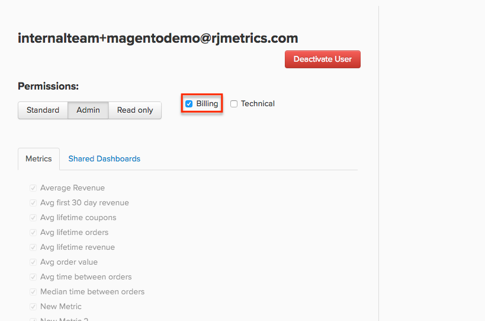

# 管理使用者權限

MBI旨在成為整個組織內的單一真相來源。 每位使用者都有自己的控制面板集， [與其他使用者共用](../../data-user/dashboards/share-dashboard-with-users.md).

## 使用者權限層級

在 [!DNL MBI]，則有三個一般權限層級會套用至使用者，並在建立帳戶時加以選取：

* `Admin`
* `Standard`
* `Read-Only`

這些權限可讓使用者執行特定動作或存取 [!DNL MBI]. 下表列出每個權限級別在MBI中可執行的操作：

|  | `Admin` | `Standard` | `Read Only` |
| -----|-----|-----|----|
| **建立/管理使用者** | ✔ |  |  |
| **建立電子郵件摘要** | ✔ | ✔ |  |
| **建立/編輯/共用控制面板** | ✔ | ✔ |  |
| **檢視控制面板** | ✔ | ✔ | ✔ |
| **建立/編輯/刪除視覺報表** | ✔ | ✔* |  |
| **建立/編輯/刪除SQL報告** | ✔ |  |  |
| **複製控制面板** | ✔ |  |  |
| **新增/管理整合** | ✔ |  |  |
| **存取Data Warehouse管理員** | ✔ |  |  |
| **同步/不同步表和列** | ✔ |  |  |
| **建立/編輯量度** | ✔ |  |  |
| **建立/編輯篩選器集** | ✔ |  |  |
| **建立/編輯計算列** | ✔ |  |  |
| **建立相依報表清單** | ✔ |  |  |
| **訪問系統摘要** | ✔ |  |  |
| **存取時區設定** | ✔ |  |  |
| **存取帳單** | ✔ | ✔** |  |
| **聯絡支援** | ✔ | ✔ | ✔ |

{style="table-layout:auto"}

>[!NOTE]
>
>_您可以限制&#x200B;**[!UICONTROL Standard]**使用者 [存取特定量度](../../administrator/user-management/restrict-metric-access.md)._
>
>**[!UICONTROL Standard] _使用者可透過額外的權限設定存取帳單。_
>
>**[!UICONTROL Read-Only]** 使用者只能 _檢視_ 與其共用的控制面板；無法在中建立或編輯任何項目 [!DNL MBI]，他們也無法搜尋控制面板並將其新增至帳戶。 Adobe建議您與共用特定控制面板集 **[!UICONTROL Read-Only]** 您或團隊其他成員維護的使用者。 請勿複製控制面板集。

## 其他權限：帳單與技術 {#billingtech}

除了一般權限層級外，還有另外兩個使用者名稱 —  `Billing` 和 `Technical`. 這些名稱應與一般權限層級搭配使用。

### 帳單

`Billing` 用戶有權訪問帳單頁，並可以更改付款資訊。 此外，Adobe也可就帳單問題與他們聯絡。

`Admin` 使用者可存取 `Billing` 標籤，但 `Standard` 如果使用者擁有 `Billing` 核取方塊。

<!--{: width="550" height="363"}-->

### 技術

`Technical` 使用者沒有任何特定權限，此設定只會標籤您組織內的技術聯絡人。 如有技術問題，Adobe可聯絡這些使用者。

`Admin` 使用者可以按一下 **[!UICONTROL Account Settings]** > **[!UICONTROL Create Users]** 並遵循提示。 在中建立使用者後 [!DNL MBI]，您邀請的幸運者將會收到如何完成帳戶設定程式的電子郵件指示。

隨時， `Admins` 可以按一下 **[!UICONTROL Account Settings]** > **[!UICONTROL Manage Users]**. 此頁面顯示使用者的權限，以及可存取的量度和控制面板。
