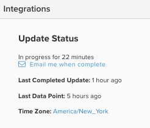

# 更新週期進度

當您登入 [!DNL MBI] 控制面板中，有數種方法可檢查上次更新週期的狀態。 全取決於 [使用者權限](../administrator/user-management/user-management.md) 你有。

## 為什麼應檢查更新週期狀態？

檢查狀態更新週期對於審核中的資料很有用 [!DNL MBI] 帳戶。 如果您看到 [不符合預期的結果](../data-analyst/data-warehouse-mgr/data-and-updates-faq.md)，例如 [!DNL MBI] 不符合您在電子商務平台或 [[!DNL Google] 電子商務收入](https://experienceleague.adobe.com/docs/commerce-knowledge-base/kb/troubleshooting/miscellaneous/diagnosing-google-ecommerce-revenue-discrepancies.html?lang=en) 您可以檢查最後一個資料點，查看更新完成後問題是否會解決。

## [!UICONTROL Read-Only] 和 [!UICONTROL Standard]**用戶

`Read-only` 使用者可登入控制面板，並將游標移至頁面右上角的圖示上，查看資料更新的時間。 這會顯示最後一個資料點提取的時間。

## [!UICONTROL Admin] 使用者

`Admin` 使用者可以登入控制面板，並查看上方的最後一個資料點，以及其帳戶整合的簡短狀態圖示。

如需詳細資訊，管理員使用者可以按一下 **[!UICONTROL Manage Data]** > **[!UICONTROL Integrations]**.

此頁將顯示當前更新狀態和上次完成更新的時間。

如果更新目前正在進行中，您會看到一個連結，在更新完成後，會要求傳送電子郵件通知。

如果未進行更新，您會看到一個連結以強制啟動更新。

>[!NOTE]
>
>如果您有封鎖時間（您不想要的時間） [!DNL MBI] 若要更新資料)集，強制更新將啟動不遵守這些封鎖時間限制的更新週期。
