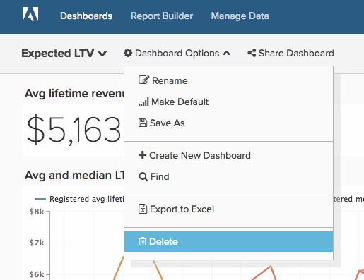
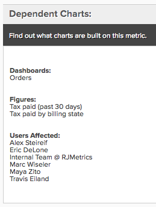
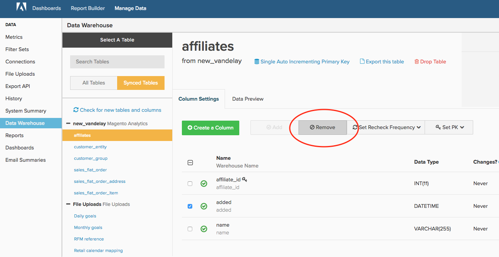

# 清理 [!DNL MBI] 帳戶

無論你跟誰在一起 [!DNL MBI] 6個月或6年來，維護一個整潔的帳戶對於貴組織充分利用平台至關重要。 隨著時間推移，使用者、控制面板、報表、量度和欄都不再需要，這是很自然的事。 您可能已建立報表供一次性使用，但忘記了該報表，或是離開您公司的使用者從未停用其帳戶。

結合 [標準化、清除所有元素的命名](../best-practices/naming-elements.md)) [!DNL MBI] 帳戶，以下帳戶稽核步驟將協助您減少使用者的雜亂和不必要的分析。 另外一項好處包括 [更快的更新週期](../best-practices/reduce-update-cycle-time.md).

## 步驟1:識別非作用中使用者

清理帳戶的第一步是停用非作用中使用者的帳戶，例如離開公司或不再使用的使用者 [!DNL MBI] 在他們目前的角色中。

您可以按一下頂端導覽列右上角的公司名稱，然後選取 **[!UICONTROL Manage Users]**. 接下來，選擇要停用的用戶，然後按一下 **[!UICONTROL Deactivate User]**.

>[!NOTE]
>
>您需要 [管理權限](../administrator/user-management/user-management.md) 做這個。

>[!WARNING]
>
>停用使用者也會移除該使用者建立的圖表、控制面板和其他資產。 如果您想要保留這些資產，請連絡 [!DNL MBI] [支援](../guide-overview.md) 團隊，再停用使用者。 支援可協助您將這些資產轉移給其他使用者。

### 重新啟用使用者

若要重新啟用使用者，請使用已停用的相同電子郵件地址重新建立其帳戶，以重新邀請使用者，使用者的存取權和擁有的資料將在登入時還原。

## 步驟2:刪除未使用的控制面板和報表

稽核帳戶的下一個步驟是刪除任何未使用的控制面板和報表。

>[!NOTE]
>
>您需要 `Admin` 或 `Standard` [使用者權限](../administrator/user-management/user-management.md) 做這個。

每個使用 `Admin` 或 `Standard` 存取權可建立報表和控制面板。 因此，擁有這些權限的所有人必須依照下列步驟來識別和移除未使用的報表。

### 檢閱控制面板和報表

刪除任何項目之前，您應先檢閱報表和控制面板，以評估目前使用中的項目。 雖然您可以使用 **[!UICONTROL find unused reports]** 功能說明如下，任何初始檢閱都能讓您的清除工作更有效率。

### 刪除控制面板和報表

存取控制面板和報表後，您就可以開始清理帳戶。

**從控制面板移除報表**

1. 在控制面板上找出您要移除的報表。
1. 選擇 **[!UICONTROL Options]** 在報表的右上角。
1. 按一下 **[!UICONTROL Remove From Dashboard]**.

**刪除整個控制面板**

1. 選擇 **[!UICONTROL Manage Data]**，然後**[!UICONTROL Dashboards**].
1. 按一下您要刪除的控制面板。
1. 按一下 **[!UICONTROL Delete Dashboard]**.

您也可以選取 **[!UICONTROL Dashboard Options]**，然後 **[!UICONTROL Delete]** 從控制面板本身。

>[!NOTE]
>
>刪除控制面板並不會刪除其中的報表，因此您必須再執行一個步驟來刪除報表。

**刪除未使用的報表**

1. 選擇 **[!UICONTROL Manage Data]**，然後 **[!UICONTROL Reports]**.
1. 檢查 **僅顯示未使用的報表** 方塊。 這會建立控制面板或電子郵件摘要中未使用的報表清單。
1. 選擇要刪除的報表。 您可以按一下報表清單上方的核取方塊，以選取全部。
1. 按一下 **[!UICONTROL Delete Selected]**.

以下是未使用的報表刪除程式：

## 步驟3:刪除未使用的量度

清理完使用者清單、控制面板和報表後，您就可以改用稽核量度清單。 這可協助您識別任何可能已過時的項目（例如，已使用不同定義建立新量度，或未使用）。

1. 若要產生量度的相依報表清單，請前往 **[!DNL Manage Data]**，然後選取「 」 **[!UICONTROL Metrics]**.
1. 按一下 **[!UICONTROL Edit]** 在量度旁邊。
1. 在頁面底部，您會看到名為 **[!UICONTROL Dependent Charts]**. 按一下連結可產生此量度的相依報表清單。
1. 系統完成檢查後， [!DNL MBI] 顯示使用此量度的控制面板、報表和使用者清單。

如果您決定不再需要量度，請導覽回 **[!UICONTROL Metrics]** 按一下 **[!UICONTROL Back to Metric List]** 在頁面頂端，找出您要刪除的量度。 按一下 **[!UICONTROL Delete]**.

## 步驟4:評估同步的欄

最後一步是評估資料倉庫中目前同步的欄。 取消同步的欄不僅會降低帳戶的品質，還可能會縮短您的更新時間。

如果你想追求這個，請聯繫 [!DNL MBI] [支援](../guide-overview.md). 支援團隊可以建立一個報告，其中包含任何用戶未在任何儀表板中使用以及未在電子郵件摘要（不包括SQL報告）中使用的所有列。 接著，您就可以使用此報表作為指南，透過「Data Warehouse管理員」選取要取消同步的欄。

>[!NOTE]
>
>您隨時都可以開始再次同步這些欄。 取消同步欄不會從您的資料倉庫移除任何資料；這隻表示在更新週期期間不會檢查此欄是否有新值或更新值。

**取消同步列（或列）**

1. 前往 **[!DNL Manage Data]**，然後 **[!UICONTROL Data Warehouse]**.
1. 在 **[!UICONTROL Synced Tables]** 清單，導覽至包含欄的表格。
1. 勾選您要取消同步之欄旁的方塊。
   >[!NOTE]
   >
   >不刪除整個表，就不能取消同步主鍵列。

1. 按一下 **[!UICONTROL Remove]** 取消同步列。

以下是整個程式：

## 包裝

就這樣！ 您的 [!DNL MBI] 帳戶現在應更輕鬆，並且更方便為您和您的團隊導覽。
