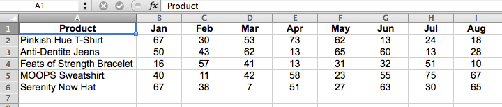
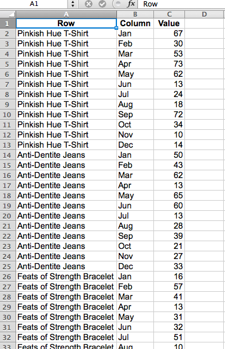
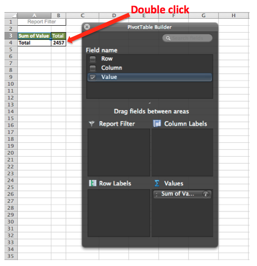

# 格式化和導入財務資料

本主題討論導入財務資料以便在 [!DNL Adobe Commerce Intelligence]。

二維交叉表資料表通常是用於財務資料的格式。 由於按列和行中的標籤分類的值，使用人眼和電子錶格工具可以輕鬆查看此類佈局，但它對資料庫不友好。

要導入並分析此資料，請在 [!DNL Commerce Intelligence]，表必須平展為一維清單。 展平後，每個資料值都按多個標籤分類，這些標籤都位於一行中，其中每行是唯一的，或者具有唯一標識符，例如主鍵列。

## 格式化Excel檔案以導入

使用 [!DNL Excel] 資料透視表：

1. 使用二維資料表開啟檔案。
1. 開啟資料透視表嚮導。 在 [!DNL Windows]，快捷方式是 `Alt-D`。 在 [!DNL Mac OS]輸入 `Command-Option-P`。
1. 選擇 **[!UICONTROL Multiple consolidated ranges]** 按一下 **[!UICONTROL Next]**。
1. 選擇 **[!UICONTROL I will create the page fields]** 按一下 **[!UICONTROL Next]**。
1. 在二維表中選擇整個資料集，包括標籤。 確保 `0` 為所需頁面欄位數選擇，然後按一下 **[!UICONTROL Next]**。
1. 在新工作表中建立透視表並按一下 **[!UICONTROL Finish]**。
1. 從欄位清單中取消選擇列和行欄位。
1. 按兩下生成的數值以在新頁面中顯示展平的源資料。
   
1. 另存為 `CSV` 的子菜單。

## 包裝

資料表已轉換為清單格式，保留其所有原始資訊，現在可以 [導入 [!DNL Commerce Intelligence]](../data-analyst/importing-data/connecting-data/using-file-uploader.md) 分析。
