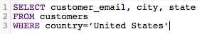
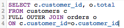
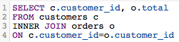
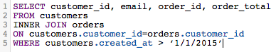
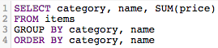

# 最佳化SQL查詢

此 [!DNL SQL Report Builder] 可讓您隨時查詢和迭代這些查詢。 當您需要修改查詢而不必等待更新週期完成才實現您建立的欄或報告需要更新時，這會很有用。

在執行查詢之前， [[!DNL Commerce Intelligence] 預估成本](https://experienceleague.adobe.com/docs/commerce-knowledge-base/kb/troubleshooting/miscellaneous/sql-queries-explain-cost-errors.html). 成本會考量執行查詢所需的時間長度和資源數量。 如果該成本太高或傳回的列數超過 [!DNL Commerce Intelligence] 限制，查詢會失敗。 查詢您的 [Data Warehouse](../data-analyst/data-warehouse-mgr/tour-dwm.md)，這可確保您撰寫儘可能精簡的查詢，Adobe建議以下內容。

## 使用SELECT或選取所有欄

選取所有欄無法進行即時、輕鬆執行的查詢。 使用的查詢 `SELECT *` 執行可能需要一點時間，尤其是如果您的表格有許多欄時。

因此，Adobe建議您避免使用 `SELECT *` 儘可能且僅包含您需要的欄：

| **而不是這個……** | **試試這個！** |
|-----|-----|
|  |  |

{style="table-layout:auto"}

## 使用完整外部聯結

外部聯結會選取兩個要聯結之表格的整體，這會增加查詢的運算成本。 這表示您的查詢執行時間較長，而且很可能會失敗，因為傳回結果所花的時間可能超過執行限制。

請考慮使用內部或左側聯結，而不使用這種型別的聯結。 只有當資料表之間有欄位相符時(例如， `order_id` 同時存在於兩種典型中 `customers` 和 `orders` 表格)。 左聯結會傳回左（第一個）表格中的所有結果，以及右（第二個）表格中的相符結果。

檢視如何重新寫入FULL OUTER JOIN查詢：

| **而不是這個……** | **試試這個！** |
|-----|-----|
|  |  |

{style="table-layout:auto"}

除了它們使用的JOIN型別外，這些查詢在所有方面都是相同的。

## 使用多重聯結

雖然您可以在查詢中包含多個聯結，但請記住，這可能會增加查詢的成本。 為避免達到成本臨界值，Adobe建議儘可能避免多個聯結。

## 使用篩選器

儘可能使用篩選器。 `WHERE` 和 `HAVING` 條款會篩選結果，並只提供您真正想要的資料。

## 在JOIN子句中使用篩選器

如果您在執行連線時使用篩選器，請務必將其套用至連線中的兩個表格。 即使它是多餘的，這也會減少查詢的運算成本並減少執行時間。

| **而不是這個……** | **試試這個！** |
|-----|-----|
|  |  |

{style="table-layout:auto"}

## 使用運運算元

在撰寫查詢時，請考慮儘可能使用「最便宜」的運運算元。 每個查詢都有計算成本，這是由組成查詢的函式、運運算元和篩選器所決定。 有些運運算元所需的運算量較少，因此較其他運運算元便宜。

比較運運算元（>、&lt;、=等）是最便宜的，其次是 [類似。 SIMILAR TO和POSIX運運算元](https://www.postgresql.org/docs/9.5/functions-matching.html) 這些是最昂貴的運運算元。

## 使用EXISTS與IN

使用 `EXISTS` 與 `IN` 取決於您嘗試傳回的結果型別。 如果您只對單一值感興趣，請使用 `EXISTS` 子句而非 `IN`. `IN` 與逗號分隔值清單一起使用，這會增加查詢的運算成本。

時間 `IN` 執行查詢，系統必須首先處理子查詢( `IN` 陳述式)，則整個查詢會根據 `IN` 陳述式。 `EXISTS` 效率更高，因為查詢不需要執行多次 — 檢查查詢中指定的關係時傳回true/false值。

簡言之，系統在使用時，不必處理太多 `EXISTS`.

| **而不是這個……** | **試試這個！** |
|-----|-----|
|  |  |

{style="table-layout:auto"}

## 使用ORDER BY

`ORDER BY` 是SQL中一個昂貴的函式，而且會顯著提高查詢的成本。 如果您收到錯誤訊息，指出查詢的EXPLAIN成本過高，請嘗試消除任何 `ORDER BY`s （除非必要）。

這並不是說 `ORDER BY` 無法使用 — 僅應僅在必要時使用。

## 使用GROUP BY和ORDER BY

在少數情況下，此方法可能與您嘗試執行的操作不符。 一般規則是，如果您使用 `GROUP BY` 和 `ORDER BY`，您應該以相同的順序放置兩個子句中的欄。 例如：

| **而不是這個……** | **試試這個！** |
|-----|-----|
|  |  |

{style="table-layout:auto"}

## 正在結束

學習撰寫SQL的最好方法（並有效率）是反複試驗。 若要找出最適合您的內容，請嘗試僅使用SQL編輯器重新建立一些報表。
