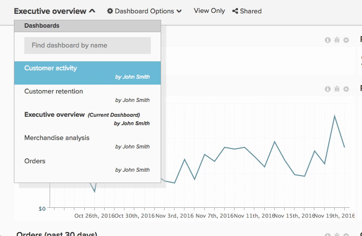

# 共用控制面板

共用儀表板表示您和您的團隊在任何指定時間都擁有相同的資訊，這允許共同作業和討論。 以下是共用控制面板和保持您的[!DNL Adobe Commerce Intelligence]帳戶整潔的一些建議。

## 避免報告面板重複

您有時可能會發現多個同名控制面板，通常是因為其他使用者已建立類似的控制面板，並與您共用。 這些儀表板可能是主要復本的重複專案。 在此情況下，Adobe建議您讓一位使用者共用控制面板的主要副本，然後移除所有重複的控制面板。

若要檢視誰擁有儀表板，請按一下左上角的儀表板下拉式清單。 任何下方沒有名稱的儀表板都屬於您。

若要移除所有重複的控制面板：

1. 與您的團隊同步，並識別應該維護儀表板的人員。
1. [從所有類似的儀表板（主要使用者共用的儀表板除外）取消共用您自己](../data-user/dashboards/leave-dashboard.md)。
1. 如果您有儀表板的復本，請[刪除它](../data-user/dashboards/deleting-dashboard.md)。
1. 要求其他人刪除他們的儀表板版本。

## 建立核心儀表板集

建立新使用者時，他們並沒有任何儀表板或圖表。 但是，他們將在首次登入後看到您組織中最受歡迎的控制面板清單（具有整個團隊的檢視或編輯許可權）。 確認控制面板一律在此清單中，以便包含新使用者。

## 與新使用者共用儀表板

新使用者也可以受益於對某些未在整個組織內共用的儀表板的存取。 在這些情況下，Adobe建議儀表板擁有者在建立帳戶時[與新使用者共用相關的儀表板](../data-user/dashboards/share-dashboard-with-users.md)。

## 具有編輯許可權的選擇性專案

`Edit`許可權可為使用者提供大量許可權。 但強大的功能也帶來極大的責任。 為避免圖表和儀表板意外變更，Adobe建議您選擇您授予`Edit`許可權的對象。

## 為圖表加上註釋

共用儀表板只會讓使用者存取相同的資訊。 為確保資訊受到理解，Adobe建議使用圖表附註功能，以分享有關特定資料點的知識及細微差別，或傳達分析目的。
