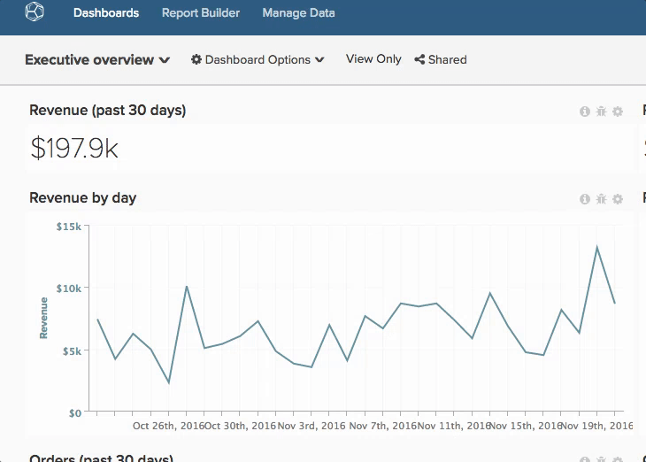

# 共用控制面板

共用儀表板表示您和您的團隊在任何指定時間都擁有相同的資訊，因此可以進行共同作業和討論。 以下是分享控制面板和保留的一些建議 [!DNL Adobe Commerce Intelligence] 帳戶整齊。

## 避免重複的報告面板

您有時可能會找到多個名稱相同的儀表板，這通常是因為其他使用者已建立類似的儀表板並與您共用。 這些儀表板可能是主要復本的重複專案。 在這種情況下，Adobe建議您讓一位使用者共用控制面板的主要副本，然後移除所有重複的控制面板。

若要檢視控制面板的擁有者，請按一下左上角的控制面板下拉式清單。 任何下方沒有名稱的儀表板都屬於您。

若要移除所有重複的控制面板：

1. 與您的團隊同步，並識別應該維護儀表板的人員。
1. [取消共用您自己](../data-user/dashboards/leave-dashboard.md) 從所有類似的儀表板，但主要使用者共用的儀表板除外。
1. 如果您有儀表板的復本， [刪除它](../data-user/dashboards/deleting-dashboard.md).
1. 要求其他人刪除他們的儀表板版本。

## 建立核心儀表板集

建立新使用者時，他們並沒有任何儀表板或圖表。 但是，他們將在首次登入後看到您組織中最受歡迎的控制面板清單（具有整個團隊的「檢視」或「編輯」許可權）。 確保儀表板一律位於此清單中，以便包含新使用者。

## 與新使用者共用儀表板

新使用者也可以從存取某些未在整個組織內共用的儀表板中受益。 在這些情況下，Adobe會建議控制面板擁有者 [共用相關儀表板](../data-user/dashboards/share-dashboard-with-users.md) 建立帳號時與新使用者建立帳號。

## 具有編輯許可權可選擇

`Edit` 許可權可賦予使用者很大的權力。 但強大的功能帶來極大的責任。 為避免圖表和儀表板意外變更，Adobe建議您選擇提供對象 `Edit` 的許可權。

## 為圖表加上註釋

共用儀表板只會讓使用者存取相同的資訊。 為確保資訊被理解，Adobe建議使用圖表註記功能來分享有關特定資料點的知識和細微差別，或傳達分析的目的。
