# 基本分析

在您熟悉 [!DNL MBI] 平台，且對工具有基本的了解，您就要開始建立報表。 你最常問的問題之一是「我該看什麼？」

以下資訊概述一些您認為有價值的通用量度和報表。 帳戶中已存在許多這些報表，因此請務必檢閱帳戶中存在的量度和報表，以避免產生重複項目。

## 要了解的表和列

建立量度時，您需要了解四個資訊：

1. 資料所在的表格，
1. 您要執行的特定動作，
1. 要對和執行該操作的列
1. 您要用於追蹤該資料的時間戳記。

很可能，這些示例中使用的表的名稱與資料庫中的列和表名稱稍有不同，因為每個資料庫都是唯一的。 如果您需要在資料庫中標識相應表或列的幫助，請參考以下定義。

## 客戶表

此表包含有關每個客戶的主要資訊，例如唯一客戶ID、電子郵件地址、帳戶建立日期等。 在下列範例中，我們將使用 **[!UICONTROL customer_entity]** 作為示例客戶表的名稱。

如果您的資料庫中目前不存在這些計算，則帳戶中的任何管理員使用者都可以建立這些計算。 此外，您也想確定這些維度可對所有適用量度分組。

**Dimension**

* **[!UICONTROL Entity_id]**:每個客戶的唯一識別碼。 這也可能是唯一的客戶編號或客戶電子郵件地址，且應作為訂單表格的參考金鑰。
* **[!UICONTROL Created_at]**:建立客戶帳戶並將其添加到資料庫的日期。
* **[!UICONTROL Customer's lifetime revenue]**:客戶產生的期限總收入。
* **[!UICONTROL Customer's first 30-day revenue]**:客戶在其前30天內產生的收入總額。
* **[!UICONTROL Customer's lifetime number of orders]**:客戶在其期限內下的訂單數。
* **[!UICONTROL Customer's lifetime number of coupons]**:客戶在有生之年使用的抵用券總數。
* **[!UICONTROL Customer's first order date]**:客戶首次訂購的日期。 如果客戶在建立訂單時未下訂單，則此日期可能與created_at日期不同。

**你接受客人的命令嗎？**

*如果是，此表可能不包含所有客戶。 聯繫我們的 [支援團隊](https://experienceleague.adobe.com/docs/commerce-knowledge-base/kb/troubleshooting/miscellaneous/mbi-service-policies.html?lang=en) 以確保客戶分析包含所有客戶。*

*不確定你接受客人的命令？ 請參閱 [本主題](../data-warehouse-mgr/guest-orders.md) 要了解更多！*

## 訂購表

在此表格中，每一列代表一個順序。 此表中的列包含有關每個訂單的基本資訊，如訂單的ID、建立日期、狀態、下單的客戶ID等。 在下列範例中，我們使用 **[!UICONTROL sales_flat_order]** 作為示例訂單表的名稱。

**Dimension**

* **[!UICONTROL Customer_id]**:下訂單的客戶的唯一識別碼。 這通常用於在客戶和訂單表之間移動資訊。 在我們的範例中，我們希望 **[!UICONTROL sales_flat_order]** 表格與 **[!UICONTROL entitiy_id]** 在 **[!UICONTROL customer_entity]** 表格。
* **[!UICONTROL Created_at]**:建立或下單的日期。
* **[!UICONTROL Customer_email]**:下訂單的客戶的電子郵件地址。 這也可能是客戶的唯一識別碼。
* **[!UICONTROL Customer's lifetime number of orders]**:在您的 `Customers` 表格。
* **[!UICONTROL Customer's order number]**:與訂單關聯的客戶順序訂單編號。 例如，如果您要查看的列是客戶的首筆訂單，則此欄為「1」；但是，如果這是客戶的第15個訂單，此欄會針對此訂單顯示「15」。 如果您的 `Customers` 桌子，問 [支援團隊](https://experienceleague.adobe.com/docs/commerce-knowledge-base/kb/troubleshooting/miscellaneous/mbi-service-policies.html?lang=en) 來幫助你建造它。
* **[!UICONTROL Customer's order number (previous-current)]**:中兩個值的串連 **[!UICONTROL Customer's order number]** 欄。 它用於下列範例報表中，以顯示任意兩個訂單之間經過的時間。 例如，客戶的首次訂購日期與其第二次訂購日期之間的時間，會透過此計算顯示為「1-2」。
* **[!UICONTROL Coupon_code]**:顯示每筆訂單上使用的抵用券。
* **[!UICONTROL Seconds since previous order]**:客戶訂購之間的時間（以秒為單位）。

## 訂單項表

在此表格中，每一列代表已銷售的一個項目。 此表包含有關每張訂單中銷售的物料的資訊，如訂單參考編號、產品編號、數量等。 在下列範例中，我們使用 `sales_flat_order_item` 作為示例訂單項表的名稱。

**Dimension**

* **[!UICONTROL Item_id]**:表格中每一列的唯一識別碼。
* **[!UICONTROL Order_id]**:您的 `Orders` 表格，告訴您是否以相同順序購買項目。 如果訂單包含多個項目，則會重複此值。
* **[!UICONTROL Product_id]**:如果您想要了解已購買的特定產品（例如顏色、大小等），可使用此欄從產品表格中提取該資訊。
* **[!UICONTROL Order's created_at]**:下單的時間戳記，通常複製到 `order line items` 表格 `Orders` 表格。
* **[!UICONTROL Order's coupon_code]**:類似於 `Order's created_at` 維度中，此欄會從您的訂單表格中複製。

## 訂閱表格

此表用於管理您的訂閱資訊，如訂閱id、訂閱者的電子郵件地址、訂閱開始日期等。

**Dimension**

* **[!UICONTROL Customer_id]**:下訂單的客戶的唯一識別碼。 這是在「客戶」表格和「訂單」表格之間建立路徑的常見方式。 在我們的範例中，我們希望 **sales_flat_order** 表格與 `entitiy_id` 在 `customer_entity` 表格。
* **[!UICONTROL Start date]**:客戶訂閱的開始日期。

## 行銷支出表

分析行銷支出時，您可以包括 [!DNL Facebook], [!DNL Google AdWords]，或分析中的其他來源。 如果您有多個行銷支出來源，請連絡我們的 [Managed Services團隊](https://business.adobe.com/products/magento/fully-managed-service.html) ，協助您為行銷活動設定匯總表格。

**Dimension**

* **[!UICONTROL Spend]**:廣告總支出。 在 [!DNL Facebook]，這會是 `facebook_ads_insights_####` 表格。 針對 [!DNL Google AdWords]，這是 `adCost` 欄中 `campaigns####` 表格。
* 此 `####` 會附加至這些表格中，與您的 [!DNL Facebook] 或 [!DNL Google AdWords] 帳戶。
* **[!UICONTROL Clicks]**:點按總次數。 在 [!DNL Facebook]，這會是 `facebook_ads_insights_####` 表格。 在 [!DNL Google AdWords]，這會是 `campaigns####` 表格。
* **[!UICONTROL Impressions]**:曝光總數。 在 [!DNL Facebook]，這會是 `facebook_ads_insights_####` 表格。 在 [!DNL Google AdWords]，這是 `campaigns####` 表格。
* **[!UICONTROL Campaign]**:點按總次數。 在 [!DNL Facebook]，這會是 `facebook_ads_insights_####` 表格。 在 [!DNL Google AdWords]，這會是 `campaigns####` 表格。
* **[!UICONTROL Date]**:特定促銷活動發生的花費、點按或曝光的時間戳記。 在 [!DNL Facebook]，這是 `date_start` 欄中 `facebook_ads_insights_####` 表格。 在 [!DNL Google AdWords]，這會是 `campaigns####` 表格。
* **[!UICONTROL Customer's first order's source]**:訂單的來源來自客戶的首筆訂單。 首先，檢查您是否有 `customer's first order's source` 在您的帳戶中。 如果您沒有看到此欄，可以使用這些指示建立所需的欄。
* **[!UICONTROL Customer's first order's medium]**:訂單是客戶首次訂購的介質。 首先，檢查您是否有 `customer's first order's source` 在您的帳戶中。 如果您沒有看到此欄，可以使用這些指示建立所需的欄。
* **[!UICONTROL Customer's first order's campaign]**:訂單的促銷活動來自客戶的首筆訂單。 首先，檢查您是否有 `customer's first order's source` 在您的帳戶中。 如果您沒有看到此欄，可以使用這些指示建立所需的欄。

## 常見報表和量度

以下是一些報表和量度的常見範例，您可能會覺得有用：

* [Customer Analytics](#customeranalytics)
* [Order Analytics](#orderanalytics)
* [行銷支出分析](#mktgspendanalytics)

## 客戶分析 {#customeranalytics}

### 新使用者

* **說明**:指定時段內新獲得用戶總數的計數。 `New Users` 與 `Unique Customers`，因為 `New Users` 具有使用您的服務建立帳戶的時間戳記（這不代表他們必須下訂單），而 `Unique Customers` 至少下了一次命令。
* **量度定義**:此量度會執行 **計數** of `entity_id` 從 `customer_entity` 按順序排列的表 `created_at`.
* **報表範例**:上個月建立的新用戶數
   * **[!UICONTROL Metric]**: `New Users`
   * **[!UICONTROL Time Range]**: `Last Month`
   * **[!UICONTROL Time Interval]**: `By Day`

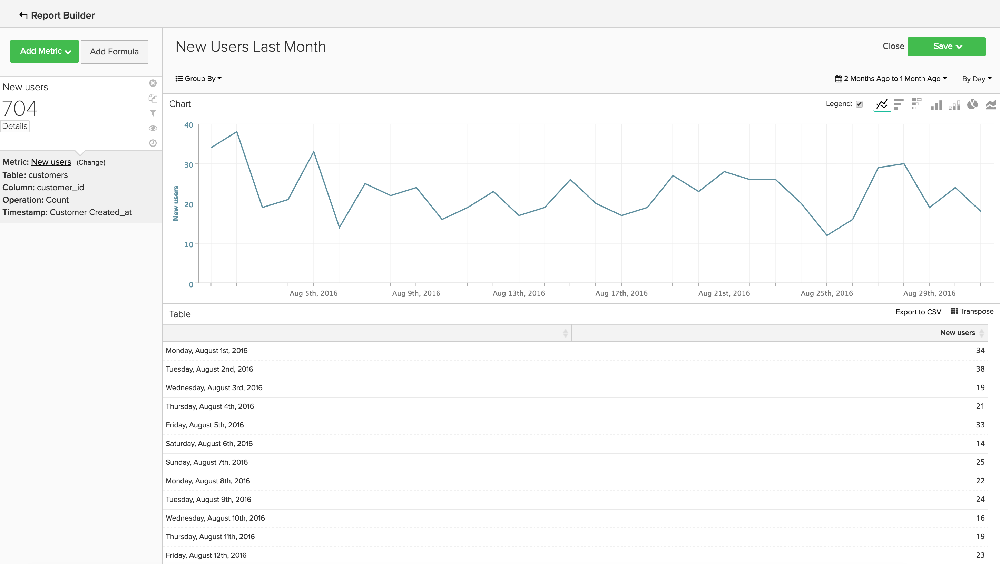<!--{: width="929"}-->

### 不重複客戶

* **說明**:指定時段內不重複客戶總數的計數。 這與 `New Users`，因為它只會追蹤已下至少一筆訂單的客戶。 不同客戶報表在指定時間間隔內只追蹤客戶一次。 如果您將時間間隔設定為 `By Day` 當天客戶進行了一次以上的購買，客戶只會計算一次。 如果您想了解一般購買的總數，請查看 `Number of Orders`.
* **量度定義**:此量度會執行 **相異計數** of `customer_id` 從 `sales_flat_order` 按順序排列的表 `created_at`.
* **報表範例**:過去90天內按周區分客戶
   * **[!UICONTROL Metric]**: `Distinct Customers`
   * **[!UICONTROL Time Range]**: `Moving range > Last 90 Days`
   * **[!UICONTROL Time Interval]**: `By Day`

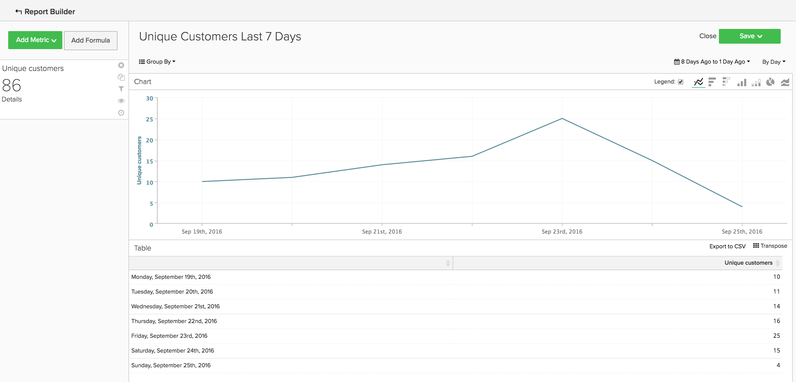<!--{: width="929"}-->

### 新訂閱者

* **說明**:在指定時間內獲得的新訂閱者總數的計數。
* **量度定義**:此量度會執行 **相異計數** of `customer_id` 從 `subscriptions` 按順序排列的表 `start_date`.
* **報表範例**:今年按月新增訂閱者
   * **[!UICONTROL Metric]**: `New Subscribers`
   * **[!UICONTROL Time Range]**: `1 Year Ago to 0 Days Ago`
   * **[!UICONTROL Time Interval]**: `By Month`

<!--{: width="929"}-->

### 重複客戶

* **說明**:一段時間內下超過一筆訂單的客戶總數。 在重複客戶報表中，您可以使用 `Distinct Customers` 量度和 `Customer's Order Number` 維度 `orders` 表格。
* **使用的量度**: `Distinct Customers`
* **報表範例**:去年進行的第2次和第3次購買數
   * **[!UICONTROL Metric]**: `Distinct Customers`
   * **[!UICONTROL Time Range]**: `Moving Range > Last Year`
   * **[!UICONTROL Time Interval]**: `By Month`
   * **[!UICONTROL Group By]**: `Customer's Order Number`，然後選取 `2` 和 `3`

   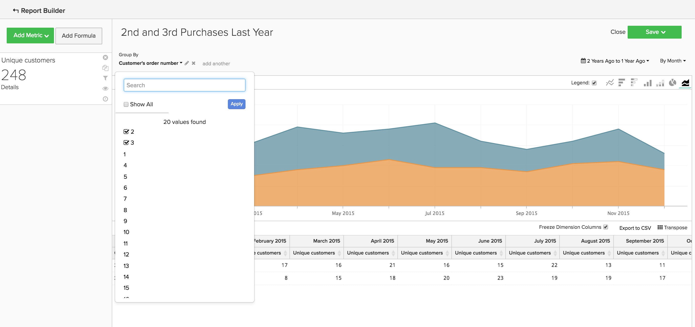

* **報表範例2**:去年的重複客戶數
   * **[!UICONTROL Metric]**: `Distinct Customers`
   * **[!UICONTROL Filters]**: `Customer's Order Number Greater Than 1`
   * **[!UICONTROL Time Range]**: `Moving range > Last Year`
   * **[!UICONTROL Time Interval]**: `By Month`

   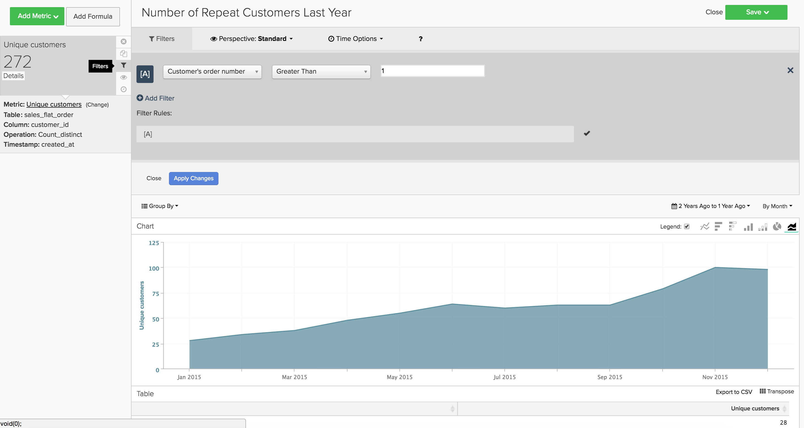<!--{: width="929"}-->

### 按期限訂單數列出的主要客戶

* **說明**:根據訂單總數排名最前的客戶清單。 這可提供最常購物者的直接清單。
* **使用的量度**: `Orders`
* **報表範例**:按期限訂單數列出的25大客戶
   * **[!UICONTROL Metric]**: `Orders`
   * **[!UICONTROL Time Range]**: `All Time`
   * **[!UICONTROL Time Interval]**: `None`
   * **[!UICONTROL Group By]**: `customer_email`
   * **[!UICONTROL Show Top/Bottom]**:前25個按訂單排序

   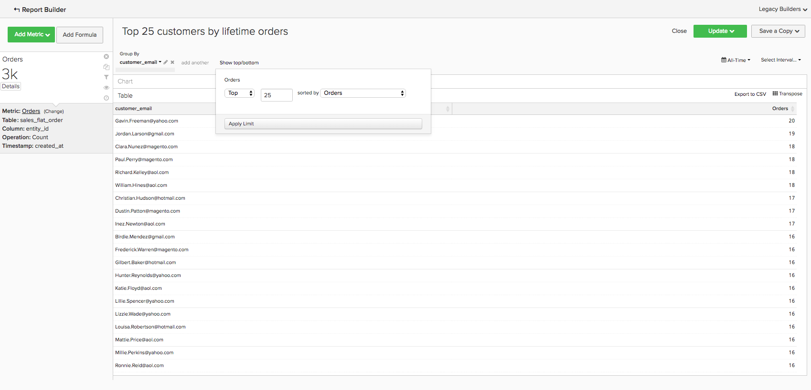<!--{: width="929"}-->

### 按期限收入劃分的最佳客戶

* **說明**:根據期限收入的最佳客戶清單。
* **使用的量度**: `Average Lifetime Revenue`
* **報表範例**:按期限收入劃分的25大客戶
   * **[!UICONTROL Metric]**: `Average Lifetime Revenue`
   * **[!UICONTROL Time Range]**: `All time`
   * **[!UICONTROL Time Interval]**: `None`
   * **[!UICONTROL Group By]**: `customer_email`
   * **[!UICONTROL Show Top Bottom]**:前25名按期限收入排序

   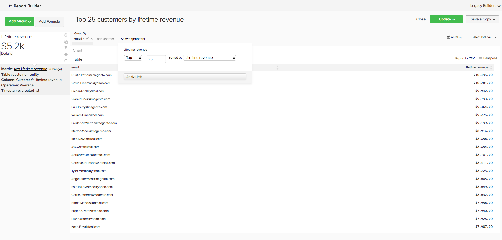<!--{: width="929"}-->

### 依同類群組的平均期限收入

* **說明**:追蹤 [不同同類群組的平均存留期收入](../dev-reports/lifetime-rev-cohort-analysis.md) 識別表現最佳的同類群組。 同類群組會依共同日期（例如首次訂購日期或建立日期）分組。
* **使用的量度**: `Revenue`
* **報表範例**:平均客戶期限收入（依同類群組）
   * **[!UICONTROL Metric]**: `Revenue`
   * **[!UICONTROL Cohort Date]**: `Customer's first order date`
   * **[!UICONTROL Time Interval]**: `Month`
   * **[!UICONTROL Time Period]**:移動最近8個同類群組的同類群組，至少包含4個月資料
   * **[!UICONTROL Duration]**: `12 Month(s)`
   * **[!UICONTROL Table]**: `Customer_entity`
   * **[!UICONTROL Perspective]**:每個同類群組成員的累積平均值

   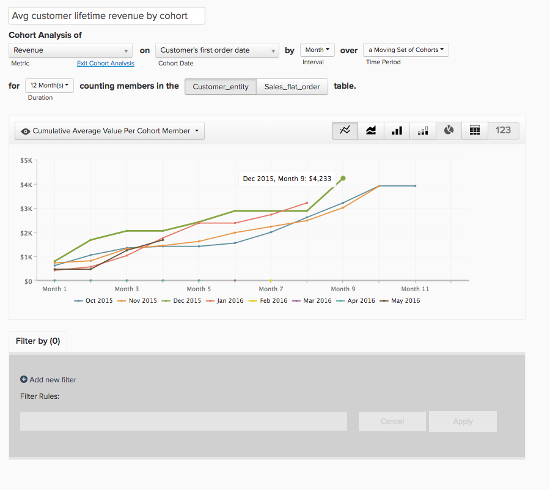<!--{: width="929"}-->

### 按抵用券使用量劃分的客戶

* **說明**:已使用抵用券/折扣代碼的已贏取客戶數的計數。 這可協助您清楚了解您的折扣購買者與全價購買者。
* **使用的量度**: `New Users`
* **報表範例**:抵用券和非抵用券客戶（按月）
   * **[!UICONTROL Metric A]**: `Non coupon customers`
   * **[!UICONTROL Metric]**: `New Users`
   * **[!UICONTROL Filters]**:客戶期限訂購數大於0，客戶期限抵用券數等於0
   * **[!UICONTROL Metric B]**: `Coupon customers`
   * **[!UICONTROL Metric]**: `New Users`
   * **[!UICONTROL Filters]**:客戶期限訂購數大於0，客戶期限抵用券數大於0
   * **[!UICONTROL Time range]**: `All Time`
   * **[!UICONTROL Time interval]**: `By Month`

   <!--{: width="929"}-->

* **報表範例2**:抵用券和非抵用券客戶的百分比（按月）
   * **[!UICONTROL Metric A]**: `Non coupon customers` （隱藏量度）
      * **[!UICONTROL Metric]**: `New Users`
      * **[!UICONTROL Filters]**: `Customer's Lifetime Number of Orders Greater Than 0` 和 `Customer's Lifetime Number of Coupons Equal to 0`
   * **[!UICONTROL Metric B]**: `Coupon customers`
      * **[!UICONTROL Metric]**: `New Users`
      * **[!UICONTROL Filters]**: `Customers Lifetime Number of Orders Greater Than 0` 和 `Customer's Lifetime Number of Coupons Greater Than 0`
   * **[!UICONTROL Time Range]**: `All Time`
   * **[!UICONTROL Time Interval]**: `By Month`
   * **[!UICONTROL Formula]**: `B/(A+B)`

>[!NOTE]
>
> **隱藏所有量度**

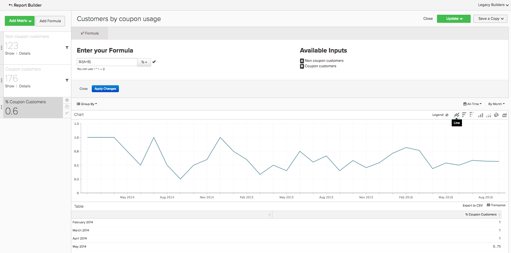<!--{: width="929"}-->

### 前30天平均收入

* **說明**:客戶作為客戶前30天內產生之平均收入金額。
* **量度說明**:此量度會執行 **平均** of `Customer's First 30 Day Revenue` 從 `customer_entity` 按順序排列的表 `created_at`.
* **報表說明**:客戶前30天收入的所有時間平均值
* **[!UICONTROL Metric]**: `Average First 30 Day Revenue`
* **[!UICONTROL Time Range]**: `All Time`
* **[!UICONTROL Time Interval]**: `None`

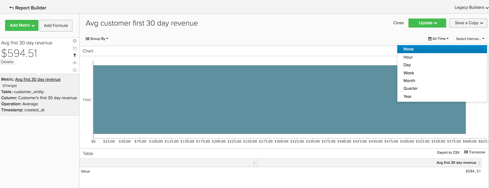<!--{: width="929"}-->

### 平均客戶期限收入

* **說明**:客戶在其期限內產生的平均收入金額。
* **量度說明**:此量度會執行 **平均** 的 `Customer's Lifetime Revenue` 欄 `customer_entity` 表格 `created_at`.
* **報表說明**:客戶期限收入的所有時間平均值
   * **[!UICONTROL Metric]**: `Average Customer Lifetime Revenue`
   * **[!UICONTROL Time Range]**: `All Time`
   * **[!UICONTROL Time Interval]**: `None`

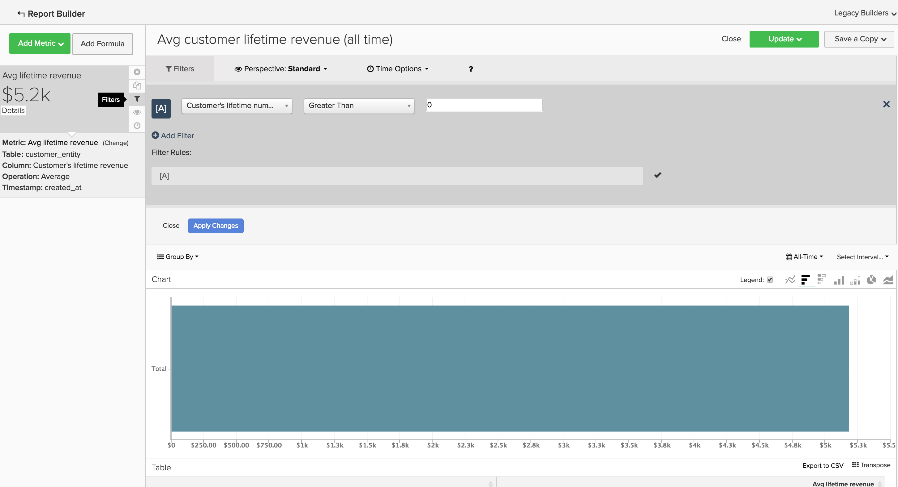<!--{: width="929"}-->

## 訂購分析 {#orderanalytics}

### 收入

* **說明**:收入量度會顯示選定時段內的總收入。
* 此量度會執行 **sum** of `grand_total` 從 `sales_flat_order` 按順序排列的表 `created_at`.
* **報表範例**:按月列出的收入，當年統計日
   * **[!UICONTROL Metric]**: `Revenue`
   * **[!UICONTROL Time Range]**: `1 Year Ago to 1 Month Ago`
   * **時間間隔**: `By Month`

>[!TIP]
>
>確認收入量度的計算與您內部討論的定義一致。 例如，您可能只想計算已發運訂單的收入，您可能需要轉換不同地區的貨幣，而且可能想要排除稅。 此外，您可以使用 [篩選集](../../data-user/reports/ess-manage-data-filters.md) 以確保同一表格上建立的所有量度的一致性。

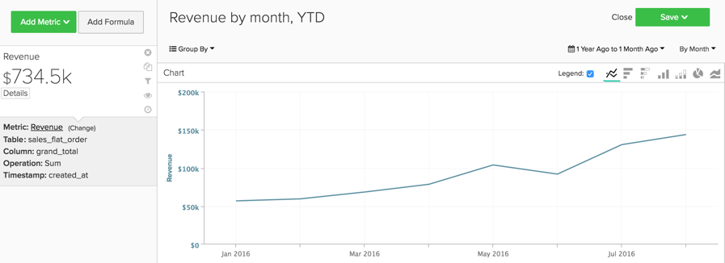<!--{: width="929"}-->

### 訂購

* **說明**:指定時段內的訂單總數計數。 訂單報表將追蹤因新產品、促銷或其他可能增加（或減少）交易量之項目所導致的訂單量變更。 您可能經常想要依許多變數來區隔此量度，以回答您的問題。
* **量度定義**:此量度會執行 **計數** of `entity_id` 從 `sales_flat_order` 按順序排列的表 `created_at`.
* **報表範例**:按月、當年截至統計日的訂單數
   * **[!UICONTROL Metric]**: `number of orders`
   * **[!UICONTROL Time Range]**: `1 Year Ago to 1 Month Ago`
   * **[!UICONTROL Time Interval]**: `By Month`

>[!TIP]
>
>就像收入量度一樣，您應該 [篩選集](../../data-user/reports/ess-manage-data-filters.md) 排除未完成、測試或退貨的訂單。

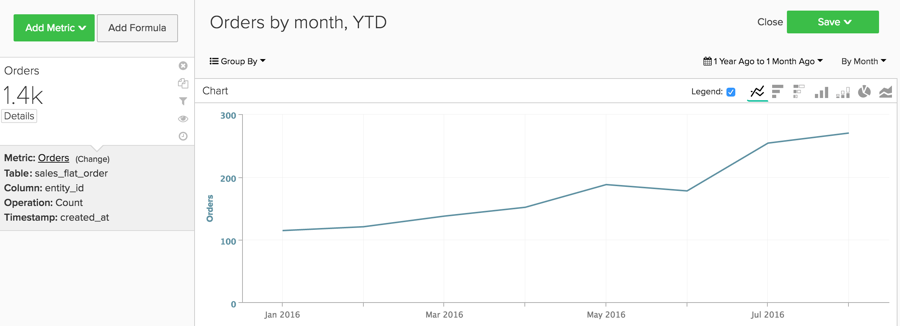<!--{: width="929"}-->

### 訂購的產品

* **說明**:產品訂購量度會告訴您特定時段內的銷售項目數量。
* **量度定義**:此量度會執行 **sum** of `qty_ordered` 從 `sales_flat_order_item` 按順序排列的表 `created_at`.
* **報表範例**:按月銷售的物料，當年截至統計日
   * **[!UICONTROL Metric]**: `Products ordered`
   * **[!UICONTROL Time Range]**: `1 Year Ago to 1 Month Ago`
   * **[!UICONTROL Time Interval]**: `By Month`

   <!--{: width="929"}-->

* 將此量度與訂單數量量度結合，以計算每筆訂單的項目數。 接下來，在報表中新增抵用券代碼，以判斷您的促銷活動對購物車大小的影響，或依新訂單與重複訂單的區隔，以便更清楚了解您的客戶行為。
* **報表範例**:每筆訂單的產品：1次訂購與重複訂購
   * **[!UICONTROL Metric A]**:訂購的產品：訂購
      * **[!UICONTROL Metric]**: `Products ordered`
      * **[!UICONTROL Filter]**: `Customer's order number = 1`
   * **[!UICONTROL Metric B]**:訂購：訂購
      * **[!UICONTROL Metric]**: `Orders`
      * **[!UICONTROL Filter]**: `Customer's order number = 1`
   * **[!UICONTROL Metric C]**:訂購的產品：重複訂單
      * **[!UICONTROL Metric]**: `Products ordered`
      * **[!UICONTROL Filter]**: `Customer's order number > 1`
   * **[!UICONTROL Metric D]**:訂購：重複訂購
      * **[!UICONTROL Metric]**: `Orders`
      * **[!UICONTROL Filter]**: `Customer's order number > 1`
   * **[!UICONTROL Time Range]**: `1 Year Ago to 1 Month Ago`
   * **[!UICONTROL Time Interval]**: `By Week`
   * **[!UICONTROL Formula 1]**: `A/B`
   * **[!UICONTROL Formula 2]**: `C/D`

>[!NOTE]
>
>取消核取 `Multiple Y-Axes box` 和 `Hide` 所有量度

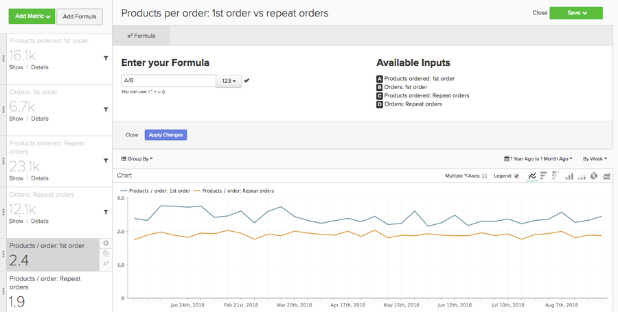<!--{: width="929"}-->

### 平均訂購值

* **說明**:追蹤一段時間內下單的平均值。 使用此量度可快速判斷您的平均訂購值(AOV)在行銷工作、產品供應和/或業務其他變更後的波動程度。
* **量度定義**:此量度會執行 **平均** of `grand_total` 從 `sales_flat_order` 按順序排列的表 `created_at`.
* **報表範例**:AOV與上一年、當年截至統計日
   * **[!UICONTROL Metric]**: `Average order value`
   * **[!UICONTROL Time Range]**: `1 Year Ago to 1 Month Ago`
   * **[!UICONTROL Time Interval]**: `By Month`
   * **[!UICONTROL Perspective]**: `Amount Change vs Previous Year`

   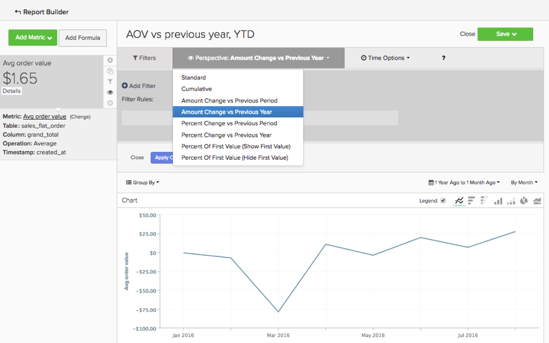<!--{: width="929"}-->

### 透過抵用券購買最多的產品

* **說明**:此報表可讓您深入分析在您提供促銷活動或抵用券時，正在販售哪些產品。
* **使用的量度**:訂購的產品
* **報表範例**:透過抵用券購買最多的產品
   * **[!UICONTROL Metric]**: `Products ordered`
   * **[!UICONTROL Filter]**: `Order's coupon_code Is Not \[NULL\]`
   * **[!UICONTROL Time Range]**: `All-Time`
   * **[!UICONTROL Time Interval]**: `None`
   * **[!UICONTROL Group By**]: `name` (或 `SKU`，或任何其他產品識別碼)
   * **[!UICONTROL Show top/bottom]**:前25個按訂購的產品排序

   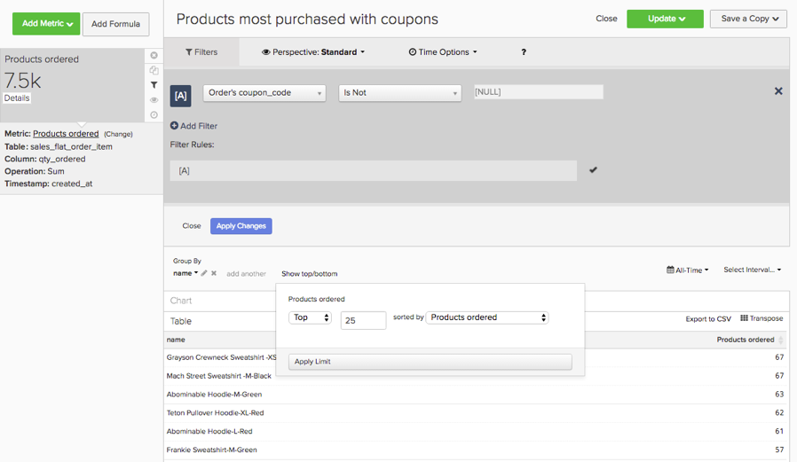<!--{: width="929"}-->

### 訂單間時間

* **說明**:使用 **訂購間時間** 查看平均值（或中位數！）的分析 兩次購買之間的時間量。 在下圖中，您可以看到您的最佳客戶（下訂單超過三次的客戶）在不到6個月內第二次購買。 未下第四筆訂單的客戶需等待14個月，才能再次購買。
* **量度定義**:此量度會執行 **平均** of `Time since previous order` 從 `sales_flat_order` 訂購 `created_at`.
* **報表範例**:
   * **量度1**:≤ 3訂單
      * **[!UICONTROL Metric]**: `Average time between orders`
      * **[!UICONTROL Filter]**: `Customer's lifetime number of orders ≤ 3`
   * **量度2**:> 3份訂單
      * **[!UICONTROL Metric]**: `Average time between orders`
      * **[!UICONTROL Filter]**: `Customer's lifetime number of orders > 3`
   * **[!UICONTROL Time Range]**: `All-Time`
   * **[!UICONTROL Time Interval]**: `None`
   * **[!UICONTROL Group By]**:` Customer's order number (previous-current)`

>[!NOTE]
>
>取消核取 `Multiple Y-Axes` 框。

<!--{: width="929"}-->

## 行銷支出分析 {#mktgspendanalytics}

### 廣告支出

* **說明**:您可以依促銷活動、廣告集或其他區段，分析不同時段和間隔的行銷支出。
* **量度定義**:此量度會對 `Marketing Spend` 表按順序排列 `date` 欄。
* **報表範例**:依行銷活動的廣告支出
   * **[!UICONTROL Metric]**: `Ad spend`
   * **[!UICONTROL Time Range]**: `All-Time`
   * **[!UICONTROL Time Interval]**: `None`
   * **[!UICONTROL Group By]**: `campaign`

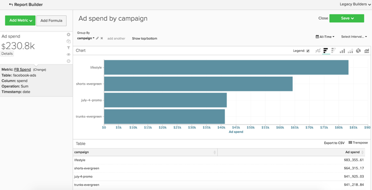<!--{: width="929"}-->

### 廣告曝光次數和廣告點按次數

* **說明**:除了分析廣告支出外，您還可以分析廣告曝光次數和廣告點按次數。
* **量度定義**:此量度會對 `Marketing Spend` 表格依日期欄排序。
* **報表範例**:依日新增曝光次數和廣告點按次數
   * **[!UICONTROL Metric A]**: `Ad impressions`
   * **[!UICONTROL Metric B]**: `Ad clicks`
   * **[!UICONTROL Time Range]**: `1 Year Ago to 3 Months Ago`
   * **[!UICONTROL Time Interval]**: `By Day`

   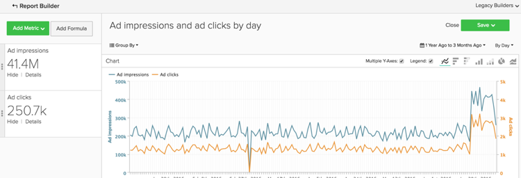<!--{: width="929"}-->

### 點進率(CTR)

* **說明**:您可以使用您在上述建立的廣告曝光次數和廣告點按量度，依不同促銷活動分析您的點進率。
* **報表範例**:按促銷活動列出的CTR
   * **[!UICONTROL Metric A]**: `Ad impressions`
   * **[!UICONTROL Metric B]**: `Ad clicks`
   * **[!UICONTROL Time Range]**:`All-Time`
   * **[!UICONTROL Time Interval]**: `None`
   * **[!UICONTROL Formula]**: `B/A`
   * 選取 `%` 選項。
   * **[!UICONTROL Group By]**: `campaign`

>[!NOTE]
>
>您可以 **標題** 公式為 `CTR`，和 **隱藏** 所有量度。

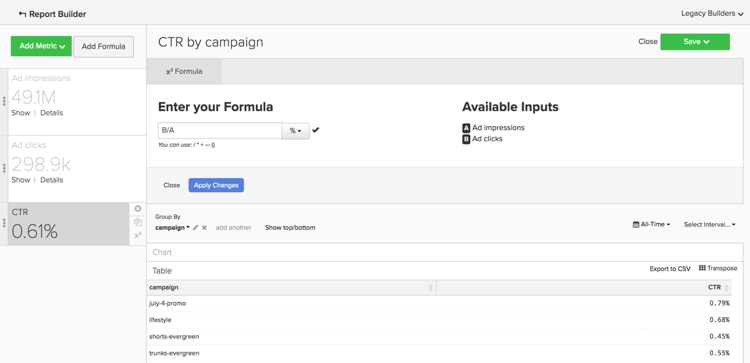<!--{: width="929"}-->

### 每次點按成本(CPC)

* **說明**:使用您在上述建立的廣告支出和廣告點按量度，您可以依不同促銷活動分析每次點按的成本。
* **報表範例**:各行銷活動CPC
   * **[!UICONTROL Metric A]**: `Ad spend`
   * **[!UICONTROL Metric B]**: `Ad clicks`
   * **[!UICONTROL Time Range]**: `All-Time`
   * **[!UICONTROL Time Interval]**: `None`
   * **[!UICONTROL Formula]**: `A/B`
   * 選取 `currency` 選項
   * **[!UICONTROL Group By]**: `campaign`

>[!NOTE]
>
>您可以 **標題** 公式為 `CPC`，和 **隱藏** 所有量度。

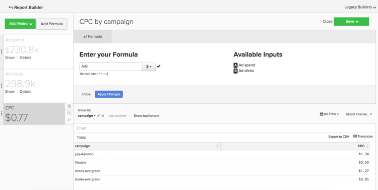<!--{: width="929"}-->

### 按贏取來源列出的客戶

* **說明**:如果您使用追蹤訂單的來源、媒體和促銷活動， [!DNL Google eCommerce]，您可以依客戶的贏取來源分析客戶。 這可協助您識別哪些行銷來源正在贏取客戶，並回答下列問題：「大部分客戶是透過 [!DNL Google], [!DNL Facebook]，或其他來源？」
* **報表範例**:按贏取來源列出的客戶
   * **[!UICONTROL Metric Used]**: `New Customers`
   * **[!UICONTROL Time Range]**: `All-Time`
   * **[!UICONTROL Time Interval]**: `By Month`
   * **[!UICONTROL Group By]**: `Customer's first order's source`

>[!NOTE]
>
>結帳 [這篇文章](../analysis/most-value-source-channel.md) 以取得使用贏取來源的報表範例。

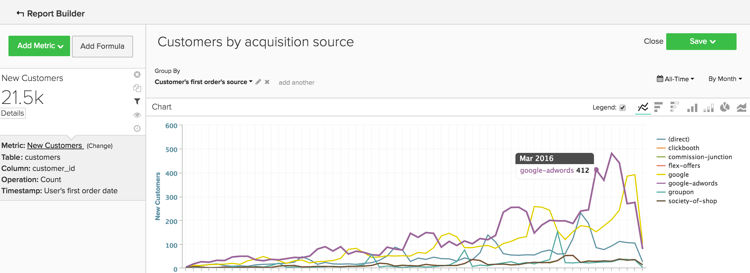<!--{: width="929"}-->

### 按贏取媒體和贏取促銷活動劃分的客戶

* **說明**:與依贏取來源分析客戶類似，您也可以依客戶的第一訂單媒體和行銷活動來分析客戶。 這可協助您回答「哪些促銷活動吸引新客戶？」等問題。
* **報表範例**:按贏取促銷活動（含付費媒體）劃分的客戶
   * **[!UICONTROL Metric Used]**: `New customers`
   * **[!UICONTROL Filter]**: `Customer's first order's medium IN ppc`
   * **[!UICONTROL Time Range]**: `All-Time`
   * **[!UICONTROL Time Interval]**: `None`
   * **[!UICONTROL Group By]**: `Customer's first order's campaign`

>[!NOTE]
>
>針對 `New Customers` 量度中，您可以為您的業務新增任何其他被視為「付費」媒體的媒體，例如cpc或付費搜尋。

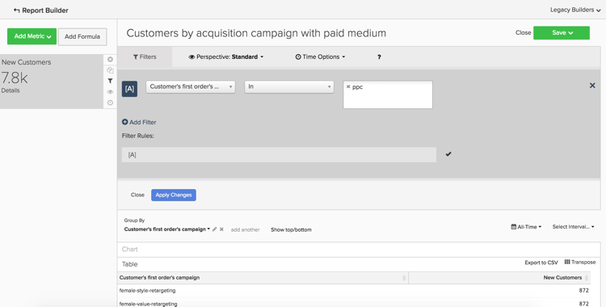<!--{: width="929"}-->

### 客戶購置成本(CAC)或每次購置成本(CPA)

* **說明**:分析促銷活動成本的一種方式是，將所有成本僅歸因於您透過促銷活動取得的客戶。
* **報表範例**:各行銷活動CAC
   * **[!UICONTROL Metric A]**: `New customers`
   * **[!UICONTROL Filter]**: `Customer's first order's medium IN ppc`
   * **[!UICONTROL Metric B]**: `Ad Spend`
   * **[!UICONTROL Time Range]**: `All-Time`
   * **[!UICONTROL Time Interval]**: `None`
   * **[!UICONTROL Formula]**: `B/A`
   * 選取 `currency` 選項
   * **[!UICONTROL Group By]**:
      * 針對量度 `A`，選取 `Customer's first order's campaign`
      * 針對量度 `B`，選取 `campaign`

   

>[!NOTE]
>
>您可以 **標題** 公式為 `CTR`，和 **隱藏** 所有量度。 此外，請查看 [這篇文章](../analysis/roi-ad-camp.md) 以取得更多資訊。

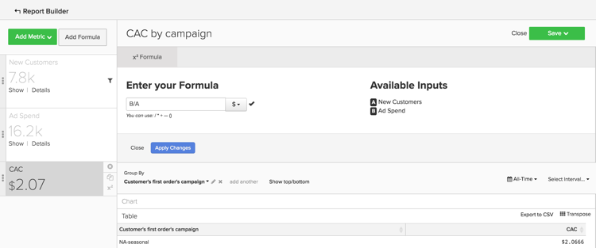

### 期限值（依贏取來源、媒體和促銷活動）

* **說明**:除了分析每個促銷活動獲得的客戶數量，您還可以分析這些客戶的平均期限收入。 這可協助您識別：
   * 如果某些促銷活動吸引了大量客戶，但這些客戶的期限值很低。
   * 如果某些促銷活動吸引的客戶數量較少，但這些客戶具有高的終身價值。
* **報表範例**:首先新增 `New customers` 量度。 然後，新增 `Average lifetime revenue` 量度。 選取所需的時間範圍，然後選擇 `interval` as `None`. 最後，選取 `group by` 選項`Customer's first order's campaign`.
   * **[!UICONTROL Metric A]**: `New Customers`
   * **[!UICONTROL Filter A]**: `Customer's first order's source` LIKE「%google%」
   * **[!UICONTROL Filter B]**: `Customer's first order's medium IN ppc`
   * **[!UICONTROL Metric B]**: `Average lifetime revenue`
   * **[!UICONTROL Filter A]**: `Customer's first order's source` LIKE「%google%」
   * **[!UICONTROL Filter B]**: `Customer's first order's medium IN ppc`
   * **[!UICONTROL Time Range]**: `All-Time`
   * **[!UICONTROL Time Interval]**: `None`
   * **[!UICONTROL Group By]**: `Customer's first order's campaign`

>[!NOTE]
>
>對於這兩個篩選器，您可以為您的業務新增任何其他被視為「付費」媒體（例如cpc或付費搜尋），而且您可以新增您要分析的任何其他來源，例如Facebook。 此外，請查看 [這篇文章](../analysis/roi-ad-camp.md) 如需CAC、LTV和ROI的詳細資訊。

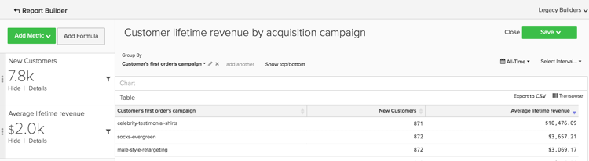<!--{: width="929"}-->

### 投資報酬率(ROI)

* **說明**:要依促銷活動計算ROI，方法之一是分析透過促銷活動下的所有訂單。 不過，另一種方法是分析透過促銷活動取得之客戶的期限值。 要分析ROI，請務必在您的支出資料和交易資料中保持一致促銷活動名稱。 如果您建立下列報表，且由於促銷活動名稱不相符而沒有ROI值，則您可能需要查看 [UTM標籤](../../best-practices/utm-tagging-google.md) 您已實作。
* **報表範例**:各行銷活動的投資報酬率
   * **[!UICONTROL Metric A]**: `New Customers`
   * **[!UICONTROL Filter A]**: `Customer's first order's source` LIKE「%google%」
   * **[!UICONTROL Filter B]**: `Customer's first order's medium IN ppc`
   * **[!UICONTROL Metric B]**: `Average lifetime revenue`
   * **[!UICONTROL Filter A]**: `Customer's first order's source` LIKE「%google%」
   * **[!UICONTROL Filter B]**: `Customer's first order's medium IN ppc`
   * **[!UICONTROL Metric C]**: `Ad spend`
   * **[!UICONTROL Time Range]**: `All-Time`
   * **[!UICONTROL Time Interval]**: `None`
   * **[!UICONTROL Formula]**: `(B-(C/A))/(C/A)`
   * 選取 `% `選項
   * **[!UICONTROL Group By]**:
      * 針對量度 `A` 和 `B`，選取 `Customer's first order's campaign`
      * 針對量度 `C`，選取 `campaign`

>[!NOTE]
>
>您可以將公式標題為「ROI」，並隱藏所有量度。 此外，您可以調整量度中的篩選器，以分析替代來源和媒體。 此外，請查看 [本主題](../analysis/roi-ad-camp.md) 如需CAC、LTV和ROI的詳細資訊。

<!--{: width="929"}-->

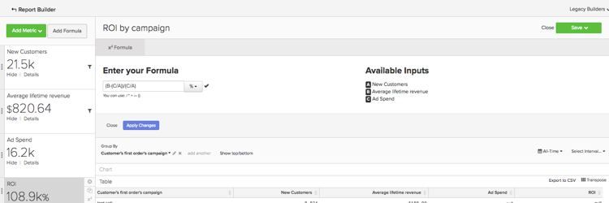<!--{: width="929"}-->
