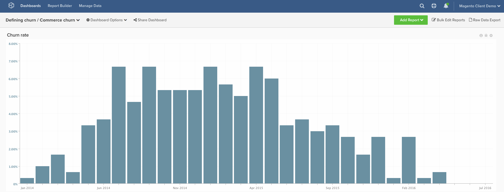

# 流失率

此主題示範如何計算&#x200B;**商務客戶**&#x200B;的&#x200B;**流失率**。 與SaaS或傳統訂閱公司不同，商業客戶通常沒有具體的&#x200B;**「流失事件」**&#x200B;來向您顯示他們不應該再計入您的活躍客戶。 因此，下列指示可讓您根據客戶自上次訂購以來經過的確定時間量，將客戶定義為「已流失」。

許多客戶想要協助，以便開始根據他們的資料來構想他們應該使用的&#x200B;**時間範圍**。 如果您想要使用歷史客戶行為來定義此&#x200B;**流失時間範圍**，您可能想要熟悉[定義流失](../analysis/define-cust-churn.md)主題。 然後，您便可以在以下說明中使用流失率公式中的結果。

## 計算欄

要建立的欄

* **`customer_entity`**&#x200B;資料表
* **`Customer's last order date`**
   * 選取[!UICONTROL definition]： `Max`
   * 選取[!UICONTROL table]： `sales_flat_order`
   * 選取[!UICONTROL column]： `created_at`
   * `sales_flat_order.customer_id = customer_entity.entity_id`
   * [!UICONTROL Filter]： `Orders we count`

* **`Seconds since customer's last order date`**
   * 選取[!UICONTROL definition]： `Age`
   * 選取[!UICONTROL column]： `Customer's last order date`

>[!NOTE]
>
>在建立新報表之前，請務必[將所有新欄新增為量度](../data-warehouse-mgr/manage-data-dimensions-metrics.md)的維度。

## 量度

* **新客戶（依第一筆訂單日期）**
   * 被計數的客戶

>[!NOTE]
>
>此量度可能存在於您的帳戶上。

* 在&#x200B;**`customer_entity`**&#x200B;資料表中
* 此量度執行&#x200B;**計數**
* 在&#x200B;**`entity_id`**&#x200B;欄上
* 依&#x200B;**`Customer's first order date`**&#x200B;時間戳記排序
* [!UICONTROL Filter]：

* **新客戶（依上次訂購日期）**
   * 被計數的客戶

  >[!NOTE]
  >
  >此量度可能存在於您的帳戶上。

* 在&#x200B;**`customer_entity`**&#x200B;資料表中
* 此量度執行&#x200B;**計數**
* 在&#x200B;**`entity_id`**&#x200B;欄上
* 依&#x200B;**`Customer's last order date`**&#x200B;時間戳記排序
* [!UICONTROL Filter]：

>[!NOTE]
>
>在建立新報表之前，請務必[將所有新欄新增為量度](../data-warehouse-mgr/manage-data-dimensions-metrics.md)的維度。

## 報表

* **流失率**
   * [!UICONTROL Metric]：新客戶（依第一筆訂單日期）
   * [!UICONTROL Filter]： `Lifetime number of orders Greater Than 0`
   * &#x200B;
     [!UICONTROL Perspective]: `Cumulative`
   * [!UICONTROL Metric]： `New customers (by last order date)`
   * [!UICONTROL Filter]：
   * 自客戶上次訂購日期起的秒數>= [您為流失客戶定義的截止日期&#x200B;]&#x200B;**`^`**
   * `Lifetime number of orders Greater Than 0`

   * [!UICONTROL Metric]： `New customers (by last order date)`
   * [!UICONTROL Filter]： `Lifetime number of orders Greater Than 0`
   * &#x200B;
     [!UICONTROL Perspective]: Cumulative
   * [!UICONTROL Formula]： `(B / ((A + B) - C)`
   * &#x200B;
     [!UICONTROL Format]: Percentage

* *量度`A`：`New customers cumulative`*
* *量度`B`：`Churned customers by last order date`*
* *量度`C`：`Customers by last order date cumulative`*
* *`Formula`：`Repeat order probability`*
* *`Time period`：`All time (or custom range)`*
* *`Group by`：`Customer's order number`*
* *`Chart Type`：`Column`*

以下是一些常見的月份>秒轉換，但Google提供其他值，包括您正在尋找的任何自訂值的周>秒轉換。

| **個月** | **秒** |
|---|---|
| 3 | 7,776,000 |
| 6 | 15,552,000 |
| 9 | 23,328,000 |
| 12 | 31,104,000 |

編譯所有報表後，您可以視需要在控制面板上組織報表。 結果可能如上述範例控制面板所示。
