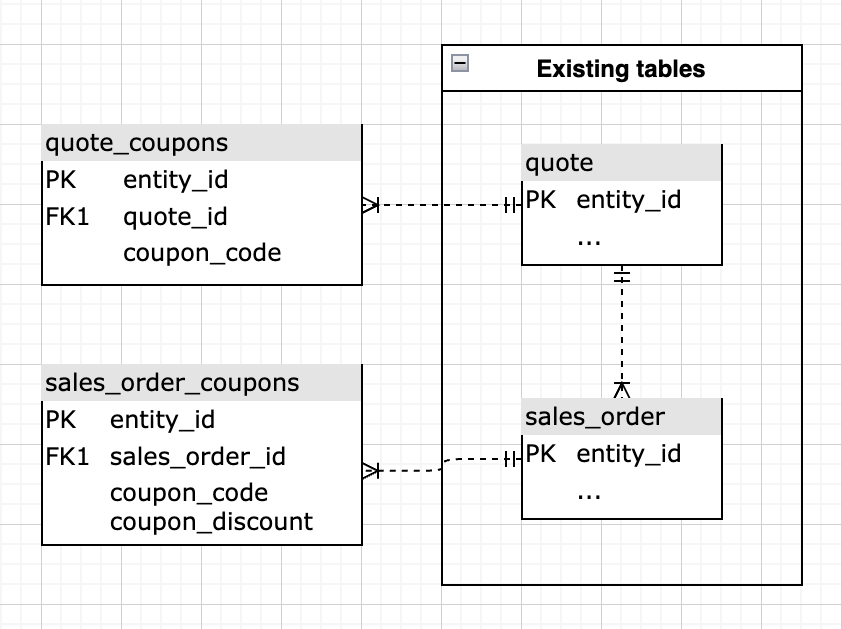

# 進階抵用券程式碼分析

瞭解您的企業優惠券績效對於細分您的訂單以及更好地瞭解您的客戶來說是一種有趣的方式。 本主題將逐步帶您瞭解建立分析的步驟，以瞭解您透過使用抵用券而獲得哪些客戶、其如何執行以及追蹤一般抵用券的使用情況。

<!--{: width="800" height="375"}-->

此分析包含[進階計算資料行](../data-warehouse-mgr/adv-calc-columns.md)。

## 快速入門

首先，您必須確保將下列欄同步至您的Data Warehouse。 如果沒有，請瀏覽至「`Manage Data` > `Data Warehouse`」並同步處理下列專案，繼續追蹤他們：

* **sales\_flat\_order**&#x200B;資料表
* **抵用券\_代碼**
* **base\_discount\_amount**

## 計算欄

要建立的資料欄，不考慮來賓訂單原則：

* `sales\_flat\_order`資料表
* **已套用訂單優惠券？**
   * [!UICONTROL Column type]： `Same Table => CALCULATION`
   * [!UICONTROL Inputs]：
      * `A`： `coupon\_code`

   * &#x200B;
     [!UICONTROL 資料型別]: `String`
   * [!UICONTROL Calculation]： `A`為Null然後`No coupon`否則`Coupon`結束的情況

* **\[INPUT\] customer\_id — 優惠券代碼**
   * [!UICONTROL Column type]： `Same Table => CALCULATION`
   * [!UICONTROL Inputs]：
      * `A`： `customer\_id`
      * `B`： `coupon\_code`

   * [!UICONTROL Datatype]字串
   * [!UICONTROL Calculation]： `concat(A,' - ',B)`

* **含此優惠券的訂單數**
   * [!UICONTROL Column type]： `Same Table => EVENT\_NUMBER`
   * 事件擁有者： `INPUT customer_id - coupon code`
   * 事件排名： `created\_at`
   * [!UICONTROL Filters]： `Orders we count`篩選器集

如果客體訂單不受支援，則要建立的其他欄位：

* `customer\_entity`資料表
   * **客戶的第一個訂單包含優惠券？ （優惠券/無優惠券）**
   * [!UICONTROL Column type]： `Many to One => MAX`
   * [!UICONTROL Path]： `sales\_flat\_order.customer\_id = customer\_entity.entity\_id`
   * 選取[!UICONTROL column]： `Order has coupon applied? (Coupon/No coupon)`
   * [!UICONTROL Filters]：
      * `A`： `Orders we count`
      * `B`： `Customer's order number = 1`

   * **客戶的首筆訂單優惠券**
      * [!UICONTROL Column type]： `Many to One => MAX`
      * [!UICONTROL Path]： `sales\_flat\_order.customer\_id = customer\_entity.entity\_id`
      * 選取[!UICONTROL column]： `coupon\_code`
      * [!UICONTROL Filter]：
         * `A`： `Orders we count`
         * `B`： `Customer's order number = 1`

   * **客戶使用的贈券期限數**
      * [!UICONTROL Column type]： `Many to One => COUNT`
      * [!UICONTROL Path]： `sales\_flat\_order.customer\_id = customer\_entity.entity\_id`
      * [!UICONTROL Filter]：
         * `A`： `Orders we count`
         * `B`： `Order has coupon applied? (Coupon/No coupon) = Coupon`

   * **優惠券贏取客戶或非優惠券贏取客戶**
      * [!UICONTROL Column type]： `Same Table => CALCULATION`
      * [!UICONTROL Inputs]：
         * `A`： `Customer's first order included a coupon? (Coupon/No coupon)`

      * &#x200B;
        [!UICONTROL 資料型別]: `String`
      * [!UICONTROL Calculation]： **案例，當A=&#39;Coupon&#39;然後&#39;Coupon acquisition customer&#39;否則&#39;Non-coupon acquisition customer&#39;結束**

   * 含優惠券的客戶&#x200B;**訂單百分比**
      * [!UICONTROL Column type]： `Same Table => CALCULATION`
      * [!UICONTROL Inputs]：
         * `A`： `User's lifetime number of coupons used`
         * `B`： `User's lifetime number of orders`

      * &#x200B;
        [!UICONTROL 資料型別]: `Decimal`
      * [!UICONTROL Calculation]： **當A為null或B為null或B=0然後為null時，否則A/B結束**

   * **客戶的抵用券使用量**
      * [!UICONTROL Column type]： `Same Table => Calculation`
      * [!UICONTROL Inputs]：
         * `A`： `Percent of customer's orders with coupon`

      * &#x200B;
        [!UICONTROL 資料型別]: `String`
      * [!UICONTROL Calculation]： **當A為Null時為Null，當A=0時為「Nevere used coupon」，當A&lt;0.5時為「Moverly full price」，當A=0.5時為「50/50」，當A=1時為「Coupons only」，當A>0.5時為「Moverly coupon」，否則為「Undefined」時為**

* `sales\_flat\_order`資料表
   * **客戶的第一個訂單包含優惠券？ （優惠券/無優惠券）**
      * [!UICONTROL Column type]： `One to Many => JOINED\_COLUMN`
      * [!UICONTROL Path]： `sales\_flat\_order.customer\_id = customer\_entity.entity\_id`
      * 選取[!UICONTROL column]： `Customer's first order included a coupon? (Coupon/No coupon)`
^

   * **客戶的首筆訂單優惠券**
      * [!UICONTROL Column type]： `One to Many => JOINED\_COLUMN`
      * [!UICONTROL Path]： `sales\_flat\_order.customer\_id = customer\_entity.entity\_id`
      * 選取[!UICONTROL column]： `Customer's first order coupon?`

如果客體訂單不受支援，則要建立的其他欄位：

* `sales\_flat\_order`資料表
   * **客戶的第一個訂單包含優惠券？ （優惠券/無優惠券）** **-**&#x200B;由分析人員建立，作為您的\[優惠券分析\]票證的一部分
   * **分析人員建立的客戶第一筆訂單優惠券&#x200B;**{::}**-**，做為您\[優惠券分析\]票證的一部分

* **分析人員建立作為\[COUPON ANALYSIS\]票證一部分的&#x200B;**{::}**-**&#x200B;使用之客戶優惠券的期限數
* **優惠券贏取客戶或非優惠券贏取客戶**
   * [!UICONTROL Column type]： `Same Table => CALCULATION`
   * [!UICONTROL Inputs]：
      * `A`： `Customer's first order included a coupon? (Coupon/No coupon)`

   * &#x200B;
     [!UICONTROL 資料型別]: `String`
   * [!UICONTROL Calculation]： **案例，當A=&#39;Coupon&#39;然後&#39;Coupon acquisition customer&#39;否則&#39;Non-coupon acquisition customer&#39;結束**

* 含優惠券的客戶&#x200B;**訂單百分比**
   * [!UICONTROL Column type]： `Same Table => CALCULATION`
   * [!UICONTROL Inputs]：
      * `A`： `User's lifetime number of coupons used`
      * `B`： `User's lifetime number of orders`

   * &#x200B;
     [!UICONTROL 資料型別]: `Decimal`
   * [!UICONTROL Calculation]： **當A為null或B為null或B=0然後為null時，否則A/B結束**

* **客戶的抵用券使用量**
   * [!UICONTROL Column type]： `Same Table => Calculation`
   * [!UICONTROL Inputs]：
      * `A`： `Percent of customer's orders with coupon`

   * &#x200B;
     [!UICONTROL 資料型別]: `String`
   * [!UICONTROL Calculation]： **當A為Null時為Null，當A=0時為「Nevere used coupon」，當A&lt;0.5時為「Moverly full price」，當A=0.5時為「50/50」，當A=1時為「Coupons only」，當A>0.5時為「Moverly coupon」，否則為「Undefined」時為**

## 量度

* **優惠券折扣金額**
   * `Orders we count`
   * `Order has coupon applied? (Coupon/No coupon)= Coupon`

* 在`sales\_flat\_order`資料表中
* 此量度執行&#x200B;**總和**
* 在`discount\_amount`欄上
* 依`created\_at`時間戳記排序
* [!UICONTROL Filter]：

* **已使用的抵用券數目**
   * `Orders we count`
   * `Order has coupon applied? (Coupon/No coupon)= Coupon`

* 在`sales\_flat\_order`資料表中
* 此量度執行&#x200B;**計數**
* 在`entity\_id`欄上
* 依`created\_at`時間戳記排序
* [!UICONTROL Filter]：

>[!NOTE]
>
>在建立新報表之前，請務必[將所有新欄新增為量度](../data-warehouse-mgr/manage-data-dimensions-metrics.md)的維度。

## 報表

* 已取得優惠券與已取得非優惠券客戶的&#x200B;**%**
   * [!UICONTROL Metric]： `New customers`

* 量度`A`： `Coupon acquisitions`
* [!UICONTROL Time period]： `All time`
* &#x200B;
  [!UICONTROL 間隔]: `None`
* [!UICONTROL Group by]： `Coupon acquisitions customer`或`Non coupon acquisition customer`
* &#x200B;
  [!UICONTROL 圖表型別]: `Pie`

* **已取得優惠券與未取得優惠券的客戶數目**
   * [!UICONTROL Metric]： `New customers`

* 量度A： `Coupon acquisitions`
* [!UICONTROL Time period]： `All time`
* [!UICONTROL Interval]： `By Month`
* [!UICONTROL Group by]： `Coupon acquisitions customer`或`Non coupon acquisition customer`
* [!UICONTROL Chart type]： `Stacked column`

* **平均期限收入：優惠券常見問答集。 （90+天存留期）**
   * [!UICONTROL Metric]： `Average lifetime revenue`
   * [!UICONTROL Filter]：
      * 客戶的第一筆訂單包含優惠券（優惠券/無優惠券） =優惠券

* 量度`A`： `Average lifetime revenue (at least 3 months age)`
* [!UICONTROL Time period]： `X years ago to 90 days ago`
* &#x200B;
  [!UICONTROL 間隔]: `None`
* &#x200B;
  [!UICONTROL 圖表型別]: `Scalar`

* **平均存留期收入：無優惠券常見問答集。 （90+天存留期）**
   * [!UICONTROL Metric]：平均期限收入
   * [!UICONTROL Filter]：
      * 客戶的第一筆訂單包含優惠券（優惠券/無優惠券） =無優惠券

* 量度`A`： `Average lifetime revenue (at least 3 months age)`
* [!UICONTROL Time period]： `X years ago to 90 days ago`
* &#x200B;
  [!UICONTROL 間隔]: `None`
* &#x200B;
  [!UICONTROL 圖表型別]: `Scalar`

* **依第一筆贈券的平均期限收入**
   * [!UICONTROL Metric]： `Average lifetime revenue`

* 量度`A`： `Average lifetime revenue`
* [!UICONTROL Time period]： `All time`
* &#x200B;
  [!UICONTROL 間隔]: `None`
* [!UICONTROL Group by]： `Customer's first order's coupon`
* &#x200B;
  [!UICONTROL 圖表型別]: `Column`

>[!NOTE]
>
>如果您有許多抵用券代碼（許多使用者端都有），您想要套用前/後（例如依平均期限收入排序的前10名）

* **重複訂購可能性：優惠券取得**
   * [!UICONTROL Metric]： `Number of orders`
   * [!UICONTROL Filter]：
      * 客戶的第一筆訂單包含優惠券（優惠券/無優惠券） =優惠券

   * [!UICONTROL Metric]： `Number of orders`
   * [!UICONTROL Filter]：
      * 客戶的第一筆訂單包含優惠券（優惠券/無優惠券） =優惠券
      * 客戶的上次訂單是哪個？ =否
   * &#x200B;
     [!UICONTROL 公式]: `B/A`
   * [!UICONTROL Format]： `Percentage %`

   * 從`Customer's by lifetime orders`圖表選取統計顯著數字。 檢視圖表時，一個好的規則是尋找貯體中具有30個或更多客戶的訂單編號。 根據您的資料集，這可能是很大的數字，因此歡迎新增1-10。

* 量度`A`： `Number of orders`
* 量度`B`： `Number of non last orders`
* [!UICONTROL Formula]： `Repeat order probability`
* [!UICONTROL Time period]： `All time`
* &#x200B;
  [!UICONTROL 間隔]: `None`
* [!UICONTROL Group by]： `Customer's order number`
* [!UICONTROL Chart type]： `Bar chart`

* **重複訂購機率：非優惠券收購**
   * [!UICONTROL Metric]： `Number of orders`
   * [!UICONTROL Filter]：
      * 客戶的第一筆訂單包含優惠券（優惠券/無優惠券） =無優惠券

   * [!UICONTROL Metric]： `Number of orders`
   * [!UICONTROL Filter]：
      * 客戶的第一筆訂單包含優惠券（優惠券/無優惠券） =無優惠券
      * 客戶的上次訂單是哪個？ =否

   * &#x200B;
     [!UICONTROL 公式]: `B/A`
   * [!UICONTROL Format]： `Percentage %`

   * 從`Customer's by lifetime orders`圖表或1-5中選取統計顯著數字。

* 量度`A`： `Number of orders`
* 量度`B`： `Number of non last orders`
* [!UICONTROL Formula]： `Repeat order probability`
* [!UICONTROL Time period]： `All time`
* &#x200B;
  [!UICONTROL 間隔]: `None`
* [!UICONTROL Group by]： `Customer's order number`
* [!UICONTROL Chart type]： `Bar chart`

* **已取得優惠券的客戶優惠券使用率（重複訂購）**
   * [!UICONTROL Metric]： `New customers`
   * [!UICONTROL Filter]：
      * 優惠券取得客戶或非優惠券取得客戶=優惠券取得

   * [!UICONTROL Metric]： `Number of orders`
   * [!UICONTROL Filter]：
      * 客戶的訂單編號> 1
      * 客戶的第一筆訂單是否包含抵用券？ （抵用券/無抵用券） =抵用券

   * [!UICONTROL Metric]：`Number of orders`
   * [!UICONTROL Filter]：
      * 客戶的訂單編號> 1
      * 客戶的第一筆訂單是否包含抵用券？ （抵用券/無抵用券） =抵用券
      * 已套用訂單優惠券？ （抵用券/無抵用券） =抵用券

   * &#x200B;
     [!UICONTROL 公式]: `C/B`
   * [!UICONTROL Format]： `Percentage %`

* 量度`A`： `Coupon-acquired customers`
* 量度`B`： `Number of repeat orders`
* 量度`C`： `Number of repeat orders with coupon`
* [!UICONTROL Formula]： `% of repeat orders with coupon`
* [!UICONTROL Time period]： `All time`
* &#x200B;
  [!UICONTROL 間隔]: `None`
* &#x200B;
  [!UICONTROL 圖表型別]: `Table` (可以調換此表格以提供更好的視覺效果)

* **非優惠券取得客戶的優惠券使用率（重複訂購）**
   * [!UICONTROL Metric]： `New customers`
   * [!UICONTROL Filter]：
      * 優惠券取得客戶或非優惠券取得客戶=非優惠券取得

   * [!UICONTROL Metric]： `Number of orders`
   * [!UICONTROL Filter]：
      * 客戶的訂單編號> 1
      * 客戶的第一筆訂單是否包含抵用券？ （抵用券/無抵用券） =無抵用券

   * [!UICONTROL Metric]： `Number of orders`
   * [!UICONTROL Filter]：
      * 客戶的訂單編號> 1
      * 客戶的第一筆訂單是否包含抵用券？ （抵用券/無抵用券） =無抵用券
      * 已套用訂單優惠券？ （抵用券/無抵用券） =抵用券

   * &#x200B;
     [!UICONTROL 公式]: `C/B`
   * [!UICONTROL Format]： `Percentage %`

* 量度`A`： `Non-coupon-acquired customers`
* 量度`B`： `Number of repeat orders`
* 量度`C`： `Number of repeat orders with coupon`
* [!UICONTROL Formula]： `% of repeat orders with coupon`
* [!UICONTROL Time period]： `All time`
* &#x200B;
  [!UICONTROL 間隔]: `None`
* &#x200B;
  [!UICONTROL 圖表型別]: `Table` (可以調換此表格以提供更好的視覺效果)

* **優惠券使用詳細資料（首次訂購）**
   * [!UICONTROL Metric]： `Number of orders`
   * [!UICONTROL Filter]：
      * 客戶的訂單編號= 1
      * 含此抵用券的訂單數> 10

   * &#x200B;
     [!UICONTROL 公制]: `Revenue`
   * [!UICONTROL Filter]：
      * 客戶的訂單編號= 1
      * 含此抵用券的訂單數> 10

   * [!UICONTROL Metric]： `Coupon discount amount`
   * [!UICONTROL Filter]：
      * 客戶的訂單編號= 1
      * 含此抵用券的訂單數> 10

   * [!UICONTROL Formula]： `B-C` （如果C是負數）；B+C （如果C是正數）
   * &#x200B;
     [!UICONTROL 格式]: `Currency`

   * [!UICONTROL Metric]： `Average order value`
   * [!UICONTROL Filter]：
      * 客戶的訂單編號= 1
      * 含此抵用券的訂單數> 10

* 量度`A`： `First time orders (FTO)`
* 量度`B`： `Revenue from FTO`
* 量度`C`： `Discounts applied to FTO`
* [!UICONTROL Formula]： `Gross revenue from FTO`
* 量度`E`： `Average order value for FTO`
* [!UICONTROL Time period]： `All time`
* &#x200B;
  [!UICONTROL 間隔]: `None`
* [!UICONTROL Group by]： `coupon code`
* &#x200B;
  [!UICONTROL 圖表型別]: `Table`
>[!NOTE]
>
>「具有此抵用券的訂單數」的數量10為任意數。 您可以針對此篩選器使用最適當的數量。

* **含優惠券的訂單數（所有時間）**
   * [!UICONTROL Metric]： `Number of coupons used`

* 量度`A`： `Number or orders with coupon`
* [!UICONTROL Time period]： `All time`
* &#x200B;
  [!UICONTROL 間隔]: `None`
* &#x200B;
  [!UICONTROL 圖表型別]: `Scalar`

* **含優惠券的訂單淨收入（所有時間）**
   * &#x200B;
     [!UICONTROL 公制]: `Revenue`
   * [!UICONTROL Filter]：
      * 已套用訂單優惠券？ （抵用券/無抵用券） =抵用券

* 量度`A`： `Net revenue from orders with coupons`
* [!UICONTROL Time period]： `All time`
* &#x200B;
  [!UICONTROL 間隔]: `None`
* &#x200B;
  [!UICONTROL 圖表型別]: `Scalar`

* **優惠券折扣（所有時間）**
   * [!UICONTROL Metric]： `Number of coupons used`

* 量度`A`： `Coupon discount amount`
* [!UICONTROL Time period]： `All time`
* &#x200B;
  [!UICONTROL 間隔]: `None`
* &#x200B;
  [!UICONTROL 圖表型別]: `Scalar`

* **含和不含抵用券的訂單數**
   * [!UICONTROL Metric]： `Number of orders`

* 量度`A`： `Number of orders`
* [!UICONTROL Time period]： `Last 24 months`
* &#x200B;
  [!UICONTROL 間隔]: `None`
* [!UICONTROL Group by]： `Order has coupon applied? (Coupon/No coupon)`
* [!UICONTROL Chart type]： `Stacked column`

* **重複使用者之間的優惠券使用量**
   * [!UICONTROL Metric]： `New customers`
   * [!UICONTROL Filter]：
      * 客戶期限訂單數> 1

* 量度`A`： `New customers`
* [!UICONTROL Time period]： `All time`
* &#x200B;
  [!UICONTROL 間隔]: `None`
* [!UICONTROL Group by]： `Customer's coupon usage`
* &#x200B;
  [!UICONTROL 圖表型別]: `Pie`

* **優惠券使用詳細資料**
   * [!UICONTROL Metric]： `Number of orders with coupon`
   * [!UICONTROL Filter]：
      * 含此抵用券的訂單數> 10

   * &#x200B;
     [!UICONTROL 公制]: `Revenue`
   * [!UICONTROL Filter]：
      * 含此抵用券的訂單數> 10

   * [!UICONTROL Metric]： `Coupon discount amount`
   * [!UICONTROL Filter]：
      * 含此抵用券的訂單數> 10

   * [!UICONTROL Formula]： `B-C` （如果`C`為負數）； `B+C` （如果`C`為正數）
   * &#x200B;
     [!UICONTROL 格式]: `Currency`

   * [!UICONTROL Formula]： `C/(B-C)` （如果`C`為負數）； `C/(B+C)` （如果`C`為正數）
   * &#x200B;
     [!UICONTROL 格式]: `Percentage`

   * [!UICONTROL Metric]： `Average order value`
   * [!UICONTROL Filter]：
      * 含此抵用券的訂單數> 10

   * &#x200B;
     [!UICONTROL 公式]: `C/A`
   * &#x200B;
     [!UICONTROL 格式]: `Currency`

   * [!UICONTROL Metric]： `Distinct buyers`
   * [!UICONTROL Filter]：
      * 含此抵用券的訂單數> 10

* 量度`A`： `Number of orders`
* 量度`B`： `Net revenue from orders`
* 量度`C`： `Total discounts applied`
* [!UICONTROL Formula]： `Gross revenue`
* [!UICONTROL Formula]： `% discounted`
* 量度`F`： `Average net order value`
* [!UICONTROL Formula]： `Average order discount`
* 量度`H`： `Distinct buyers`
* [!UICONTROL Time period]： `All time`
* &#x200B;
  [!UICONTROL 間隔]: `None`
* [!UICONTROL Group by]： `coupon code`
* &#x200B;
  [!UICONTROL 圖表型別]: `Table`

>[!NOTE]
>
>「具有此抵用券的訂單數」的數量10為任意數。 您可以針對此篩選器使用最適當的數量。

編譯所有報表後，您可以視需要在控制面板上組織報表。 結果看起來可能像頁面頂端的影像。

如果您在建立此分析時遇到任何問題，或只是想與專業服務團隊互動，請[聯絡支援人員](https://experienceleague.adobe.com/docs/commerce-knowledge-base/kb/troubleshooting/miscellaneous/mbi-service-policies.html?lang=zh-Hant)。

>[!NOTE]
>
>截至Adobe Commerce 2.4.7，客戶可以使用&#x200B;**quote_coupons**&#x200B;和&#x200B;**sales_order_coupons**&#x200B;資料表，深入瞭解客戶如何使用多張優惠券。

