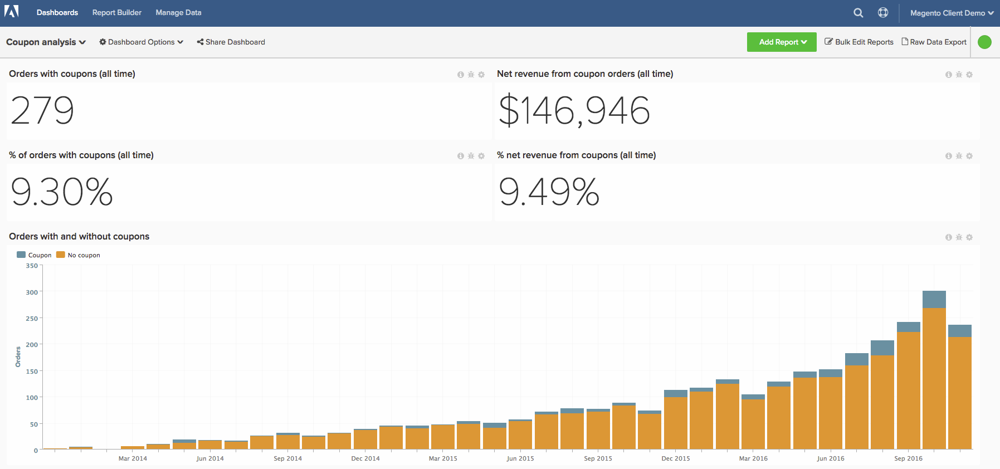

# 進階抵用券代碼分析

瞭解您企業的優惠券績效是細分訂單的有趣方式，也可以更好地瞭解您的客戶。 本主題將逐步帶您瞭解建立分析的步驟，以瞭解您透過使用抵用券獲得哪些客戶、其如何執行以及追蹤一般抵用券的使用情況。

<!--{: width="800" height="375"}-->

此分析包含 [進階計算欄](../data-warehouse-mgr/adv-calc-columns.md).

## 快速入門

首先，您必須確保將下列欄同步至您的Data Warehouse。 如果沒有，請導覽至「 」以追蹤他們 `Manage Data` > `Data Warehouse`，並同步下列專案：

* **sales\_flat\_order** 表格
* **抵用券代碼**
* **base\_discount\_amount**

## 計算欄

要建立的欄位不考慮來賓訂單原則：

* `sales\_flat\_order` 表格
* **訂單已套用優惠券？**
   * [!UICONTROL Column type]: `Same Table => CALCULATION`
   * [!UICONTROL Inputs]:
      * `A`: `coupon\_code`
   * 
      [！UICONTROL資料型別]: `String`
   * [!UICONTROL Calculation]：案例： `A` 為null，則 `No coupon` 否則 `Coupon` 結束

* **\[INPUT\] customer\_id — 優惠券代碼**
   * [!UICONTROL Column type]: `Same Table => CALCULATION`
   * [!UICONTROL Inputs]:
      * `A`: `customer\_id`
      * `B`: `coupon\_code`
   * [!UICONTROL Datatype] 字串
   * [!UICONTROL Calculation]: `concat(A,' - ',B)`

* **具有此抵用券的訂單數**
   * [!UICONTROL Column type]: `Same Table => EVENT\_NUMBER`
   * 事件擁有者：`INPUT customer_id - coupon code`
   * 事件排名： `created\_at`
   * [!UICONTROL Filters]： `Orders we count` 篩選器集

不支援客體訂單時要建立的其他欄位：

* `customer\_entity` 表格
   * **客戶的第一筆訂單是否包含優惠券？ （優惠券/無優惠券）**
   * [!UICONTROL Column type]: `Many to One => MAX`
   * [!UICONTROL Path]: `sales\_flat\_order.customer\_id = customer\_entity.entity\_id`
   * 選取 [!UICONTROL column]： `Order has coupon applied? (Coupon/No coupon)`
   * [!UICONTROL Filters]:
      * `A`: `Orders we count`
      * `B`: `Customer's order number = 1`
   * **客戶第一筆訂單的優惠券**
      * [!UICONTROL Column type]: `Many to One => MAX`
      * [!UICONTROL Path]: `sales\_flat\_order.customer\_id = customer\_entity.entity\_id`
      * 選取 [!UICONTROL column]： `coupon\_code`
      * [!UICONTROL Filter]:
         * `A`: `Orders we count`
         * `B`: `Customer's order number = 1`
   * **客戶使用的優惠券期限數量**
      * [!UICONTROL Column type]: `Many to One => COUNT`
      * [!UICONTROL Path]: `sales\_flat\_order.customer\_id = customer\_entity.entity\_id`
      * [!UICONTROL Filter]:
         * `A`: `Orders we count`
         * `B`: `Order has coupon applied? (Coupon/No coupon) = Coupon`
   * **優惠券取得客戶或非優惠券取得客戶**
      * [!UICONTROL Column type]: `Same Table => CALCULATION`
      * [!UICONTROL Inputs]:
         * `A`: `Customer's first order included a coupon? (Coupon/No coupon)`
      * 
         [！UICONTROL資料型別]: `String`
      * [!UICONTROL Calculation]： **案例，當A=&#39;Coupon&#39;然後&#39;Coupon acquisition customer&#39;否則&#39;Non-coupon acquisition customer&#39;結束**
   * **含優惠券的客戶訂單百分比**
      * [!UICONTROL Column type]: `Same Table => CALCULATION`
      * [!UICONTROL Inputs]:
         * `A`: `User's lifetime number of coupons used`
         * `B`: `User's lifetime number of orders`
      * 
         [！UICONTROL資料型別]: `Decimal`
      * [!UICONTROL Calculation]： **A為null或B為null或B=0然後為null的情況，否則A/B結束**
   * **客戶的優惠券使用量**
      * [!UICONTROL Column type]: `Same Table => Calculation`
      * [!UICONTROL Inputs]:
         * `A`: `Percent of customer's orders with coupon`
      * 
         [！UICONTROL資料型別]: `String`
      * [!UICONTROL Calculation]： **A=0時為Null且當A=0時為Null，當A&lt;0.5時為「Never used coupon」，當A=0.5時為「Moverly full price」，當A=1時為「50/50」，當A>0.5時為「Coupons only」，然後「Moverly coupon」，否則為「Undefined」**

* `sales\_flat\_order` 表格
   * **客戶的第一筆訂單包含優惠券？ （優惠券/無優惠券）**
      * [!UICONTROL Column type]: `One to Many => JOINED\_COLUMN`
      * [!UICONTROL Path]: `sales\_flat\_order.customer\_id = customer\_entity.entity\_id`
      * 選取 [!UICONTROL column]： `Customer's first order included a coupon? (Coupon/No coupon)`
^
   * **客戶第一筆訂單的優惠券**
      * [!UICONTROL Column type]: `One to Many => JOINED\_COLUMN`
      * [!UICONTROL Path]: `sales\_flat\_order.customer\_id = customer\_entity.entity\_id`
      * 選取 [!UICONTROL column]： `Customer's first order coupon?`

不支援客體訂單時要建立的其他欄位：

* `sales\_flat\_order` 表格
   * **客戶的第一筆訂單是否包含優惠券？ （優惠券/無優惠券）** **-** 由分析人員建立，作為您的\[優惠券分析\]票證的一部分
   * **客戶第一筆訂單的優惠券**{：：}**-** 由分析人員建立，作為您的\[優惠券分析\]票證的一部分

* **客戶使用的優惠券期限數量**{：：}**-** 由分析人員建立，作為您的\[優惠券分析\]票證的一部分
* **優惠券取得客戶或非優惠券取得客戶**
   * [!UICONTROL Column type]: `Same Table => CALCULATION`
   * [!UICONTROL Inputs]:
      * `A`: `Customer's first order included a coupon? (Coupon/No coupon)`
   * 
      [！UICONTROL資料型別]: `String`
   * [!UICONTROL Calculation]： **案例，當A=&#39;Coupon&#39;然後&#39;Coupon acquisition customer&#39;否則&#39;Non-coupon acquisition customer&#39;結束**

* **含優惠券的客戶訂單百分比**
   * [!UICONTROL Column type]: `Same Table => CALCULATION`
   * [!UICONTROL Inputs]:
      * `A`: `User's lifetime number of coupons used`
      * `B`: `User's lifetime number of orders`
   * 
      [！UICONTROL資料型別]: `Decimal`
   * [!UICONTROL Calculation]： **A為null或B為null或B=0然後為null的情況，否則A/B結束**

* **客戶的優惠券使用量**
   * [!UICONTROL Column type]: `Same Table => Calculation`
   * [!UICONTROL Inputs]:
      * `A`: `Percent of customer's orders with coupon`
   * 
      [！UICONTROL資料型別]: `String`
   * [!UICONTROL Calculation]： **A=0時為Null且當A=0時為Null，當A&lt;0.5時為「Never used coupon」，當A=0.5時為「Moverly full price」，當A=1時為「50/50」，當A>0.5時為「Coupons only」，然後「Moverly coupon」，否則為「Undefined」**

## 量度

* **優惠券折扣金額**
   * `Orders we count`
   * `Order has coupon applied? (Coupon/No coupon)= Coupon`

* 在 `sales\_flat\_order` 表格
* 此量度會執行 **總和**
* 於 `discount\_amount` 欄
* 排序依據： `created\_at` timestamp
* [!UICONTROL Filter]:

* **使用的優惠券數目**
   * `Orders we count`
   * `Order has coupon applied? (Coupon/No coupon)= Coupon`

* 在 `sales\_flat\_order` 表格
* 此量度會執行 **計數**
* 於 `entity\_id` 欄
* 排序依據： `created\_at` timestamp
* [!UICONTROL Filter]:

>[!NOTE]
>
>請確定 [將所有新欄新增為量度的維度](../data-warehouse-mgr/manage-data-dimensions-metrics.md) 建立新報表之前。

## 報表

* **已取得優惠券及未取得優惠券客戶的%**
   * [!UICONTROL Metric]: `New customers`

* 量度 `A`： `Coupon acquisitions`
* [!UICONTROL Time period]: `All time`
* 
   [！UICONTROL間隔]: `None`
* [!UICONTROL Group by]： `Coupon acquisitions customer` 或 `Non coupon acquisition customer`
* 

   [！UICONTROL圖表型別]: `Pie`

* **已取得優惠券及未取得優惠券的客戶數目**
   * [!UICONTROL Metric]: `New customers`

* 量度A： `Coupon acquisitions`
* [!UICONTROL Time period]: `All time`
* [!UICONTROL Interval]: `By Month`
* [!UICONTROL Group by]： `Coupon acquisitions customer` 或 `Non coupon acquisition customer`
* [!UICONTROL Chart type]: `Stacked column`

* **平均期限收入：優惠券常見問答。 （90天以上存留期）**
   * [!UICONTROL Metric]: `Average lifetime revenue`
   * [!UICONTROL Filter]:
      * 客戶的第一筆訂單包含優惠券（優惠券/無優惠券） =優惠券

* 量度 `A`： `Average lifetime revenue (at least 3 months age)`
* [!UICONTROL Time period]: `X years ago to 90 days ago`
* 
   [！UICONTROL間隔]: `None`
* 

   [！UICONTROL圖表型別]: `Scalar`

* **平均期限收入：非抵用券常見問答。 （90天以上存留期）**
   * [!UICONTROL Metric]：平均期限收入
   * [!UICONTROL Filter]:
      * 客戶的第一筆訂單包含優惠券（優惠券/無優惠券） =無優惠券

* 量度 `A`： `Average lifetime revenue (at least 3 months age)`
* [!UICONTROL Time period]: `X years ago to 90 days ago`
* 
   [！UICONTROL間隔]: `None`
* 

   [！UICONTROL圖表型別]: `Scalar`

* **依第一筆抵用券的平均期限收入**
   * [!UICONTROL Metric]: `Average lifetime revenue`

* 量度 `A`： `Average lifetime revenue`
* [!UICONTROL Time period]: `All time`
* 
   [！UICONTROL間隔]: `None`
* [!UICONTROL Group by]: `Customer's first order's coupon`
* 

   [！UICONTROL圖表型別]: `Column`

>[!NOTE]
>
>如果您有許多抵用券代碼（許多使用者端都有），則您想要套用「頂端/底端」，例如依平均期限收入排序的前10名

* **重複訂購的可能性：抵用券取得**
   * [!UICONTROL Metric]: `Number of orders`
   * [!UICONTROL Filter]:
      * 客戶的第一筆訂單包含優惠券（優惠券/無優惠券） =優惠券
   * [!UICONTROL Metric]: `Number of orders`
   * [!UICONTROL Filter]:
      * 客戶的第一筆訂單包含優惠券（優惠券/無優惠券） =優惠券
      * 客戶的上一個訂單嗎？ =否
   * 
      [！UICONTROL公式]: `B/A`
   * [!UICONTROL Format]: `Percentage %`

   * 從下列來源選取統計顯著數字 `Customer's by lifetime orders` 圖表。 檢視圖表時，一個好的規則是尋找貯體中具有30個或更多客戶的訂單編號。 根據您的資料集，這可能是很大的數字，因此歡迎新增1-10。

* 量度 `A`： `Number of orders`
* 量度 `B`： `Number of non last orders`
* [!UICONTROL Formula]: `Repeat order probability`
* [!UICONTROL Time period]: `All time`
* 
   [！UICONTROL間隔]: `None`
* [!UICONTROL Group by]: `Customer's order number`
* [!UICONTROL Chart type]: `Bar chart`

* **重複訂購機率：非抵用券取得**
   * [!UICONTROL Metric]: `Number of orders`
   * [!UICONTROL Filter]:
      * 客戶的第一筆訂單包含優惠券（優惠券/無優惠券） =無優惠券
   * [!UICONTROL Metric]: `Number of orders`
   * [!UICONTROL Filter]:
      * 客戶的第一筆訂單包含優惠券（優惠券/無優惠券） =無優惠券
      * 客戶的上一個訂單嗎？ =否
   * 
      [！UICONTROL公式]: `B/A`
   * [!UICONTROL Format]: `Percentage %`

   * 從下列來源選取統計顯著數字 `Customer's by lifetime orders` 圖表或1-5。

* 量度 `A`： `Number of orders`
* 量度 `B`： `Number of non last orders`
* [!UICONTROL Formula]: `Repeat order probability`
* [!UICONTROL Time period]: `All time`
* 
   [！UICONTROL間隔]: `None`
* [!UICONTROL Group by]: `Customer's order number`
* [!UICONTROL Chart type]: `Bar chart`

* **購買優惠券的客戶優惠券使用率（重複訂單）**
   * [!UICONTROL Metric]: `New customers`
   * [!UICONTROL Filter]:
      * 優惠券取得客戶或非優惠券取得客戶=優惠券取得
   * [!UICONTROL Metric]: `Number of orders`
   * [!UICONTROL Filter]:
      * 客戶的訂單編號> 1
      * 客戶的第一筆訂單是否包含優惠券？ （抵用券/無抵用券） =抵用券
   * [!UICONTROL Metric]:`Number of orders`
   * [!UICONTROL Filter]:
      * 客戶的訂單編號> 1
      * 客戶的第一筆訂單是否包含優惠券？ （抵用券/無抵用券） =抵用券
      * 訂單已套用優惠券？ （抵用券/無抵用券） =抵用券
   * 
      [！UICONTROL公式]: `C/B`
   * [!UICONTROL Format]: `Percentage %`

* 量度 `A`： `Coupon-acquired customers`
* 量度 `B`： `Number of repeat orders`
* 量度 `C`： `Number of repeat orders with coupon`
* [!UICONTROL Formula]: `% of repeat orders with coupon`
* [!UICONTROL Time period]: `All time`
* 
   [！UICONTROL間隔]: `None`
* 

   [！UICONTROL圖表型別]: `Table` (可以調換此表格以提供更好的視覺效果)

* **非優惠券取得客戶的優惠券使用率（重複訂購）**
   * [!UICONTROL Metric]: `New customers`
   * [!UICONTROL Filter]:
      * 優惠券取得客戶或非優惠券取得客戶=非優惠券取得
   * [!UICONTROL Metric]: `Number of orders`
   * [!UICONTROL Filter]:
      * 客戶的訂單編號> 1
      * 客戶的第一筆訂單是否包含優惠券？ （抵用券/無抵用券） =無抵用券
   * [!UICONTROL Metric]: `Number of orders`
   * [!UICONTROL Filter]:
      * 客戶的訂單編號> 1
      * 客戶的第一筆訂單是否包含優惠券？ （抵用券/無抵用券） =無抵用券
      * 訂單已套用優惠券？ （抵用券/無抵用券） =抵用券
   * 
      [！UICONTROL公式]: `C/B`
   * [!UICONTROL Format]: `Percentage %`

* 量度 `A`： `Non-coupon-acquired customers`
* 量度 `B`： `Number of repeat orders`
* 量度 `C`： `Number of repeat orders with coupon`
* [!UICONTROL Formula]: `% of repeat orders with coupon`
* [!UICONTROL Time period]: `All time`
* 
   [！UICONTROL間隔]: `None`
* 

   [！UICONTROL圖表型別]: `Table` (可以調換此表格以提供更好的視覺效果)

* **優惠券使用量詳細資料（首次訂購）**
   * [!UICONTROL Metric]: `Number of orders`
   * [!UICONTROL Filter]:
      * 客戶的訂單編號= 1
      * 含此抵用券的訂單數> 10
   * 
      [！UICONTROL公制]: `Revenue`
   * [!UICONTROL Filter]:
      * 客戶的訂單編號= 1
      * 含此抵用券的訂單數> 10
   * [!UICONTROL Metric]: `Coupon discount amount`
   * [!UICONTROL Filter]:
      * 客戶的訂單編號= 1
      * 含此抵用券的訂單數> 10
   * [!UICONTROL Formula]： `B-C` （如果C是負數）；B+C （如果C是正數）
   * 

      [！UICONTROL格式]: `Currency`

   * [!UICONTROL Metric]: `Average order value`
   * [!UICONTROL Filter]:
      * 客戶的訂單編號= 1
      * 含此抵用券的訂單數> 10

* 量度 `A`： `First time orders (FTO)`
* 量度 `B`： `Revenue from FTO`
* 量度 `C`： `Discounts applied to FTO`
* [!UICONTROL Formula]: `Gross revenue from FTO`
* 量度 `E`： `Average order value for FTO`
* [!UICONTROL Time period]: `All time`
* 
   [！UICONTROL間隔]: `None`
* [!UICONTROL Group by]: `coupon code`
* 

   [！UICONTROL圖表型別]: `Table`
>[!NOTE]
>
>「含此抵用券的訂單數」的數量10是任意的。 請對此篩選器使用最適當的數量。

* **含抵用券的訂單數（所有時間）**
   * [!UICONTROL Metric]: `Number of coupons used`

* 量度 `A`： `Number or orders with coupon`
* [!UICONTROL Time period]: `All time`
* 
   [！UICONTROL間隔]: `None`
* 

   [！UICONTROL圖表型別]: `Scalar`

* **含抵用券的訂單淨收入（所有時間）**
   * 
      [！UICONTROL公制]: `Revenue`
   * [!UICONTROL Filter]:
      * 訂單已套用優惠券？ （抵用券/無抵用券） =抵用券

* 量度 `A`： `Net revenue from orders with coupons`
* [!UICONTROL Time period]: `All time`
* 
   [！UICONTROL間隔]: `None`
* 

   [！UICONTROL圖表型別]: `Scalar`

* **優惠券折扣（所有時間）**
   * [!UICONTROL Metric]: `Number of coupons used`

* 量度 `A`： `Coupon discount amount`
* [!UICONTROL Time period]: `All time`
* 
   [！UICONTROL間隔]: `None`
* 

   [！UICONTROL圖表型別]: `Scalar`

* **有及沒有抵用券的訂單數**
   * [!UICONTROL Metric]: `Number of orders`

* 量度 `A`： `Number of orders`
* [!UICONTROL Time period]: `Last 24 months`
* 
   [！UICONTROL間隔]: `None`
* [!UICONTROL Group by]: `Order has coupon applied? (Coupon/No coupon)`
* [!UICONTROL Chart type]: `Stacked column`

* **重複使用者中的抵用券使用量**
   * [!UICONTROL Metric]: `New customers`
   * [!UICONTROL Filter]:
      * 客戶期限訂單數> 1

* 量度 `A`： `New customers`
* [!UICONTROL Time period]: `All time`
* 
   [！UICONTROL間隔]: `None`
* [!UICONTROL Group by]: `Customer's coupon usage`
* 

   [！UICONTROL圖表型別]: `Pie`

* **優惠券使用細節**
   * [!UICONTROL Metric]: `Number of orders with coupon`
   * [!UICONTROL Filter]:
      * 含此抵用券的訂單數> 10
   * 
      [！UICONTROL公制]: `Revenue`
   * [!UICONTROL Filter]:
      * 含此抵用券的訂單數> 10
   * [!UICONTROL Metric]: `Coupon discount amount`
   * [!UICONTROL Filter]:
      * 含此抵用券的訂單數> 10
   * [!UICONTROL Formula]： `B-C` (如果 `C` 為負數)； `B+C` (如果 `C` 為正數)
   * 

      [！UICONTROL格式]: `Currency`

   * [!UICONTROL Formula]： `C/(B-C)` (如果 `C` 為負數)； `C/(B+C)` (如果 `C` 為正數)
   * 

      [！UICONTROL格式]: `Percentage`

   * [!UICONTROL Metric]: `Average order value`
   * [!UICONTROL Filter]:
      * 含此抵用券的訂單數> 10
   * 
      [！UICONTROL公式]: `C/A`
   * 

      [！UICONTROL格式]: `Currency`

   * [!UICONTROL Metric]: `Distinct buyers`
   * [!UICONTROL Filter]:
      * 含此抵用券的訂單數> 10

* 量度 `A`： `Number of orders`
* 量度 `B`： `Net revenue from orders`
* 量度 `C`： `Total discounts applied`
* [!UICONTROL Formula]: `Gross revenue`
* [!UICONTROL Formula]: `% discounted`
* 量度 `F`： `Average net order value`
* [!UICONTROL Formula]: `Average order discount`
* 量度 `H`： `Distinct buyers`
* [!UICONTROL Time period]: `All time`
* 
   [！UICONTROL間隔]: `None`
* [!UICONTROL Group by]: `coupon code`
* 
   [！UICONTROL圖表型別]: `Table`

>[!NOTE]
>
>「含此抵用券的訂單數」的數量10是任意的。 請對此篩選器使用最適當的數量。

編譯所有報表後，您可以視需要在控制面板上組織報表。 結果看起來可能像頁面頂端的影像。

如果您在建立此分析時遇到任何問題，或只是想與Professional Services團隊互動， [聯絡支援](https://experienceleague.adobe.com/docs/commerce-knowledge-base/kb/troubleshooting/miscellaneous/mbi-service-policies.html).
