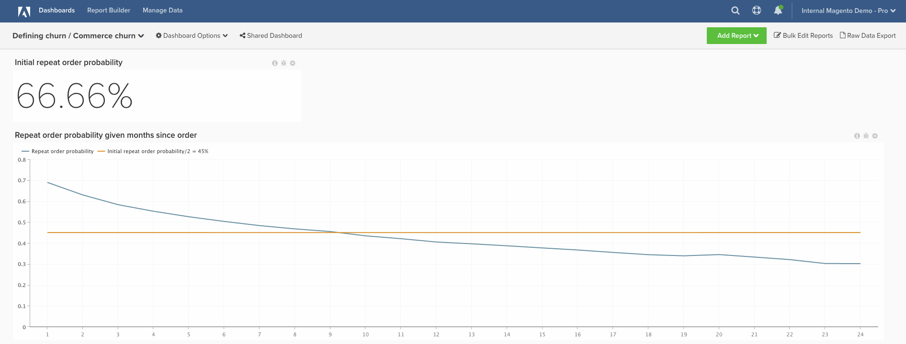

# 異動客戶流失

此主題示範如何設定控制面板，協助您定義交易式客戶的流失率。

此分析包含[進階計算資料行](../data-warehouse-mgr/adv-calc-columns.md)。

## 計算欄

要建立的欄

* `customer_entity`資料表
* `Customer's lifetime number of orders`
* 選取定義： `Count`
* 選取[!UICONTROL table]： `sales_flat_order`
* 選取[!UICONTROL column]： **`entity_id`**
* [!UICONTROL Path]： sales_flat_order.customer_id = customer_entity.entity_id
* [!UICONTROL Filter]：
* 已計算的訂單

* `sales_flat_order`資料表
* `Customer's lifetime number of orders`
* 選取定義：聯結欄
* 選取[!UICONTROL table]： `customer_entity`
* 選取[!UICONTROL column]： `Customer's lifetime number of orders`
* [!UICONTROL Path]： `sales_flat_order.customer_id = customer_entity.entity_id`
* [!UICONTROL Filter]： `Orders we count`

* `Seconds since created_at`
* 選取定義： `Age`
* 選取[!UICONTROL column]： `created_at`

* **`Customer's order number`**&#x200B;是由分析人員建立，作為您&#x200B;**[定義流失]**&#x200B;票證的一部分
* **`Is customer's last order`**&#x200B;是由分析人員建立，作為您&#x200B;**[定義流失]**&#x200B;票證的一部分
* **`Seconds since previous order`**&#x200B;是由分析人員建立，作為您&#x200B;**[定義流失]**&#x200B;票證的一部分
* **`Months since order`**&#x200B;是由分析人員建立，作為您&#x200B;**[定義流失]**&#x200B;票證的一部分
* **`Months since previous order`**&#x200B;是由分析人員建立，作為您&#x200B;**[定義流失]**&#x200B;票證的一部分

## 量度

沒有新量度！

>[!NOTE]
>
>在建立新報表之前，請務必[將所有新欄新增為量度](../data-warehouse-mgr/manage-data-dimensions-metrics.md)的維度。

## 報表

* **初始重複順序機率**
* 量度A：所有時間重複訂單
* [!UICONTROL Metric]： `Number of orders`
* [!UICONTROL Filter]： `Customer's order number greater than 1`

* 量度B：所有時間訂單
* [!UICONTROL Metric]：訂單數

* [!UICONTROL Formula]：初始重複順序機率
* 
  [！UICONTROL公式]: `A/B`
* 
  [!UICONTROL Format]: `Percent`

* [!UICONTROL Time period]： `All time`
* 
  [!UICONTROL Interval]: `None`
* 
  [!UICONTROL Chart type]: `Scalar`

* **自訂單**&#x200B;以來的指定月份重複訂單機率
* 量度A：自上次訂購後依月份重複訂購（隱藏）
* [!UICONTROL Metric]： `Number of orders`
* 
  [!UICONTROL Perspective]: `Cumulative`
* [!UICONTROL Filter]： `Customer's order number greater than 1`

* 量度B：按訂購後月份的最後訂單（隱藏）
* [!UICONTROL Metric]： `Number of orders`
* 
  [!UICONTROL Perspective]: `Cumulative`
* [!UICONTROL Filter]： `Is customer's last order? (Yes/No) = Yes`

* 量度C：所有時間重複訂單（隱藏）
* [!UICONTROL Metric]： `Number of orders`
* [!UICONTROL Filter]： `Customer's order number greater than 1`

* 
  [！UICONTROL群組依據]: `Independent`

* 量度D：所有上次訂單（隱藏）
* [!UICONTROL Metric]： `Number of orders`
* [!UICONTROL Filter]： `Is customer's last order? (Yes/No) = Yes`

* 
  [！UICONTROL群組依據]: `Independent`

* [!UICONTROL Formula]：初始重複順序機率
* 
  [！UICONTROL公式]: `(C-A)/(C+D-A-B)`
* 
  [!UICONTROL Format]: `Percent`

* [!UICONTROL Time period]： `All time`
* 
  [!UICONTROL Interval]: `None`
* [!UICONTROL Group by]： `Months since previous order`
* 顯示top.bottom：前24個類別，依類別名稱排序

* 
  [!UICONTROL Chart type]: `Line`

初始重複訂購機率報表代表「重複訂購總數/訂購總數」。 每個訂單都是重複訂單的機會；重複訂單的數量是實際重複訂單的子集。

您使用的公式將簡化為（X個月後發生的重複訂單總數）/ （至少X個月前的訂單總數）。 它向我們顯示，從歷史來看，由於自下訂單以來已有X個月，使用者下另一個訂單的可能性為Y%。

當您建置控制面板後，最常見的問題是：如何使用此功能來判斷流失臨界值？

**此問題沒有「一個正確答案」。**&#x200B;但是，Adobe建議尋找直線與初始重複機率一半的值相交的點。 這時您可以說「如果使用者要重複訂單，他們現在可能已經完成了。」 基本上，目標是選取從「保留」切換為「重新啟用」的合理臨界值。

編譯所有報表後，您可以視需要在控制面板上組織報表。 結果看起來可能像頁面頂端的影像

如果您在建立此分析時遇到任何問題，或只是想與專業服務團隊互動，請[聯絡支援人員](https://experienceleague.adobe.com/docs/commerce-knowledge-base/kb/troubleshooting/miscellaneous/mbi-service-policies.html)。
