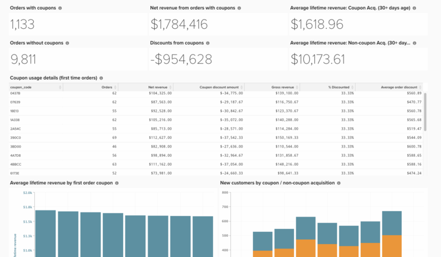

# 基本抵用券程式碼分析

瞭解企業的優惠券成效是細分訂單和更好地瞭解客戶習慣的有趣方式。

本主題記錄建立此分析所需的步驟，以瞭解取得優惠券的客戶如何執行、檢視趨勢以及追蹤個別優惠券程式碼的使用情況。

<!--{: width="807" height="471"}-->

## 快速入門

首先，附註說明如何追蹤優惠券代碼。 如果客戶將抵用券套用至訂單，則會發生下列三件事：

* 折扣反映在`base_grand_total`金額中(您的`Revenue`量度在Commerce Intelligence中)
* 優惠券代碼儲存在`coupon_code`欄位中。 如果此欄位為NULL （空白），則訂單沒有相關聯的抵用券。
* 折扣金額儲存在`base_discount_amount`中。 根據您的設定，此值可能顯示為負數或正數。

自Commerce 2.4.7起，客戶可將多個抵用券代碼套用至訂單。 在此案例中：

* 所有套用的優惠券代碼都儲存在`coupon_code`的`sales_order_coupons`欄位中。 套用的第一個抵用券代碼也儲存在`coupon_code`的`sales_order`欄位中。 如果此欄位為NULL （空白），則訂單沒有相關聯的抵用券。

## 建立量度

第一步是透過下列步驟建構新的量度：

* 瀏覽至&#x200B;**[!UICONTROL Manage Data > Metrics > Create New Metric]**。

* 選取`sales_order`。
* 此量度在&#x200B;**base_discount_amount**&#x200B;欄上執行&#x200B;**Sum**，排序方式為&#x200B;**created_at**。
   * [!UICONTROL Filters]：
      * 新增`Orders we count` （儲存的篩選器集）
      * 新增下列專案：
         * `coupon_code`**不是**`[NULL]`
      * 為量度命名，例如`Coupon discount amount`。

## 建立您的控制面板

* 建立量度後：
   * 導覽至[!UICONTROL Dashboards > Dashboard Options > Create New Dashboard]**。
   * 為儀表板命名，例如`_Coupon Analysis_`。

* 您可在此建立和新增所有報表。

## 建立報表

* **新報告：**

>[!NOTE]
>
>每個報告的**0&rbrace;列為[!UICONTROL Time Period]。 `All-time`您可以根據分析需求隨意變更。 Adobe建議此儀表板上的所有報告涵蓋相同時段，例如`All time`、`Year-to-date`或`Last 365 days`。

* **含優惠券的訂單**
   * &#x200B;
     [!UICONTROL 公制]: `Orders`
      * 新增篩選器：
         * [`A`] `coupon_code` **不是** `[NULL]`

   * [!UICONTROL Time period]： `All time`
   * &#x200B;
     [!UICONTROL 間隔]: `None`
   * [!UICONTROL Chart type]：`Number (scalar)`

* **沒有優惠券的訂單**
   * &#x200B;
     [!UICONTROL 公制]: `Orders`
      * 新增篩選器：
         * [`A`] `coupon_code` **是** `[NULL]`

   * [!UICONTROL Time period]： `All time`
   * &#x200B;
     [!UICONTROL 間隔]: `None`
   * [!UICONTROL Chart type]：`Number (scalar)`

* **含優惠券的訂單淨收入**
   * &#x200B;
     [!UICONTROL 公制]: `Revenue`
      * 新增篩選器：
         * [`A`] `coupon_code` **不是** `[NULL]`

   * [!UICONTROL Time period]： `All time`
   * &#x200B;
     [!UICONTROL 間隔]: `None`
   * [!UICONTROL Chart type]： `Number (scalar)`

* **優惠券折扣**
   * [!UICONTROL Metric]： `Coupon discount amount`
   * [!UICONTROL Time period]： `All time`
   * &#x200B;
     [!UICONTROL 間隔]: `None`
   * [!UICONTROL Chart type]： `Number (scalar)`

* **平均期限收入：已取得優惠券的客戶**
   * [!UICONTROL Metric]： `Avg lifetime revenue`
      * 新增篩選器：
         * [`A`] `Customer's first order's coupon_code` **不是** `[NULL]`

   * [!UICONTROL Time period]： `All time`
   * &#x200B;
     [!UICONTROL 間隔]: `None`
   * [!UICONTROL Chart type]： `Number (scalar)`

* **平均期限收入：非優惠券取得的客戶**
   * [!UICONTROL Metric]： `Avg lifetime revenue`
      * 新增篩選器：
         * [A] `Customer's first order's coupon_code` **IS**`[NULL]`

   * [!UICONTROL Time period]： `All time`
   * &#x200B;
     [!UICONTROL 間隔]: `None`
   * [!UICONTROL Chart type]： `Number (scalar)`

* **優惠券使用詳細資料（首次訂購）**
   * 量度`1`： `Orders`
      * 新增篩選器：
         * [`A`] `coupon_code` **不是**`[NULL]`
         * [`B`] `Customer's order number` **等於** `1`

   * 量度`2`： `Revenue`
      * 新增篩選器：
         * [`A`] `coupon_code` **不是**`[NULL]`
         * [`B`] `Customer's order number` **等於** `1`

      * 重新命名： `Net revenue`

   * 量度`3`： `Coupon discount amount`
      * 新增篩選器：
         * [`A`] `coupon_code` **不是**`[NULL]`
         * [`B`] `Customer's order number` **等於** `1`

   * 建立公式： `Gross revenue`
      * [!UICONTROL Formula]： `(B – C)`
      * &#x200B;
        [!UICONTROL Format]: `Currency`

   * 建立公式： **%已折扣**
      * 公式： `(C / (B - C))`
      * &#x200B;
        [!UICONTROL Format]: `Percentage`

   * 建立公式： `Average order discount`
      * [!UICONTROL Formula]： `(C / A)`
      * &#x200B;
        [!UICONTROL Format]: `Percentage`

   * [!UICONTROL Time period]： `All time`
   * &#x200B;
     [!UICONTROL 間隔]: `None`
   * &#x200B;
     [!UICONTROL 圖表型別]: `Table`

* **依第一筆贈券的平均期限收入**
   * [!UICONTROL Metric]：**平均期限收入**
      * 新增篩選器：
         * [`A`] `coupon_code` **是**`[NULL]`

   * [!UICONTROL Time period]： `All time`
   * &#x200B;
     [!UICONTROL 間隔]: `None`
   * [!UICONTROL Chart type]： `Number (scalar)`

* **優惠券使用詳細資料（首次訂購）**
   * [!UICONTROL Metric]： `Avg lifetime revenue`
      * 新增篩選器：
         * [`A`] `Customer's first order's coupon_code` **不是** `[NULL]`

   * [!UICONTROL Time period]： `All time`
   * &#x200B;
     [!UICONTROL 間隔]: `None`
   * [!UICONTROL Group by]： `Customer's first order's coupon_code`
   * &#x200B;
     [!UICONTROL 圖表型別]: **Column**

* **依優惠券/非優惠券贏取的新客戶**
   * 量度`1`： `New customers`
      * 新增篩選器：
         * [`A`] `Customer's first order's coupon_code` **不是** `[NULL]`

      * [!UICONTROL Rename]： `Coupon acquisition customer`

   * 量度`2`： `New customers`
      * 新增篩選器：
         * [`A`] `coupon_code` **是**`[NULL]`

      * [!UICONTROL Rename]： `Non-coupon acquisition customer`

   * [!UICONTROL Time period]： `All time`
   * [!UICONTROL Interval]： `By Month`
   * [!UICONTROL Chart type]： `Stacked Column`

建立報表後，請參閱本主題頂端的影像，瞭解如何在控制面板上組織報表。

>[!NOTE]
>
>截至Adobe Commerce 2.4.7，客戶可以使用&#x200B;**quote_coupons**&#x200B;和&#x200B;**sales_order_coupons**&#x200B;資料表，深入瞭解客戶如何使用多張優惠券。

