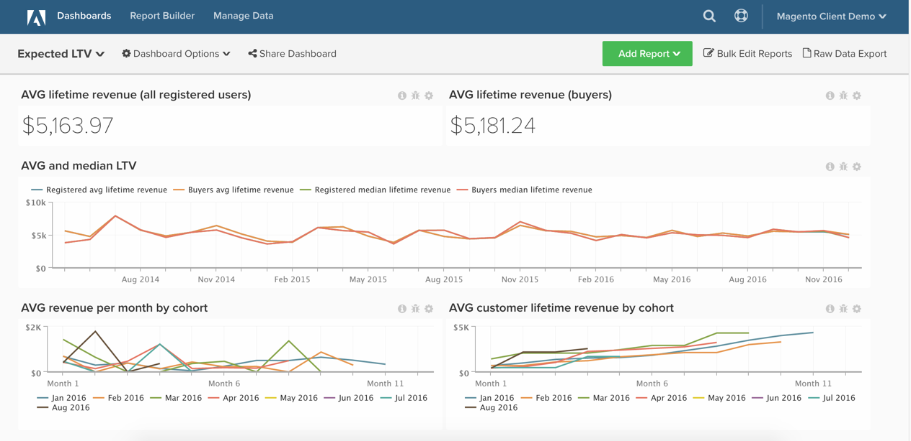

# 預期期限值分析

本文示範如何設定控制面板，協助您了解客戶期限值成長和客戶預期期限值。

此分析僅適用於新架構的Pro客戶。 如果您的帳戶可存取 `Persistent Views` 功能 `Manage Data` 側欄，表示您使用新架構，並可依照此處列出的指示自行建立此分析。

開始之前，請熟悉 [同類群組報告建立工具。](../dev-reports/cohort-rpt-bldr.md)

## 計算欄

要在 **訂購** 表格若使用 **30天月**:

* [!UICONTROL Column name]: `Months between first order and this order`
* [!UICONTROL Column type]: `Same Table`
* 
   [!UICONTROL Column equation]: `CALCULATION`
* [!UICONTROL Column input]:A = `Seconds between customer's first order date and this order`
* 
   [!UICONTROL Datatype]: `Integer`
* **定義：**`case when A is null then null when A <= 0 then '1'::int else (ceil(A)/2629800)::int end`

* [!UICONTROL Column name]: `Months since order`
* [!UICONTROL Column type]: `Same Table`
* 
   [!UICONTROL Column equation]: `CALCULATION`
* [!UICONTROL Column input]:A = `created_at`
* 
   [!UICONTROL Datatype]: `Integer`
* 定義： `case when created_at is null then null else (ceil((extract(epoch from current_timestamp) - extract(epoch from created_at))/2629800))::int end`

要在 **`orders`** 表格若使用 **日曆** 月：

* [!UICONTROL Column name]: `Calendar months between first order and this order`
* [!UICONTROL Column type]: `Same Table`
* 
   [!UICONTROL Column equation]: `CALCULATION`
* [!UICONTROL Column inputs]:
   * `A` = `created_at`
   * `B` = `Customer's first order date`

* 
   [!UICONTROL Datatype]: `Integer`
* 定義： `case when (A::date is null) or (B::date is null) then null else ((date_part('year',A::date) - date_part('year',B::date))*12 + date_part('month',A::date) - date_part('month',B::date))::int end`

* [!UICONTROL Column name]: `Calendar months since order`
* [!UICONTROL Column type]: `Same Table`
* 
   [!UICONTROL Column equation]: `CALCULATION`
* [!UICONTROL Column input]: `A` = `created_at`
* 
   [!UICONTROL Datatype]: `Integer`
* **定義：**`case when A is null then null else ((date_part('year',current_timestamp::date) - date_part('year',A::date))*12 + date_part('month',current_timestamp::date) - date_part('month',A::date))::int end`

* [!UICONTROL Column name]: `Is in current month? (Yes/No)`
* [!UICONTROL Column type]: `Same Table`
* 
   [!UICONTROL Column equation]: `CALCULATION`
* [!UICONTROL Column input]:A = `created_at`
* 
   [!UICONTROL Datatype]: `String`
* 定義： `case when A is null then null when (date_trunc('month', current_timestamp::date))::varchar = (date_trunc('month', A::date))::varchar then 'Yes' else 'No' end`

## 量度

### 量度指示

要建立的量度

* **依首次訂購日期區分客戶**
   * 如果啟用來賓訂單，請使用 `customer_email`

* 在 **`orders`** 表格
* 此量度會執行 **計算不重複值**
* 在 **`customer_id`** 欄
* 由 **`Customer's first order date`** timestamp

>[!NOTE]
>
>一定要 [將所有新欄新增為量度](../../data-analyst/data-warehouse-mgr/manage-data-dimensions-metrics.md) 建立新報表之前。

## 報表

### 報表指示

**每個客戶的預期收入（按月）**

* 量度 `A`: `Revenue (hide)`
   * `Calendar months between first order and this order` `<= X` （選擇X的合理數字，例如24個月）
   * `Is in current month?` = `No`

* 
   [!UICONTROL量度]: `Revenue`
* [!UICONTROL Filter]:

* 量度 `B`: `All time customers (hide)`
   * `Is in current month?` = `No`

* [!UICONTROL Metric]: `New customers by first order date`
* [!UICONTROL Filter]:

* 量度 `C`: `All time customers by month since first order (hide)`
   * `Calendar months since order` `<= X`
   * `Is in current month?` = `No`

* [!UICONTROL Metric]: `New customers by first order date`
* [!UICONTROL Filter]:

* [!UICONTROL Formula]: `Expected revenue`
* [!UICONTROL Formula]: `A / (B - C)`
* 

   [!UICONTROL Format]: `Currency`

其他圖表詳細資訊

* [!UICONTROL Time period]: `All time`
* 時間間隔： `None`
* [!UICONTROL Group by]: `Calendar months between first order and this order`  — 全部顯示
* 變更 `group by` 針對 `All time customers` 量度設為獨立，使用旁邊的鉛筆圖示 `group by`
* 編輯 `Show top/bottom` 欄位如下：
   * [!UICONTROL Revenue]: `Top 24 sorted by Calendar months between first order and this order`
   * [!UICONTROL All time customers]: `Top 24 sorted by All time customers`
   * [!UICONTROL All time customers by month since first order]: `Top 24 sorted by All time customers by month since first order`

**依同類群組每月平均收入**

* 量度 `A`: `Revenue`
* 
   [!UICONTROL Metric view]: `Cohort`
* [!UICONTROL Cohort date]: `Customer's first order date`
* [!UICONTROL Perspective]: `Average value per cohort member`

**依同類群組的每月累積平均收入**

* 量度 `A`: `Revenue`
* 
   [!UICONTROL Metric view]: `Cohort`
* [!UICONTROL Cohort date]: `Customer's first order date`
* [!UICONTROL Perspective]: `Cumulative average value per cohort member`

編譯所有報表後，您可以視需要在控制面板上組織報表。 結果可能像頁面頂端的影像。

如果在構建此分析時遇到任何問題，或只是希望與專業服務團隊接洽， [聯絡支援](https://experienceleague.adobe.com/docs/commerce-knowledge-base/kb/troubleshooting/miscellaneous/mbi-service-policies.html?lang=en).
