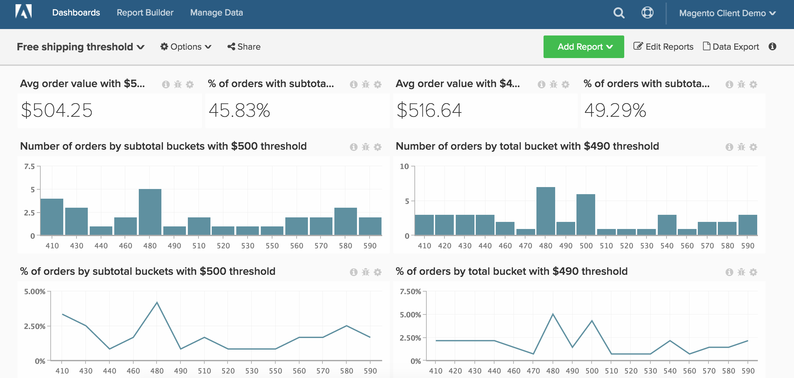

# 免運費

>[!NOTE]
>
>本文包含使用原始架構和新架構的用戶端指示。 如果您在主工具列選取「管理資料」後，有「Data Warehouse檢視」區段可供使用，則可使用新架構。

本文示範如何設定控制面板，以追蹤免費運送臨界值的效能。 此控制面板（如下所示）是A/B測試兩個免運費臨界值的絕佳方式。 例如，您的公司可能不確定您應以$50還是$100提供免運費。 您應對客戶的兩個隨機子集執行A/B測試，並在 [!DNL MBI].

開始之前，您需要識別兩個不同的時段，其中您的商店免運費臨界值的值不同。

此分析包含 [進階計算欄](../data-warehouse-mgr/adv-calc-columns.md).

## 計算欄

如果您位在原始架構上(例如，如果您沒有 `Data Warehouse Views` 選項 `Manage Data` 功能表)，您需要聯絡支援團隊以建置下列。 在新架構上，可從 `Manage Data > Data Warehouse` 頁面。 詳細說明如下。

* **`sales_flat_order`** 表格
   * 此計算會建立相對於一般購物車大小增量的貯體。 這可以是增量，包括5、10、50、100

* **`Order subtotal (buckets)`** 原始架構：由分析師建立，作為 `[FREE SHIPPING ANALYSIS]` 票證
* **`Order subtotal (buckets)`** 新架構：
   * 如上所述，此計算會建立相對於一般購物車大小以增量為單位的貯體。 如果您有原生小計欄，例如 `base_subtotal`，可作為此新欄的基礎。 否則，它可以是從收入中排除運費和折扣的計算欄。
   >[!NOTE]
   >
   >「貯體」大小取決於適合您作為客戶的項目。 你可以從 `average order value` 並建立一些小於且大於該量的桶。 查看下面的計算時，您可以了解如何輕鬆複製部分查詢、編輯查詢並建立其他儲存貯體。 此範例以50為增量完成。

   * `Column type - Same table, Column definition - Calculation, Column Inputs-` `base_subtotal`，或 `calculated column`, `Datatype`: `Integer`
   * [!UICONTROL Calculation]: `case when A >= 0 and A<=200 then 0 - 200`
何時 `A< 200` 和 `A <= 250` then `201 - 250`
when `A<251` 和 `A<= 300` then `251 - 300`
when `A<301` 和 `A<= 350` then `301 - 350`
when `A<351` 和 `A<=400` then `351 - 400`
when `A<401` 和 `A<=450` then `401 - 450`
其他「450歲以上」的結尾

## 量度

無新量度!!!

>[!NOTE]
>
>一定要 [將所有新欄新增為量度](../data-warehouse-mgr/manage-data-dimensions-metrics.md) 建立新報表之前。

## 報表

* **具有發運規則A的平均訂單值**
   * [!UICONTROL Metric]: `Average order value`

* 量度 `A`: `Average Order Value`
* [!UICONTROL Time period]: `Time period with shipping rule A`
* 
   [!UICONTROL Interval]: `None`
* 

   [!UICONTROL Chart Type]: `Scalar`

* **按裝貨規則A的小計時段列出的訂單數**
   * [!UICONTROL Metric]: `Number of orders`

   >[!NOTE]
   >
   >您可以顯示頂端來切掉尾端 `X` `sorted by` `Order subtotal` （貯體） `Show top/bottom`.

* 量度 `A`: `Number of orders`
* [!UICONTROL Time period]: `Time period with shipping rule A`
* 
   [!UICONTROL Interval]: `None`
* [!UICONTROL Group by]: `Order subtotal (buckets)`
* 

   [!UICONTROL Chart Type]: `Column`

* **訂單百分比（按小計），與發運規則A**
   * [!UICONTROL Metric]: `Number of orders`

   * [!UICONTROL Metric]: `Number of orders`
   * 
      [!UICONTROL分組依據]: `Independent`
   * [!UICONTROL Formula]: `(A / B)`
   * 

      [!UICONTROL Format]: `%`

* 量度 `A`: `Number of orders by subtotal (hide)`
* 量度 `B`: `Total number of orders (hide)`
* [!UICONTROL Formula]: `% of orders`
* [!UICONTROL Time period]: `Time period with shipping rule A`
* 
   [!UICONTROL Interval]: `None`
* [!UICONTROL Group by]: `Order subtotal (buckets)`
* 

   [!UICONTROL Chart Type]: `Line`

* **小計超過發運規則A的訂單百分比**
   * [!UICONTROL Metric]: `Number of orders`
   * 

      [!UICONTROL Perspective]: `Cumulative`

   * [!UICONTROL Metric]: `Number of orders`
   * 

      [!UICONTROL分組依據]: `Independent`

   * [!UICONTROL Formula]: `1- (A / B)`
   * 

      [!UICONTROL Format]: `%`

* 量度 `A`: `Number of orders by subtotal`
* 量度 `B`: `Total number of orders (hide)`
* [!UICONTROL Formula]: `% of orders`
* [!UICONTROL Time period]: `Time period with shipping rule A`
* 
   [!UICONTROL Interval]: `None`
* [!UICONTROL Group by]: `Order subtotal (buckets)`
* 

   [!UICONTROL Chart Type]: `Line`

對發運規則B和時段重複上述步驟和報告。

編譯所有報表後，您可以視需要在控制面板上組織報表。 結果可能類似於此頁頂部的影像。
