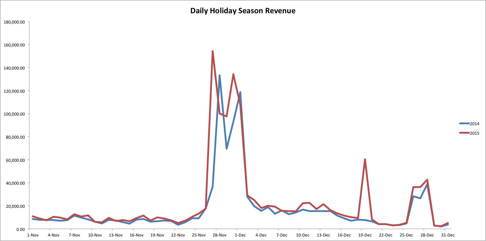

# 假日購物分析

對於你的企業來說，假期可能是一年中最繁忙的時期之一。 對於擁有大量美國顧客的零售商來說，假日季節通常會跨越感恩節和新年之間的幾個月。

年內任何時候都能體驗到乳酪；例如，如果貴公司銷售短褲或泳池用品，則夏季可能會遇到熱潮。 在本主題中，我們將探索有助於您比較不同年份的旺季的分析。

## 建議量度

分析節日季績效時，請考慮分析([或建築](../../data-user/reports/ess-manage-data-metrics.md))這些量度：

### 新客戶數、訂單數、收入

要幫助您了解今年的增長模式與往年相比如何，請考慮分析這些指標。 新客戶數量、新訂單數量和收入將顯示您指定的時間範圍（節假日季）的日常業績。 您也可以使用累積透視來分析這些測量，以查看量度在一段時間內的變化。

### 平均訂購值

此測量會顯示節假日季節的整體平均訂購值。

## 範例：每日節假日季收入

現在我們知道要分析的量度了，我們查看了2014年和2015年11月和12月的節假日季收入資料範例。

在此範例中，2014年和2015年的收入有兩個大幅尖峰：這些增加與黑色星期五和網路星期一同時進行。 請注意，2014年和2015年的尖峰不在同一天。 這是因為2014年11月27日是黑色星期五，2015年11月28日是黑色星期五。 同樣，2014年11月30日是網路星期一，2015年12月1日是網路星期一。

此外，2015年12月19日的收入也出現2014年未出現的飆升。 在這個特定的週六，有可能出售了去年沒有的股票。

除上述數個日期外，該兩年之收入會一併追蹤。

## 我該考慮哪些問題？

為協助您了解業務的季節性趨勢，在探索自己的資料時，請謹記以下幾個問題：

* 預期的趨勢是年復一年嗎？
* 這些趨勢是否反映了您對各季不同的期望？
* 年年有不同嗎？ 這些差異可以解釋嗎？
* 在特定年度提供促銷活動嗎？
* 價格在特定一年內是否上漲？
* 廣告支出是否在特定一年增加？

## 我還應分析什麼？

一個選項是分析客戶在節假日期間的購買行為。 在節日期間購買的客戶是否比在節日期間購買的客戶花費更多或購買頻率更高？

另一個選項是在節假日期間，依促銷活動分析您的投資報酬率。 對於在節日期間執行的特定促銷活動，您的投資報酬率是否較高？ 在這些季節中，您是否應增加高ROI行銷活動的支出？

此外，您還可以分析折扣訂單與全價訂單的數量。 [是否大多數客戶都在等待銷售到採購訂單](../analysis/coupon-usage.md) 是在節假日期間，還是購買了全價商品？

### 相關

* [分析抵用券對贏取和保留客戶的影響](../analysis/coupon-impact.md)
* [分析客戶再購買行為](../analysis/repurchase-behavior.md)
