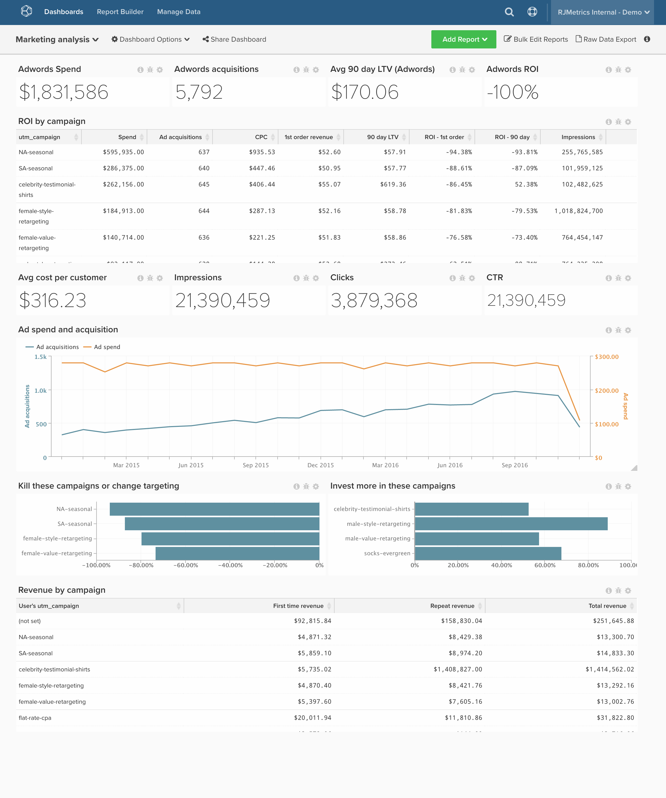

# 行銷ROI

>[!NOTE]
>
>本文包含使用原始架構和新架構的用戶端相關說明。 您在 [新架構](../../administrator/account-management/new-architecture.md) 如果您在從主工具列選取「管理資料」後，有「Data Warehouse檢視」區段可供使用。

如果你線上上廣告上花錢，你將不可避免地希望跟蹤你在此支出上的回報，並就進一步的投資做出資料驅動的決策。 在本文中，我們將示範如何設定控制面板來追蹤您的通道分析，包括匯總及依促銷活動的投資報酬率。

開始之前，您要連接 [!DNL [Facebook Ads]](../importing-data/integrations/facebook-ads.md), [!DNL [Adwords]](../importing-data/integrations/google-adwords.md)，和 [!DNL [Google Ecommerce]](../importing-data/integrations/google-ecommerce.md) 帳戶，並帶入任何額外的線上廣告支出資料。 此分析包含 [進階計算欄](../data-warehouse-mgr/adv-calc-columns.md).

## 統一表

**原始架構：** 從各種來源匯集您的支出(例如 [!DNL Facebook Ads] 或 [!DNL Google Adwords])，建議您建立 **統一表** 廣告花費的全部。 您需要一名分析師來為您完成此步驟。 如果你還沒有， [提出支援請求](../../guide-overview.md) 與主題 `[MARKETING ROI ANALYSIS]`，分析師將建立此表格。

**新架構：** 您可以遵循 [此分析程式庫](../../data-analyst/data-warehouse-mgr/create-dw-views.md) 主題。 統一表現在稱為新體系結構上的Data Warehouse視圖。

## 計算欄

要建立的列

* **`Consolidated Digital Ad Spend`** 表格
* **`Campaign name`** 將由分析師建立，作為 **[行銷ROI分析]** 票證

>[!NOTE]
>
>請參閱上方，了解全新架構的差異。

**原始和新體系結構：**

* **`sales_flat_order`** 表格
   * **`Order's GA campaign`**
      * 選取定義： `Joined Column`
      * [!UICONTROL Create Path]:
      * 
         [!UICONTROL Many]: `sales_flat_order.increment_id`
      * 

         [!UICONTROL One]: `ecommerce####.transaction_id`

      * 選取 [!UICONTROL table]: `ecommerce####`
      * 選取 [!UICONTROL column]: `campaign`
      * [!UICONTROL Path]: `sales_flat_order.increment_id = ecommerce#####.transactionID`
   * **`Order's GA medium`**
      * 選取定義：聯接列
      * 選取 [!UICONTROL table]: `ecommerce####`
      * 選取 [!UICONTROL column]: `medium`
      * [!UICONTROL Path]:sales_flat_order.increment_id = ecommerce####.transactionId
   * **`Order's GA source`**
      * 選取定義：聯接列
      * 選取 [!UICONTROL table]: `ecommerce####`
      * 選取 [!UICONTROL column]: `source`
      * [!UICONTROL Path]:sales_flat_order.increment_id = ecommerce####.transactionId ^

* **`customer_entity`** 表格
* **`Customer's first order GA campaign`**
   * 選取定義： `Max`
   * 選取 [!UICONTROL table]: `sales_flat_order`
   * 選取 [!UICONTROL column]: `Order's GA campaign`
   * [!UICONTROL Path]: `sales_flat_order.customer_id = customer_entity.entity_id`
   * [!UICONTROL Filter]:
      * `Orders we count`
      * `Customer's order number = 1`

* **`Customer's first order GA source`**
   * 選取定義： `Max`
   * 選取 [!UICONTROL table]: `sales_flat_order`
   * 選取 [!UICONTROL column]: `Order's GA source`
   * [!UICONTROL Path]:sales_flat_order.customer_id = customer_entity.entity_id
   * [!UICONTROL Filter]:
      * `Orders we count`
      * `Customer's order number = 1`

* **`Customer's first order GA medium`**
   * 選取定義： `Max`
   * 選取 [!UICONTROL table]: `sales_flat_order`
   * 選取 [!UICONTROL column]: `Order's GA medium`
   * [!UICONTROL Path]: `sales_flat_order.customer_id = customer_entity.entity_id`
   * [!UICONTROL Filter]:
      * `Orders we count`
      * `Customer's order number = 1`

* **`sales_flat_order`** 表格
* **`Customer's first order GA campaign`**
   * 選取定義： `Joined Column`
   * 選取 [!UICONTROL table]: `customer_entity`
   * 選取 [!UICONTROL column]: `Customer's first order GA campaign`
   * [!UICONTROL Path]: `sales_flat_order.customer_id = customer_entity.entity_id`

* **`Customer's first order GA source`**
   * 選取定義：聯接列
   * 選取 [!UICONTROL table]: `customer_entity`
   * 選取 [!UICONTROL column]: `Customer's first order GA source`
   * [!UICONTROL Path]: `sales_flat_order.customer_id = customer_entity.entity_id`

* **`Customer's first order GA medium`**
   * 選取定義： `Joined Column`
   * 選取 [!UICONTROL table]: `customer_entity`
   * 選取 [!UICONTROL column]: `Customer's first order GA medium`
   * [!UICONTROL Path]: `sales_flat_order.customer_id = customer_entity.entity_id`

## 量度

* **廣告支出**
* 在 **`Consolidated Digital Ad Spend`** 表格
* 此量度會執行 **總和**
* 在 **`adCost`** 欄
* 由 **`date`** timestamp

* **廣告曝光數**
* 在 **`Consolidated Digital Ad Spend`** 表格
* 此量度會執行 **總和**
* 在 **`Impressions`** 欄
* 由 **`Month`** timestamp

* **廣告點按次數**
* 在 **`Consolidated Digital Ad Spend`** 表格
* 此量度會執行 **總和**
* 在 **`adClicks`** 欄
* 由 **`Month`** timestamp

>[!NOTE]
>
>一定要 [將所有新欄新增為量度](../../data-analyst/data-warehouse-mgr/manage-data-dimensions-metrics.md) 建立新報表之前。

## 報表

* **廣告花費（所有時間）**
   * [!UICONTROL Metric]:廣告支出

* 量度 `A`:廣告支出
* [!UICONTROL Time period]: `All time`
* 
   [!UICONTROL間隔]: `None`
* 

   [!UICONTROL Chart Type]: `Scalar`

* **廣告客戶贏取（所有時間）**
   * [!UICONTROL Metric]: `New customers`
   * [!UICONTROL Filters]:
      * `User's first order's source LIKE %google%`
      * `User's first order's source LIKE %facebook%`
      * `User's first order's source LIKE %fb%`
      * `User's first order's medium IN cpc, ppc`
      * 篩選邏輯：([`A`] 或 [`B`] 或 [`C`])和 [`D`]

* 量度 `A`: `Ad customer acquisitions`
* [!UICONTROL Time period]: `All time`
* 
   [!UICONTROL間隔]: `None`
* 

   [!UICONTROL Chart Type]: `Scalar`

* **廣告ROI**
   * [!UICONTROL Metric]:廣告支出

   * [!UICONTROL Metric]: `New customers`
   * [!UICONTROL Filters]:
      * `User's first order's source LIKE %google%`
      * `User's first order's source LIKE %facebook%`
      * `User's first order's source LIKE %fb%`
      * `User's first order's medium IN cpc, ppc`
      * 篩選邏輯：([`A`] 或 [`B`] 或 [`C`])和 [`D`]
   * [!UICONTROL Metric]:平均期限收入
   * [!UICONTROL Filters]:
      * `User's first order's source LIKE %google%`
      * `User's first order's source LIKE %facebook%`
      * `User's first order's source LIKE %fb%`
      * `User's first order's medium IN cpc, ppc`
      * 篩選邏輯：([`A`] 或 [`B`] 或 [`C`])和 [`D`]
   * [!UICONTROL Formula]: `((C - (A / B)) / (A / B))`
   * 

      [!UICONTROL Format]: `Percentage`

* 量度 `A`: `Ad Spend (hide)`
* 量度 `B`: `Ad customer acquisitions (hide)`
* 量度 `C`: `Average LTV (hide)`
* [!UICONTROL Formula]: `Ads ROI`
* [!UICONTROL Time period]: `All time`
* 
   [!UICONTROL間隔]: `None`
* 

   [!UICONTROL Chart Type]: `Scalar`

* **按ga介質的訂單數**
   * 

      [!UICONTROL量度]: `Orders`

* 量度 `A`: `Orders`
* [!UICONTROL Time period]: `All time`
* [!UICONTROL Interval]: `By Month`
* [!UICONTROL Group by]: `Order's medium`
* 

   [!UICONTROL Chart Type]: `Area`

* **依行銷活動的廣告投資報酬率**
   * [!UICONTROL Metric]: `Ad Spend`

   * [!UICONTROL Metric]:`New customers`
   * [!UICONTROL Filters]:
      * `User's first order's source LIKE %google%`
      * `User's first order's source LIKE %facebook%`
      * `User's first order's source LIKE %fb%`
      * `User's first order's medium IN cpc, ppc`
      * 篩選邏輯：([`A`] 或 [`B`] 或 [`C`])和 [`D`]
   * [!UICONTROL Metric]:平均期限收入
   * [!UICONTROL Filters]:
      * `User's first order's source LIKE %google%`
      * `User's first order's source LIKE %facebook%`
      * `User's first order's source LIKE %fb%`
      * `User's first order's medium IN cpc, ppc`
      * 篩選邏輯：([`A`] 或 [`B`] 或 [`C`])和 [`D`]
   * [!UICONTROL Metric]:訂購的平均期限數
   * [!UICONTROL Filters]:
      * `User's first order's source LIKE %google%`
      * `User's first order's source LIKE %facebook%`
      * `User's first order's source LIKE %fb%`
      * `User's first order's medium IN cpc, ppc`
      * 篩選邏輯：([`A`] 或 [`B`] 或 [`C`])和 [`D`]
   * [!UICONTROL Formula]: `(A / B)`
   * 

      [!UICONTROL Format]: `Currency`

   * [!UICONTROL Formula]: `(C - (A / B))`
   * 

      [!UICONTROL Format]: `Currency`

   * [!UICONTROL Formula]: `((C - (A / B)) / (A / B))`
   * 

      [!UICONTROL Format]: `Percentage`

   * [!UICONTROL Metric]: `Ad Clicks`

   * [!UICONTROL Metric]: `Ad Impressions`

   * [!UICONTROL Formula]: `(H / I)`
   * 

      [!UICONTROL Format]: `Percentage`

   * [!UICONTROL Formula]: `(A / H)`
   * 

      [!UICONTROL Format]: `Currency`

* 量度 `A`: `Ad Spend` （隱藏）
* 量度 `B`: `Ad customer acquisitions`
* 量度 `C`: `Average LTV`
* 量度 `D`: `Average lifetime # of orders`
* 
   [!UICONTROL公式]: `CAC`
* [!UICONTROL Formula]: `Avg return`
* [!UICONTROL Formula]: `Ads ROI`
* 量度 `H`: `adClicks`
* 量度 `I`: `Impressions`
* 
   [!UICONTROL公式]: `CTR`
* 
   [!UICONTROL公式]: `CPC`
* [!UICONTROL Time period]: `All time`
* 
   [!UICONTROL間隔]: `None`
* 
   [!UICONTROL分組依據]: `campaign` (將「客戶的首次訂購」促銷活動用於非廣告支出表度量)
* 

   [!UICONTROL Chart Type]: `Table`

如果您在建立此分析時遇到任何問題，或只是想與我們的專業服務團隊接洽， [聯絡支援](https://experienceleague.adobe.com/docs/commerce-knowledge-base/kb/troubleshooting/miscellaneous/mbi-service-policies.html?lang=en).

### 相關

* [中UTM標籤的最佳作法 [!DNL Google Analytics]](../../best-practices/utm-tagging-google.md)
* [如何 [!DNL Google Analytics] UTM歸因功能是否正常？](../analysis/utm-attributes.md)
