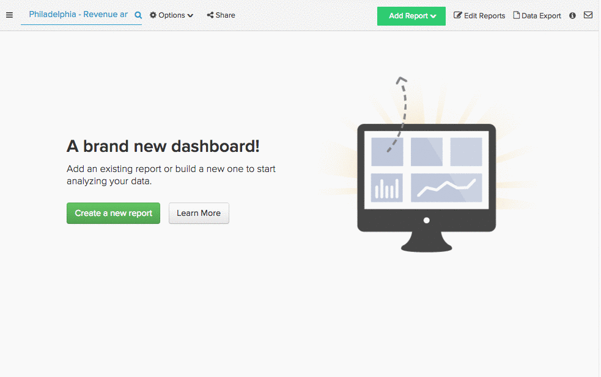
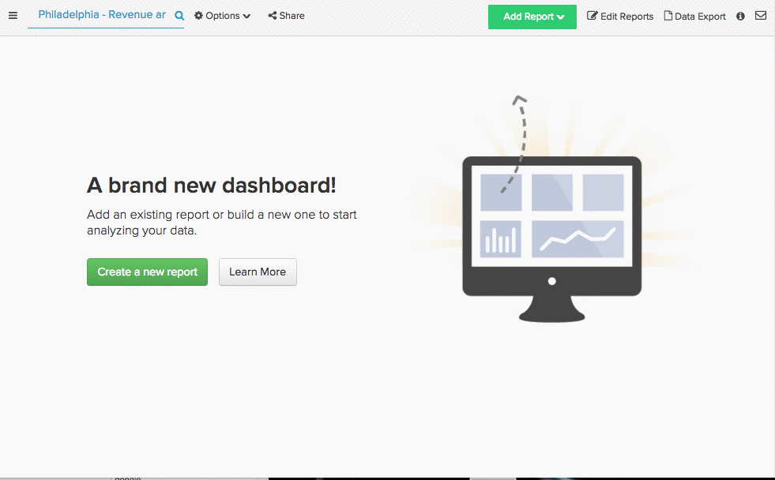
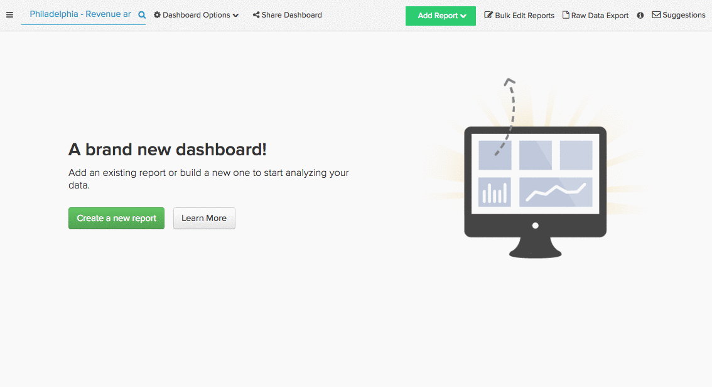
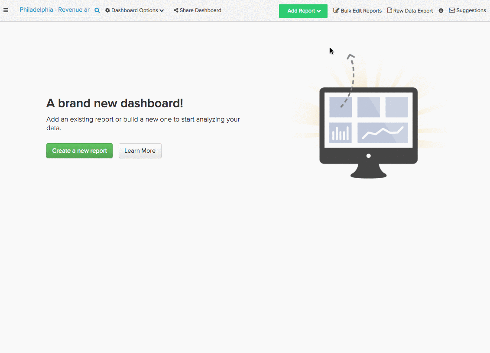

# 識別成功的行銷來源

您調查了對象、建立了行銷活動、投資了幾個行銷管道。 現在時間已經過去，這些管道的表現如何？ 哪個頻道吸引的新使用者最多？ 哪一個來源對您的總收入貢獻最大？

透過[!DNL Adobe Commerce Intelligence]，您可以透過反向連結來源輕鬆將收入和使用者分段，不論是對應至[!DNL [Google Analytics' UTM fields]](https://support.google.com/analytics/answer/1191184?hl=en)或自訂資料欄位。 此細分可讓您找到績效最佳的管道，並更好地投入行銷預算。

本主題會探索一些可用來發掘您最有價值行銷管道的報告：

* [依來源的新使用者](#newusersbysource)
* [依使用者來源的平均期限收入](#avglifetimerev)
* [依使用者來源的平均訂單值](#avgorderval)
* [依使用者註冊日期和來源列出的收入](#revbyregdateandsource)
* [依使用者來源重複訂單](#repeatordersbysource)

## 先決條件 {#prereqs}

若要在此主題中建立分析，您必須存取行銷贏取/轉介來源資料。 如果您尚未追蹤此專案，您必須先將[訂單轉介來源資料從 [!DNL Google ECommerce]](../importing-data/integrations/google-ecommerce.md)匯入[!DNL Adobe Commerce Intelligence]，才能繼續。 此外，將使用者裝置資訊新增至分析時，可讓您檢視反向連結所使用的技術。

## 依來源的新使用者 {#newusersbysource}

評估反向連結來源的效能，是決定您最具價值管道的關鍵。 此報表會依贏取來源顯示一段時間內新註冊的使用者數量，以便您追蹤反向連結來源在贏取新註冊使用者時的效能。

若要在[Report Builder](../../tutorials/using-visual-report-builder.md)中建立此報表，請將&#x200B;**新使用者**&#x200B;量度（或計算一段時間內新使用者人數的同等量度）新增至報表。 然後執行下列動作：

1. 將[!UICONTROL Time Period]設定為您要分析的註冊期間。
1. 將[!UICONTROL Interval]設定為每月。
1. 將[!UICONTROL Group By]設為贏取（或轉介）來源，並選取您要包含的來源。
1. 此範例使用`stacked columns` [!UICONTROL chart type]。

以下是視覺化逐步解說：

## 依使用者來源的平均期限收入 {#avglifetimerev}

尋找帶來新使用者的管道很重要，但這些反向連結整體上有多大價值？ 此報表顯示一段時間內來自特定贏取來源的使用者平均期限收入。 換言之，這可讓您檢視從特定來源取得的使用者在其一生中與您共用的時間是否比從不同來源取得的一組使用者多。

若要在Report Builder中建立此報表，請新增&#x200B;**平均期限收入**&#x200B;量度至報表。 然後執行下列動作：

1. 將[!UICONTROL Time Period]設定為您要分析的時間週期。
1. 將[!UICONTROL Interval]設定為每月。
   [!UICONTROL Group By]至贏取（或轉介）來源，並選取您要包含的來源。
1. 此範例使用`line chart`型別。

以下是視覺化逐步解說：

。

此範例只會檢視期限收入，但您也可以復寫此分析，以透過反向連結來源檢視[!UICONTROL Number of orders]或[!UICONTROL Distinct buyers]。

## 依使用者來源的平均訂單值 {#avgorderval}

若要更清楚瞭解使用者從特定贏取來源花費了多少錢，您可以建立報表來審視其平均訂單值。 這可讓您追蹤從特定來源取得的使用者，其每份訂單的花費是否比從其他來源取得的使用者多。

若要在Report Builder中建立此報表，請新增&#x200B;**平均訂購值**&#x200B;量度，然後執行下列動作：

1. 將[!UICONTROL Time Period]設定為您要分析的註冊期間。
1. 將[!UICONTROL Time Interval]設定為每月。
1. 將[!UICONTROL Group By]設為贏取（或轉介）來源，並選取您要包含的來源。
1. 此範例使用&#x200B;**棧疊資料行**&#x200B;圖表型別。

以下是視覺化逐步解說：

## 依使用者註冊日期和來源區分的總收入 {#revbyregdateandsource}

先前涵蓋的期限收入分析可讓您檢視從不同來源取得之使用者的平均期限收入，但期限收入總計會如何？ 此報表可讓您識別在特定時間內從特定來源註冊的整體收入使用者產生了多少收入。

若要在Report Builder中建立此報表，請新增`Revenue by user registration date`量度。 如果您尚未[建立此量度](../../data-user/reports/ess-manage-data-metrics.md)，您可以復寫`Revenue`量度並將`time stamp`變更為使用者的`creation date`來執行此操作。 新增量度後，請執行下列動作：

1. 將[!UICONTROL Time Period]設定為您要分析的註冊期間。
1. 將[!UICONTROL Time Interval]設定為每月。
1. 將[!UICONTROL Group By]設為贏取（或轉介）來源，並選取您要包含的來源。
1. 此範例使用`stacked columns`圖表型別。

以下是視覺化逐步解說：

## 依使用者來源重複訂單 {#repeatordersbysource}

「平均訂單值」報表平均會顯示從特定來源取得的使用者在下訂單時花費的金額。 但是，這些相同的使用者是否為回頭客戶，此報表不會向您顯示。 但是透過使用者來源的重複訂單，您可以檢視特定來源的使用者是否進行多次購買。

若要在[Report Builder](../../tutorials/using-visual-report-builder.md)中建立此報表，請新增&#x200B;**訂單數**&#x200B;量度，然後執行下列動作：

1. 將[!UICONTROL Time Period]設定為您要分析的註冊期間。
1. 將[!UICONTROL Time Interval]設定為每月。
1. 新增[!UICONTROL filter]，以便只包含具有重複訂單的使用者：

   使用者訂單編號大於1

1. 將[!UICONTROL Group By]設為贏取（或轉介）來源，並選取您要包含的來源。
1. 此範例使用`stacked columns`圖表型別。

以下是視覺化逐步解說：

## 正在結束 {#wrapup}

本主題僅涉及幾個可用來分析贏取和行銷管道價值的分析，但這只是冰山一角。

## 相關 {#related}

* [透過 [!DNL Google ECommerce]追蹤訂單轉介來源](../importing-data/integrations/google-ecommerce.md)
* [正在連線您的 [!DNL Google Adwords] 帳戶](../importing-data/integrations/google-adwords.md)
* [使用訂單和客戶資料建置 [!DNL Google ECommerce] 維度](../data-warehouse-mgr/bldg-google-ecomm-dim.md)
* [在 [!DNL Google Analytics]中進行UTM標籤的最佳作法](../../best-practices/utm-tagging-google.md)
