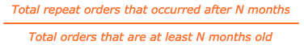
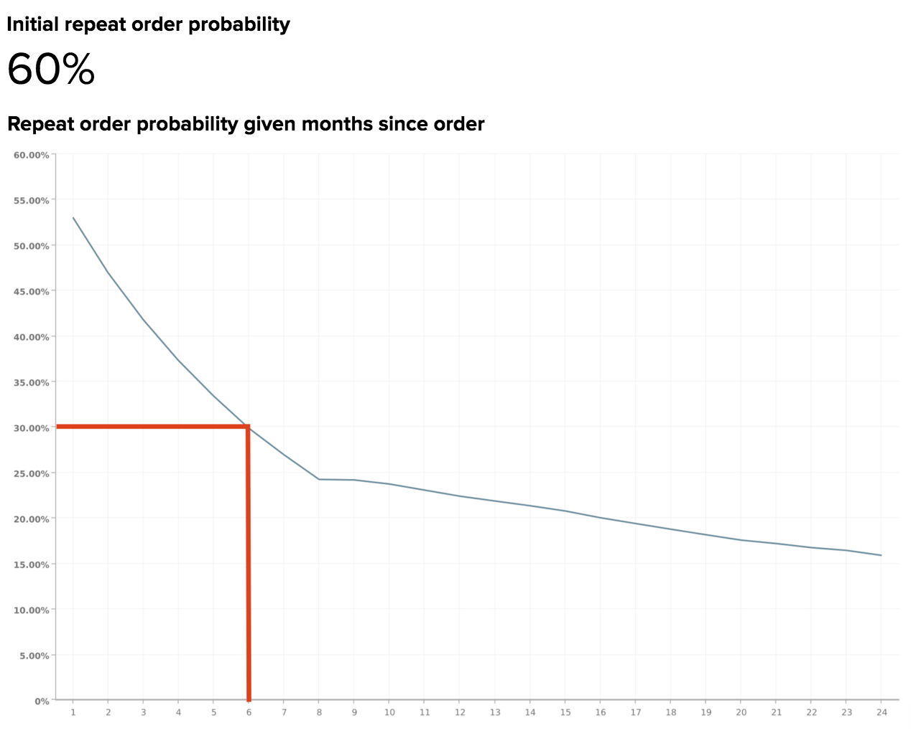

# 重複概率衰減和流失

如果您的部分收入來自重複購買，您可能會意識到忠實客戶群的巨大價值。 為此，瞭解訂單之間的時間流逝以及客戶預計何時流失非常重要。

本主題探索可協助您回答以下問題的分析：

* 客戶再次購買的可能性有多大？
* 自客戶最近一次購買後，重複訂購的可能性會隨著時間而改變嗎？
* 何時應將客戶視為流失？ 因此，何時應該開始重新啟動行銷活動？

## 建議的量度

分析重複概率衰減和流失時，請考慮使用([或建置](../../data-user/reports/ess-manage-data-metrics.md))這些量度：

### 初始重複順序機率

此測量定義為重複訂購的總數，以訂購總數的百分比表示。 換言之，這是訂單被其他訂單跟進的可能性。 當此機率高於50%時，表示超過一半的訂單會依序進行後續訂單。

### 重複訂購機率自訂購以來的指定月份

此測量可顯示使用者再次訂購的可能性，提供自上次訂購後經過的月數。 用來產生此量度的公式簡化為：

根據您的業務模式，重複訂購的機率可能會在客戶下訂單後立即下降，並在隨後的幾個月中繼續下降，也可能顯示季節性變化和尖峰。

瞭解預期會重複購買的客戶百分比（以及此趨勢如何隨時間變化），可讓您定期鎖定客戶，最大化重複購買的可能性。 因此，當重複購買的可能性降低時，您可以選擇時間將客戶識別為流失，並將您的工作從保留轉為重新啟用。

## 今天的範例

檢視典型電子商務業務的重複概率衰減。

### 初始重複順序機率

在此範例中，初始重複訂購的可能性（或客戶重複購買的可能性）為60%。 這表示此業務的所有訂單中，有60%會接著進行後續訂單。

### 重複訂購機率自訂購以來的指定月份

此報表顯示客戶自上次訂購以來經過了幾個月後，再次訂購的可能性。 雖然在此報表中，流失臨界值並無單一定義，但Adobe建議將流失定義為機率衰減超過初始重複機率一半的值。

由於此範例的初始重複機率是60%，流失日期會是重複訂購機率降至60%/2 = 30%以下或約6個月的時間。 在預期會接續其他訂單的60%訂單中，有一半是在前6個月內下達。

換言之，如果客戶要下後續訂單，他們更有可能在上次訂單的6個月內完成後續訂單，而不是在6個月標籤之後。 如果客戶在六個月後未再購買，則應啟動重新啟動行銷活動，以吸引此客戶重新加入。

根據您的商業模式，您可能會想要選擇不同的臨界值，例如重複訂購機率降至50%或10%以下的點。 如果您的內部知識建議使用不同的數字，那麼無論如何您都應該使用它！

最終，目標是選取從保留切換到重新啟動動作合理的臨界值。 保留工作可能涉及透過建議進行後續購買的電子郵件重新與現有客戶互動，而重新啟用工作可能涉及使用優惠券和優惠券向失效客戶傳送電子郵件。

## 我應該考慮哪些問題？

為了協助您瞭解適用於您企業的重複訂購機率，Adobe建議您在探索自己的資料時考慮以下問題：

* 是否預期初始重複順序機率？ 如果沒有，為什麼您認為應該更高或更低？
* 自上次訂購以來，特定月份的重複訂購機率是否有任何大幅降低？ 若是如此，這些變更是否預期發生？
* 您目前的流失臨界值為何？
* 您目前的流失臨界值與自上次訂單報告以來指定月份內的重複訂單機率值之一相符嗎？
* 您目前的臨界值是否反映您從保留轉為重新啟動的廣告工作？
* 將臨界值變更為機率衰減超過初始重複機率一半之值的月份對您的企業是否有意義？

## 我還要分析哪些專案？

建立上述分析並決定流失臨界值後，您可以建立更多分析來識別流失使用者的共同趨勢。 例如，客戶流失是在相同時段內購買，還是在上次訂購時購買了類似產品？ 設定流失臨界值後，您可以進一步深入探究這些流失客戶的特定特徵。

如果您提供多種產品，您可能會想知道購買特定產品的客戶與其他客戶在一段時間內的行為有何不同。 想瞭解更多嗎？ 請參閱本教學課程，探索客戶同類群組（根據他們購買的特定產品）的終身購買行為。

此最佳實務由提供 [!DNL Adobe Commerce Intelligence] Data Analysis Services (DAS)。 [聯絡支援人員](https://experienceleague.adobe.com/docs/commerce-knowledge-base/kb/troubleshooting/miscellaneous/mbi-service-policies.html) 以取得更多資訊。

### 相關

* [分析優惠券對吸引和留住客戶的影響](../analysis/coupon-impact.md)
* [分析客戶回購行為](../analysis/repurchase-behavior.md)
