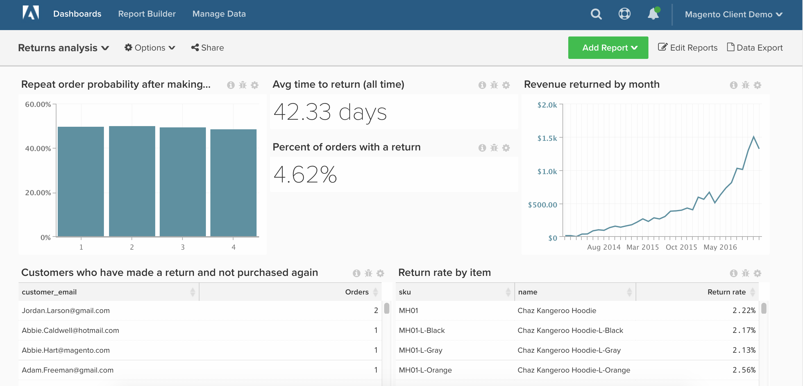

# 退貨單

在本文中，了解如何設定控制面板，提供商店退貨的詳細分析。

開始之前，您必須是 [Adobe Commerce](https://business.adobe.com/products/magento/magento-commerce.html) 客戶，並應確定您的公司使用 `enterprise\_rma` 用於返回的表。

此分析包含 [進階計算欄](../data-warehouse-mgr/adv-calc-columns.md).

## 快速入門

要追蹤的欄

* **`enterprise_rma`** 或 **`rma`** 表格
* **`entity_id`**
* **`status`**
* **`order_id`**
* **`customer_id`**
* **`date_requested`**

* **`enterprise_rma_item_entity`** 或 **`rma_item_entity`** 表格
* **`entity_id`**
* **`rma_entity_id`**
* **`qty_returned`**
* **`status`**
* **`order_item_id`**
* **`product_name`**
* **`product_sku`**

要建立的篩選集

* **`enterprise_rma`** 表格
* 篩選器集名稱： `Returns we count`
* 篩選器集邏輯：
   * 預留位置 — 在此處輸入您的自訂邏輯

* **`enterprise_rma_item_entity`** 表格
* 篩選器集名稱： `Returns items we count`
* 篩選器集邏輯：
   * 預留位置 — 在此處輸入您的自訂邏輯

### 計算欄

要建立的列

* **`enterprise_rma`** 表格
* **`Order's created at`**
* 選取定義： `Joined Column`
* [!UICONTROL Create Path]:
* 
   [!UICONTROL Many]: `enterprise_rma.order_id`
* 

   [!UICONTROL One]: `sales_flat_order.entity_id`

* 選取 [!UICONTROL table]: `sales_flat_order`
* 選取 [!UICONTROL column]: `created_at`
   * `enterprise_rma.order_id = sales_flat_order.entity_id`

* **`Customer's order number`**
* 選取定義： `Joined Column`
* 選取 [!UICONTROL table]: `sales_flat_order`
* 選取 [!UICONTROL column]: `Customer's order number`
   * `enterprise_rma.order_id = sales_flat_order.entity_id`

* **`Time between order's created_at and date_requested`** 由分析師建立，作為 `[RETURNS ANALYSIS]` 票證

* **`enterprise_rma_item_entity`** 表格
* **`return_date_requested`**
* 選取定義： `Joined Column`
* [!UICONTROL Create Path]:
   * 
      [!UICONTROL Many]: `enterprise_rma_item_entity.rma_entity_id`
   * 

      [!UICONTROL One]: `enterprise_rma.entity_id`

* 選取 [!UICONTROL table]: `enterprise_rma`
* 選取 [!UICONTROL column]: `date_requested`
   * `enterprise_rma_item_entity.rma_entity_id = enterprise_rma.entity_id`

* **`Return item total value (qty_returned * price)`** 由分析師建立，作為 `[RETURNS ANALYSIS]` 票證

* **`sales_flat_order`** 表格
* **`Order contains a return? (1=yes/0=No)`**
* 選取定義： `Exists`
* 選取 [!UICONTROL table]: `enterprise_rma`
   * `enterprise_rma.order_id = sales_flat_order.entity_id`

* **`Customer's previous order number`** 由分析師建立，作為 `[RETURNS ANALYSIS]` 票證
* **`Customer's previous order contains return? (1=yes/0=no)`** 由分析師建立，作為 `[RETURNS ANALYSIS]` 票證

>[!NOTE]
>
>如果您只想分析工作時間（秒到解析）或「秒到第一響應」(Seconds to first response)，請在請求票證時讓分析師知道。

### 量度

* **傳回**
* 在 **`enterprise_rma`** 表格
* 此量度會執行 **計數**
* 在 **`entity_id`** 欄
* 由 **`date_requested`**
* [!UICONTROL Filter]: `Returns we count`

* **傳回的項目**
* 在 **`enterprise_rma_item_entity`** 表格
* 此量度會執行 **總和**
* 在 **`qty_approved`** 欄
* 由 **`return date_requested`**
* [!UICONTROL Filter]: `Returns we count`

* **返回的物料總值**
* 在 **`enterprise_rma_item_entity`** 表格
* 此量度會執行 **總和**
* 在 **`Returned item total value (qty_returned * price)`** 欄
* 由 **`return date_requested`**
* [!UICONTROL Filter]: `Returns we count`

* **訂單與退貨之間的平均時間**
* 在 **`enterprise_rma`** 表格
* 此量度會執行 **平均**
* 在 **`Time between order's created_at and date_requested`** 欄
* 由 **`date_requested`**
* [!UICONTROL Filter]: `Returns we count`

>[!NOTE]
>
>一定要 [將所有新欄新增為量度](../data-warehouse-mgr/manage-data-dimensions-metrics.md) 建立新報表之前。

### 報表

* **返回後重複順序概率**
* 量度 `A`: `Number of orders with returns`
* [!UICONTROL Metric]: `Number of orders`
* [!UICONTROL Filter]:
   * `Order contains a return? (1=yes/0=No) = 1`
   * `Is in current month? = No`

* 量度 `B`: `Non-last orders with returns`
* [!UICONTROL Metric]: `Number of orders`
* [!UICONTROL Filter]:
   * `Is customer's last order? (1=yes/0=no) = 0`
   * `Order contains a return? (1=yes/0=No) = 1`

* 公式：重複順序概率
* [!UICONTROL Formula]: `B / A`
* 

   [!UICONTROL Format]: `Percentage`

* [!UICONTROL Time period]: `All time`
* 
   [!UICONTROL間隔]: `None`
* [!UICONTROL Group by]: `Customer's order number`
* 
   [!UICONTROL圖表類型]: `Bar`

* **平均回訪時間（所有時間）**
* 量度 `A`: `Avg time between order and return`
* [!UICONTROL Metric]: `Avg time between order and return`

* [!UICONTROL Time period]: `All time`
* 
   [!UICONTROL間隔]: `None`
* 

   [!UICONTROL圖表類型]: `Number`

* **具有退貨的訂單百分比**
* 量度 `A`: `Number of orders`
* [!UICONTROL Metric]: `Number of orders`

* 量度 `B`: `Orders w/ return`
* [!UICONTROL Metric]: `Number of orders`
* [!UICONTROL Filter]:
   * `Order contains a return? (1=yes/0=No) = 1`

* 公式：具有退貨的訂單百分比
* [!UICONTROL Formula]: `B / A`
* 

   [!UICONTROL Format]: `Percentage`

* [!UICONTROL Time period]: `All time`
* 
   [!UICONTROL間隔]: `None`
* [!UICONTROL Chart Type]: `Number - % of orders with return`

* **按月返回的收入**
* 量度 `A`: `Returned item total value`
* [!UICONTROL Metric]: `Returned item total value`

* [!UICONTROL Time period]: `All time`
* [!UICONTROL Interval]: `By month`
* 

   [!UICONTROL圖表類型]: `Line`

* **已回訪且未再購買的客戶**
* 量度 `A`: `Number of orders with returns`
* [!UICONTROL Metric]: `Number of orders`
* [!UICONTROL Filter]:
   * `Order contains a return? (1=yes/0=No) = 1`
   * `Is customer's last order? (1=yes/0=no) = 1`

* [!UICONTROL Time period]: `All time`
* 
   [!UICONTROL間隔]: `None`
* 
   [!UICONTROL分組依據]: `Customer_email`
* 

   [!UICONTROL圖表類型]: `Table`

* **按物料的退貨率**
* 量度 `A`: `Returned items` （隱藏）
* [!UICONTROL Metric]:傳回的項目

* 量度 `B`: `Items sold` （隱藏）
* [!UICONTROL Metric]: `Number of orders`
* [!UICONTROL Filter]:

* [!UICONTROL Formula]: `Return %`
* [!UICONTROL Formula]: `B / A`
* 

   [!UICONTROL Format]: `Percentage`

* [!UICONTROL Time period]: `All time`
* 
   [!UICONTROL間隔]: `None`
* [!UICONTROL Group by]: `product_sku AND/OR product_name`
* 
   [!UICONTROL圖表類型]: `Table`

編譯所有報表後，您可以視需要在控制面板上組織報表。 結果可能類似於上述範例控制面板。

如果在構建此分析時遇到任何問題，或想要與Professional Services團隊接洽， [聯絡支援](https://experienceleague.adobe.com/docs/commerce-knowledge-base/kb/troubleshooting/miscellaneous/mbi-service-policies.html?lang=en).
