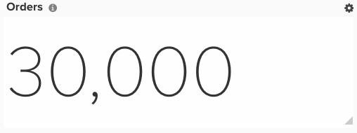

# RFM分析

本文示範如何設定控制面板，讓您依據客戶的造訪間隔、頻率和貨幣排名來劃分客戶。 RFM分析是一種行銷技術，會將客戶行為納入考量，協助您決定外展的細分。 它有三個方面：

* 客戶最近從您的商店購買的時間
* 他們向您購買的頻率
* 客戶花費的金額

RFM分析只有在您具有 [!DNL MBI] Pro針對新架構進行規劃(例如，如果您在「管理資料」功能表下有「Data Warehouse檢視」選項)。 這些欄可從「管理資料>Data Warehouse」頁面建立。 詳細說明如下。

## 快速入門

您必須先上傳僅包含主索引鍵且值為1的檔案。 這可為分析建立一些必要的計算欄。

您可以使用 [說明中心文章](../importing-data/connecting-data/using-file-uploader.md) 和下面的影像，以設定檔案格式。

## 計算欄

如果貴公司允許客戶訂購，則會作進一步區分。 若是如此，您可以忽略 `customer_entity` 表格。 如果不允許來賓訂單，請忽略 `sales_flat_order` 表格。

要建立的列

* **`Sales_flat_order/customer_entity`** 表格
* `Customer's last order date`
* [!UICONTROL Column type]: `Many to one > Max`
* [!UICONTROL Pat]: `sales_flat_order.customer_id > customer_entity.entity_id`
* 已選取 [!UICONTROL column]: `created_at`
* [!UICONTROL Filter]: `Orders we count`

* 

       距離客戶上次訂購日期的秒數
   * [!UICONTROL Column type]:- 「相同表格>年齡
* 已選取 [!UICONTROL column]: `Customer's last order date`

* （輸入）計數參考
* [!UICONTROL Column type]: `Same table > Calculation`
* 
   [!UICONTROL輸入]: `entity_id`
* [!UICONTROL Calculation]: `**case when A is null then null else 1 end**`
* 

   [!UICONTROL資料類型]: `Integer`

* **計數參考** 表格（這是您上傳的檔案，編號為「1」）
* 客戶數
* [!UICONTROL Column type]: `Many to One > Count Distinct`
* [!UICONTROL Path]: `ales_flat_order.(input) reference > Count reference.Primary Key` 或 `customer_entity.(input)reference > Count Reference`. `Primary Key`
* 已選取 [!UICONTROL column]: `sales_flat_order.customer_email` 或 `customer_entity.entity_id`

* **Customer_entity** 表格
* 客戶數
* [!UICONTROL Column type]: `One to Many > JOINED_COLUMN`
* [!UICONTROL Path]: `customer_entity`.（輸入）參考>客戶集中度。 `Primary Key`
* 已選取 [!UICONTROL column]: `Number of customers`

* （輸入） `Ranking by customer lifetime revenue`
* [!UICONTROL Column type]: `Same table > Event Number`
* [!UICONTROL Event owner]: `(input) reference for count`
* [!UICONTROL Event rank]: `Customer's lifetime revenue`

* 依客戶期限收入排名
* [!UICONTROL Column type]: `Same table > Calculation`
* [!UICONTROL Inputs]: `(input) Ranking by customer lifetime revenue`, `Number of customers`
* [!UICONTROL Calculation]: `case when A is null then null else (B-(A-1)) end`
* 

   [!UICONTROL資料類型]: `Integer`

* 客戶的貨幣分數（按百分比）
* [!UICONTROL Column type]: `Same table > Calculation`
* [!UICONTROL Inputs]: `(input) Ranking by customer lifetime revenue`, `Number of customers`
* [!UICONTROL Calculation]: `Case when round((B-A+1)*100/B,0) <= 20 then 5 when round((B-A+1)*100/B,0) <= 40 then 4 when round((B-A+1)*100/B,0) <= 60 then 3 when round((B-A+1)*100/B,0) <= 80 then 2 when round((B-A+1)*100/B,0) <= 100 then 1 else 0 end`
* 

   [!UICONTROL資料類型]: `Integer`

* （輸入）依客戶期限訂購數排名
* [!UICONTROL Column type]: `Same table > Event Number`
* [!UICONTROL Event owner]: `(input) reference for count`
* [!UICONTROL Event rank]: `Customer's lifetime number of orders`

* 依客戶期限訂購數排名
* 
   [!UICONTROL列類型]: – "同表>計算"
* [!UICONTROL Inputs]:- **（輸入）依客戶期限訂購數排名**, **客戶數**
* [!UICONTROL Calculation]:- **當A為Null然後為Null時的大小寫(B-(A-1))結束**
* [!UICONTROL Datatype]: — 整數

* 客戶的頻率分數（按百分比）
* [!UICONTROL Column type]: `Same table > Calculation`
* [!UICONTROL Inputs]: `(input) Ranking by customer lifetime number of orders`, `Number of customers`
* [!UICONTROL Calculation]: `Case when round((B-A+1)*100/B,0) <= 20 then 5 when round((B-A+1)*100/B,0) <= 40 then 4 when round((B-A+1)*100/B,0) <= 60 then 3 when round((B-A+1)*100/B,0) <= 80 then 2 when round((B-A+1)*100/B,0) <= 100 then 1 else 0 end`
* 

   [!UICONTROL資料類型]: `Integer`

* 自客戶上次訂購日期以來的排名（秒）
* [!UICONTROL Column type]: `Same table > Event Number`
* [!UICONTROL Event owner]: `(input) reference for count`
* [!UICONTROL Event rank]: `Seconds since customer's last order date`

* 客戶的造訪間隔分數（依百分位）
* [!UICONTROL Column type]: `Same table > Calculation`
* [!UICONTROL Inputs]: `(input) Ranking by customer lifetime number of orders`, `Number of customers`
* [!UICONTROL Calculation]: `Case when (A * 100/B,0) <= 20 then 5 when (A * 100/B,0) <= 40 then 4 when (A * 100/B,0) <= 60 then 3 when (A * 100/B,0) <= 80 then 2 when (A * 100/B,0) <= 100 then 1 else 0 end`
* 

   [!UICONTROL資料類型]: `Integer`

* 客戶的造訪間隔分數（依百分位）
* [!UICONTROL Column type]: `Same table > Calculation`
* [!UICONTROL Inputs]: `Customer's recency score (by percentiles)`, `Customer's frequency score (by percentiles)`, `Customer's monetary score (by percentiles)`
* [!UICONTROL Calculation]: `case when (A IS NULL or B IS NULL or C IS NULL) then null else concat(A,B,C) end`
* 

   [!UICONTROL資料類型]: String

* **計數參考** 表格
* [!UICONTROL Number of customers]: `(RFM > 0)`
* [!UICONTROL Column type]: `Many to One > Count Distinct`
* [!UICONTROL Path]: `sales_flat_order.(input) reference > Customer Concentration. Primary Key` 或 `customer_entity.(input)reference > Customer Concentration.Primary Key`
* 已選取 [!UICONTROL column]: `sales_flat_order.customer_email` 或 `customer_entity.entity_id`
* [!UICONTROL Filter]: `Customer's RFM score (by percentile)` 不等於000

* **Customer_entity** 表格
* [!UICONTROL Number of customers]: `(RFM > 0)`
* [!UICONTROL Column type]: `One to Many > JOINED_COLUMN`
* [!UICONTROL Path]: `customer_entity.(input) reference > Customer Concentration.Primary Key`
* 已選取 [!UICONTROL column]:- `Number of customers`

* 客戶造訪間隔分數 `(R+F+M)`
* [!UICONTROL Column type]: `Same table > Calculation`
* [!UICONTROL Inputs]: – `Customer's recency score (by percentiles)`, `Customer's frequency score (by percentiles)`, `Customer's monetary score (by percentiles)`
* [!UICONTROL Calculation]: `case when (A IS NULL or B IS NULL or C IS NULL) then null else A+B+C end`
* 

   [!UICONTROL資料類型]: `Integer`

* （輸入）按客戶總體RFM分數排名
* [!UICONTROL Column type]: `Same table > Event Number`
* [!UICONTROL Event owner]: `(input) reference for count`
* [!UICONTROL Event rank]: `Customer's recency score (R+F+M)`
* [!UICONTROL Filter]: `Customer's RFM score (by percentile)` 不等於000

* 依客戶整體RFM分數排名
* [!UICONTROL Column type]: `Same table > Calculation`
* [!UICONTROL Inputs]: `(input) Ranking by customer's overall RFM score`, `Number of customers (RFM > 0)`
* [!UICONTROL Calculation]: `case when A is null then null else (B-(A-1)) end`
* 

   [!UICONTROL資料類型]: `Integer`

* 客戶的RFM組
* [!UICONTROL Column type]: `Same table > Calculation`
* [!UICONTROL Inputs]: `(input) Ranking by customer lifetime revenue`, `Number of customers`
* [!UICONTROL Calculation]: `Case when round(A * 100/B,0) <= 20 then '5. copper' when round(A * 100/B,0) <= 40 then '4. bronze' when round(A * 100/B,0) <= 60 then '3. silver' when round(A * 100/B,0)<= 80 then '2. gold' else '1. Platinum' end`
* 

   [!UICONTROL資料類型]: `Integer`

>[!NOTE]
>
>使用的百分位數甚至會分割客戶（例如，傳回1-5的20%貯體）。 如果您有想要加權的自訂方式，請在提交票證時通知分析師。

## 量度

無新量度！

**附註**:一定要 [將所有新欄新增為量度](../data-warehouse-mgr/manage-data-dimensions-metrics.md) 建立新報表之前。

## 報表

* **按RFM分組的客戶**
* 量度 `A`: `New customers`
* [!UICONTROL Metric]: `New customers`
* [!UICONTROL Filter]: `Customer's RFM score (by percentiles) Not Equal to 000`

* [!UICONTROL Time period]: `All time`
* 
   [!UICONTROL Interval]: `None`
* 隱藏圖表
* [!UICONTROL Group by]: `Customer's RFM group`
* 
   [!UICONTROL分組依據]: `Email`
* 

   [!UICONTROL Chart type]: `Table`

* **具有5個最近分數的客戶**
* 量度 `A`: `New customers`
* [!UICONTROL Metric]: `New customers`
* [!UICONTROL Filter]: `Customer's recency score (by percentiles) Equal to 5`

* [!UICONTROL Time period]: `All time`
* 
   [!UICONTROL Interval]: `None`
* 
   [!UICONTROL Chart Type]: `Scalar`
* 隱藏圖表
* 
   [!UICONTROL分組依據]: `Email`
* [!UICONTROL Group by]: `Customer's RFM score (R+F+M)`
* 

   [!UICONTROL Chart type]: `Table`

* **具有單一造訪間分數的客戶**
* 量度 `A`: `New customers`
* [!UICONTROL Metric]: `New customers`
* [!UICONTROL Filter]: `Customer's recency score (by percentiles) Equal to 1`

* [!UICONTROL Time period]: `All time`
* 
   [!UICONTROL Interval]: `None`
* 
   [!UICONTROL Chart Type]: `Scalar`
* 隱藏圖表
* 
   [!UICONTROL分組依據]: `Email`
* [!UICONTROL Group by]: `Customer's RFM score (R+F+M)`
* 

   [!UICONTROL Chart type]: `Table`

編譯所有報表後，您可以視需要在控制面板上組織報表。 結果看起來可能類似於上述範例控制面板，但三個產生的表格只是您可以執行之客戶細分類型的範例。
