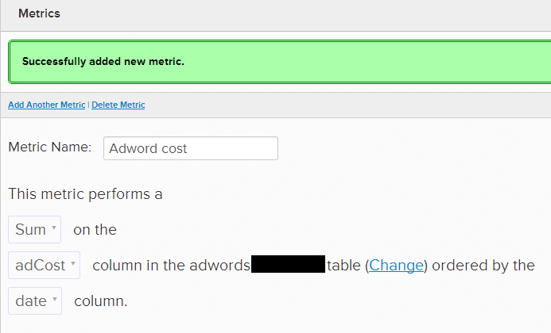

# 廣告活動和ROI

[!DNL Adobe Commerce Intelligence] 可輕鬆 [將廣告成本資料與收入資料結合](../../data-analyst/importing-data/integrations/google-adwords.md) 從資料庫中。 這有助於您確定哪些市場活動的投資回報率(ROI)最高。 本主題探討評估市場活動績效的幾種不同方法。

## 先決條件

* 導入廣告成本資料：
   * [連接 [!DNL Google AdWords] 至 [!DNL Commerce Intelligence]](../importing-data/integrations/google-adwords.md):此同步 [!DNL Adwords] 花 [!DNL Commerce Intelligence]
   * [上載其他廣告成本資料](../importing-data/connecting-data/import-offline-ad-data.md):對於沒有直接連接器的通道，建議使用此方法 [!DNL Commerce Intelligence]
   * 如果從多個來源導入成本資料，則 [整合](../../best-practices/consolidating-your-tables.md) 資料 [!DNL Commerce Intelligence]。 簡單 [提交支援票證](../../guide-overview.md#Submitting-a-Support-Ticket)。
* [跟蹤用戶獲取通道資料](../analysis/google-track-user-acq.md)

## 用戶購買活動

針對用戶購買的市場活動可以從多個角度進行衡量，包括：

1. 獲取市場活動的新用戶數
1. 市場活動從註冊到購買的轉換率
1. 基於平均用戶生存期價值(LTV)的市場活動ROI

以上分析(1)和(2)在有關 [確定您的頂級營銷渠道](../analysis/most-value-source-channel.md)。 在此，您將探索分析(3)，以衡量市場活動的投資回報率。 這就回答了從特定市場活動中購買的用戶是否產生了足夠的終身收入來支付購買成本。

>[!NOTE]
>
>此示例假定所有促銷活動成本都專門用於獲取新用戶。 實際上，您的促銷活動成本也與獲取未經轉換的訪問、重複購買等費用分攤。 假設所有成本都用於購買新註冊用戶，則生成的ROI將考慮最壞情況（每次購買成本最高）。 您可以確定實際ROI高於計算值。
>
>示例：假設您花了20美元在一個產生10個新用戶和10個重複購買者的市場活動上，則您每個新用戶的實際成本為1美元。 但是，假設所有成本都用於收購新用戶，每次收購的成本是2美元。

**1. 首先建立圖表，按市場活動劃分廣告成本：**

1. 建立 [!UICONTROL Metric] 總和你花的時間
1. 轉到 [!UICONTROL Data > Metrics]
1. 選擇 `Add New Metric` 的 [!DNL `Adwords...`] 記錄您 [!DNL AdWords] 成本資料。
1. 在度量編輯器中，為度量指定一個名稱(例如， [!UICONTROL AdWord Cost])
1. 使用下拉清單，執行 **和** 的 `adCost` 列 [!DNL Adwords...] 按 `date` 的雙曲餘切值。
   <!--="500" height="303"}-->
1. 按一下 `Back to Metric List` 轉到任何儀表板。

1. 建立按市場活動分段支出的報表
1. 在任何儀表板中，按一下 [!UICONTROL Add Report > Create report]
1. 選擇 [!UICONTROL Adword Cost] 你剛剛建立的度量
1. 設定 [!UICONTROL Time period] 至 `All-time`, [!UICONTROL Interval] 至 `None`
1. 在 `Group by` 頁籤，添加 `campaign` 如 [!UICONTROL grouping field]，然後按一下 `Add All` 的雙曲餘切值。
1. 此報告顯示您的 [!DNL AdWords] 按市場活動成本

**2. 建立按市場活動計數新用戶的報表：**

1. 在任何儀表板中，按一下 **[!UICONTROL Add Report > Create report]**
1. 選擇 `New users` 計算一段時間內新註冊用戶數的度量
1. 設定 [!UICONTROL Time period] 至 `All-time`, [!UICONTROL Interval] 至 `None`
1. 在 `Group by` 頁籤，添加 `campaign` 如 `grouping field`，然後按一下 **`Add All`** 框中
1. 此報表按市場活動顯示您的所有時間註冊用戶

**3. 建立按市場活動劃分平均用戶LTV的報表：**

1. 在任何儀表板中，按一下 **[!UICONTROL Add Report > Create report]**
1. 選擇 `Average lifetime revenue` 計算平均用戶的生存期收入的度量
1. 設定 [!UICONTROL Time period] 至 `All-time`, [!UICONTROL Interval] 至 `None`
1. 在 `Group by` 頁籤，添加 `campaign` 或 `utm\_campaign` 如 [!UICONTROL grouping field]，然後按一下 `Add All` 框中
1. 此報表按市場活動顯示平均用戶生存期收入

**最後，將以下三項分析合併到一份報告中，計算市場活動ROI:**

1. 在任何儀表板中，按一下 **[!UICONTROL Add Report > Create new report]**
1. 添加為輸入，使用上面使用的三個度量。 每個都分配一個字母(例如\[`A`\], \[`B`\]和\[`C`\])
1. [!UICONTROL Cost]:添加度量AdWords開銷 — 這是變數\[A\]。 這按市場活動返回成本。
1. [!UICONTROL Users]:添加度量「新用戶」 — 這是變數\[B\]。 這將返回按市場活動列出的用戶數。
1. [!UICONTROL LTV]:添加度量平均生存期收入 — 這是變數\[`C`\]。 這按活動返回LTV。

1. 按一下「圖表」單詞旁的隱藏表徵圖，以便可以集中在表格上
1. 現在使用 `Add Formula` 要合併這些度量，請執行以下操作：
1. [!UICONTROL ROI]:輸入公式 `(\[C\]-\[A\]/\[B\])/(\[A\]/\[B\])`，如果`A`\]表示 `Ad Cost by Campaigns`, \[`B`\]表示 `New users by campaigns`，和\[`C`\] `LTV by campaigns`。 這將返回（平均用戶LTV — 每次購置的平均成本）/（每次購置的平均成本）的比率
1. [!UICONTROL Avg Return per User]:輸入公式 **\[`C`\]-(\[`A`\]/\[`B`\])**。 這返回通過計算（平均用戶LTV） — （每次購買的平均成本）對用戶所做的平均利潤。
1. [!UICONTROL CPA]:輸入公式 **`\[A\]/\[B\]`**。 這將返回實際市場活動的每次採購成本。
1. 要包括的其他潛在指標 [!DNL AdWords] 資料包括總和  `Impressions` 和 `adClicks` 從 [!DNL AdWords] 資料)，以及總數 `number of orders` 是通過特定的活動製造的。
1. 根據用戶註冊或首次購買後30天和90天的LTV計算ROI也許也很有趣。

1. 您可以隨意按一下並拖動度量和公式以重新排序報表的列
1. 將報表命名，並確保另存為表。

## 產品市場活動

您是否在運行特定於產品的廣告？ 如果是，您可以通過計算特定產品的收入/成本來衡量這些市場活動的ROI。

>[!NOTE]
>
>本示例假定所有促銷活動成本都專門用於生成特定產品的採購。 假設所有成本都用於生成採購，則生成的ROI將考慮最壞情形（每次採購的最高成本）。 您可以確定實際ROI高於此計算。 示例：假設您花20美元在一個產生10個新用戶和10個購買的市場活動上，則每次購買的實際成本為1美元。 假設所有費用都用於購買新用戶，每次購買的費用為2美元。

在你開始之前， [提交支援票證](https://experienceleague.adobe.com/docs/commerce-knowledge-base/kb/troubleshooting/miscellaneous/mbi-service-policies.html) 將以下維連接到行項目表(`sales\_flat\_order\_item, order\_item`):

* 訂單的來源（如果僅跟蹤用戶層的推薦來源，則加入用戶的來源）
* 訂單的市場活動（如果您僅跟蹤用戶層的推薦來源，則加入用戶的市場活動）
* 訂單的介質（如果僅跟蹤用戶級別的推薦源，則加入用戶的介質）

**1. 現在，首先建立一個圖表，該圖表將針對特定產品按市場活動返回收入：**

1. 在任何儀表板中，按一下 **[!UICONTROL Add Report > Create new report]**
1. 選擇 `Revenue by items` 在行物料層計算收入的度量
1. 設定 [!UICONTROL Time period] 至 `All-time`, [!UICONTROL Interval] 至 `None`
1. 在 `Filter by` 頁籤，添加 `product name 'IN'` 產品 `A`，產品 `B`，產品 `C`,..&quot; 並包含市場活動所針對的所有產品名稱(例如， `product name 'IN' yellow t-shirt`。 `red t-shirt, blue t-shirt`)
1. 在 `Group by` 頁籤，添加 `order's campaign` 或 `order's utm\_campaign` 如 `grouping` ，然後按一下 **[!UICONTROL Add All]** 框中
1. 此報表按市場活動顯示特定產品的收入

**2. 要計算ROI，請再次將指標合併到一個報告中：**

1. 在任何儀表板中，按一下 **[!UICONTROL Add Report > Create new report]**
1. 添加 `Revenue by items` 度量，按上面特定產品市場活動報告中的篩選和按方向分組，然後按一下 **[!UICONTROL Hide]** 在度量的標量值下
1. 現在添加 [!DNL AdWords Cost] 度量，按來自 `Ad cost by campaigns` 報告中所探討 `User acquisition campaigns` 上節；按一下 **[!UICONTROL Hide]** 在度量的標量值下
1. 在設定這些度量後，添加公式：
1. [!UICONTROL ROI]:輸入公式 `\[A\]/\[B\]`。 `\[A\]` 代表 `Revenue per campaign for specific product(s)` 和 `\[B\]` 代表 `Ad cost by campaigns`。 這將返回（特定產品的收入）/（市場活動成本）的比率
1. [!UICONTROL Return]:輸入公式 `\[A\]-\[B\]`。 這將返回通過計算（平均用戶LTV） — （每次購買的平均成本）對用戶產生的平均利潤
1. （可選） [!UICONTROL Revenue]:取消隱藏 `Revenue by items` 用於查看每個市場活動的特定產品的收入的指標
1. （可選） [!UICONTROL Cost]:取消隱藏 `AdWords Cost` 用於查看市場活動成本的指標

1. 為報表指定名稱，並確保將其另存為表

**3. 對每個廣告產品或產品組重複上述步驟1和2。**

## 相關文檔

* [跟蹤訂單推薦來源 [!DNL Google Analytics] 電子商務](../importing-data/integrations/google-ecommerce.md)
* [跟蹤資料庫中的用戶推薦源](../analysis/google-track-user-acq.md)
* [跟蹤資料庫中的用戶設備、瀏覽器和OS資料](../analysis/track-usr-dev-browser.md)
* [發現您最有價值的收購來源和渠道](../analysis/most-value-source-channel.md)
* [連接 [!DNL Google Adwords] 帳戶](../importing-data/integrations/google-adwords.md)
* [如何 [!DNL Google Analytics] UTM歸因工作？](../analysis/utm-attributes.md)
* [UTM標籤的五個最佳做法 [!DNL Google Analytics]](../../best-practices/utm-tagging-google.md)
