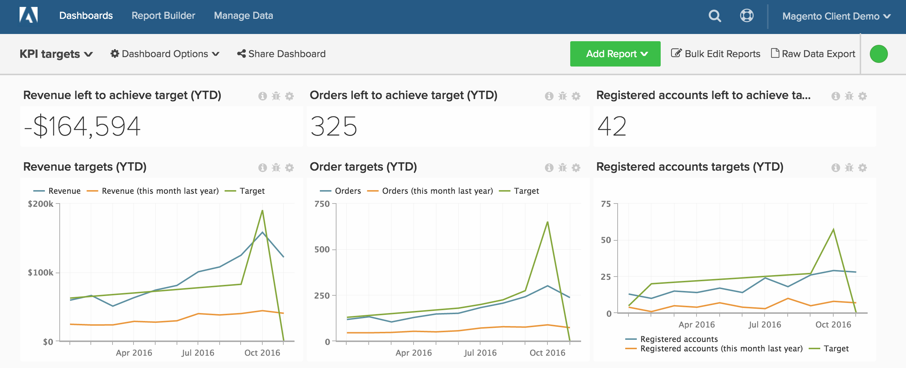
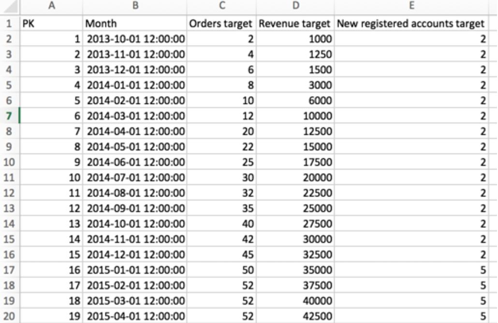

# 根據效能度量追蹤目標

大部分的客戶都想要追蹤其 **業務目標**，但並未意識到這在中是可能的 [!DNL Adobe Commerce Intelligence]. 本主題說明如何設定儀表板，協助您根據實際資料（包括收入、新註冊的使用者和一段時間的訂單）追蹤業務目標。 您也會瞭解如何比較年度與年度績效，全都透過如下的儀表板進行：

開始之前，您應該先檢閱 [檔案上傳程式](../importing-data/connecting-data/using-file-uploader.md) 並確保您已定義指定期間的業務目標。

## 快速入門

您必須先上傳包含您企業的特定每日/每月/每季目標的檔案。

您可以使用 [檔案上傳程式](../importing-data/connecting-data/using-file-uploader.md) 和下圖來格式化您的檔案。 使用者端追蹤的最常見目標 [!DNL Commerce Intelligence] 包括「訂購」、「收入」和「新註冊的帳戶」。

## 量度

為每個目標建立一個新量度。 例如，如果您上傳每月收入和訂單目標，則需要建立兩個新量度：

* **每月收入目標**
* 在 **`Monthly goals`** 表格
* 此量度會執行 **總和**
* 於 **`Revenue target`** 欄
* 排序依據： **`Month`** timestamp

* **每月訂單目標**
* 在 **`Monthly goals`** 表格
* 此量度會執行 **總和**
* 於 **`Orders target`** 欄
* 排序依據： **`Month`** timestamp

* **每月新註冊帳戶目標**
* 在 **`Monthly goals`** 表格
* 此量度會執行 **總和**
* 於 **`New registered accounts target`** 欄
* 排序依據： **`Month`** timestamp

## 報表

在分析目標時，將靜態值和視覺圖表混合使用會很有幫助。 以下是三個報表範例，可協助您開始追蹤收入表現。

* **達成目標所剩的收入**
* 量度 `A`： `Revenue`
* 
  [！UICONTROL公制]: `Revenue`

* 量度 `B`： `Target Revenue`
* [!UICONTROL Metric]: `Monthly Revenue Target`

* [!UICONTROL Formula]: `Revenue left to achieve target`
* 
  [！UICONTROL公式]: `(B-A)`
* 
  [!UICONTROL Format]: `Number`

* [!UICONTROL Time period]：（您想要的任何相關時段）
* 
  [!UICONTROL Interval]: `Month`
* 
  [！UICONTROL圖表型別]: `Scalar`

* **收入目標**
* 量度 `A`： `Revenue`
* 
  [！UICONTROL公制]: `Revenue`

* 量度 `B`： `Target Revenue`
* [!UICONTROL Metric]: `Monthly Revenue Target`

* 量度 `C`： `Revenue (amount change since previous year)` （隱藏）
* 
  [！UICONTROL公制]: `Revenue`
* [!UICONTROL Perspective]: `Amount change vs. Previous year`

* [!UICONTROL Formula]：（去年這個月）
* 
  [！UICONTROL公式]: `(A-C)`
* 
  [!UICONTROL Format]: `Currency`

* 關閉 `Multiple Y-Axes`
* [!UICONTROL Time period]：（您想要的任何相關時段）*
* 
  [!UICONTROL Interval]: `Month`
* [!UICONTROL Chart Type]: `Line Chart`

完成上述收入目標報表後，您可以針對訂單、註冊帳戶或已包含於目標檔案上傳中的任何其他值，建立相同的目標報表。

編譯所有報表後，您可以視需要在控制面板上組織報表。 結果看起來可能像這個頁面頂端的影像。
