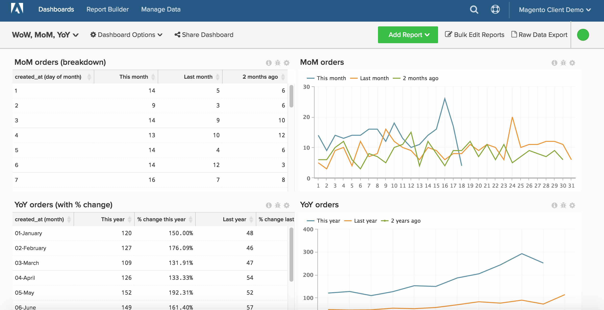
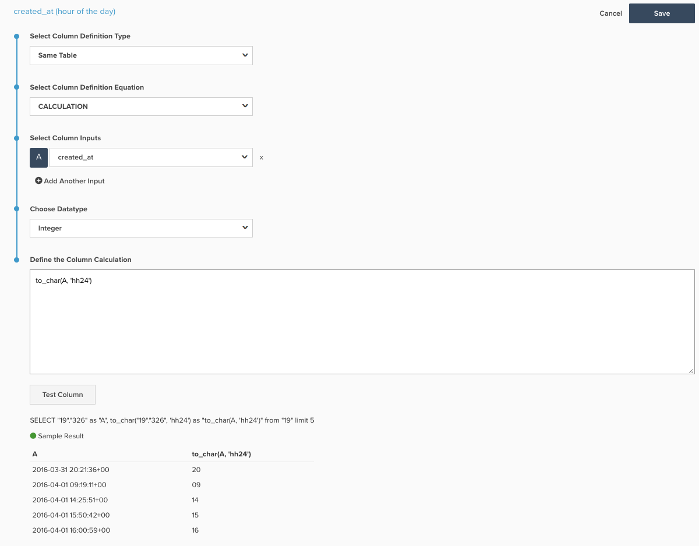

# 特定時段內的報告

>[!NOTE]
>
>本主題包含使用原始架構和新架構的使用者端指示。 您位於 [新架構](../../administrator/account-management/new-architecture.md) 如果您擁有 [!DNL _Data Warehouse檢視_] 選取後可用的區段 [!DNL Manage Data] 從主工具列。

Report Builder可讓您輕鬆檢視一段時間的趨勢，並變更您可能想要比較之時段的觀點。 此主題示範如何設定控制面板，以更深入的方式讓您建立報表，分析周別、月別、年別。

開始之前，您應該檢閱探索更詳細的觀點 [此處](../../tutorials/using-visual-report-builder.md) 和獨立時間選項 [此處](../../tutorials/time-options-visual-rpt-bldr.md).

此分析包含 [進階計算欄](../data-warehouse-mgr/adv-calc-columns.md).

## 計算欄

* **`Sales_flat_order`** 表格
* **原始架構：** 以下欄由分析師建立，作為您的一部分 `[YoY WoW MoM ANALYSIS]` 票證
* `created_at (month-day)`
* `created_at (month)`
* `created_at (day of the month)`
* `created_at (day of the week)`
* `created_at (hour of the day)`

* **新架構：** 以下列出的SQL，附有如何建立此計算的範例圖片
   * `created_at (month-day)` [!UICONTROL Calculation]： **to_char(A， &#39;mm-dd&#39;)**
   * `created_at (month)` [!UICONTROL Calculation]： **to_char(A， &#39;mm-month&#39;)**
   * `created_at (day of the month)`&lt; [!UICONTROL Calculation]： **to_char(A， &#39;dd&#39;)**
   * `created_at (day of the week)` [!UICONTROL Calculation]： **to_char(A， &#39;d-Day&#39;)**
   * **`created_at (hour of the day)` [!UICONTROL Calculation]： **to_char(A， &#39;hh24&#39;)**

      

## 量度

無。

>[!NOTE]
>
>請確定 [將所有新欄新增為量度的維度](../data-warehouse-mgr/manage-data-dimensions-metrics.md) 建立新報表之前。

## 報表

* **按年圖表**
   * [!UICONTROL Metric]: `Number of orders`

   * [!UICONTROL Metric]: `Number of orders`
   * [!UICONTROL Time options]: `Time range (Custom)`: `2 years ago to 1 year ago`

   * [!UICONTROL Show top/bottom]：前100%排序依據 **`created_at (month-day)`***

* 量度 `A`： `This year`
* 量度 `B`： `Last year`
* [!UICONTROL Time period]: `1 year ago to 0 years ago`
* 
   [!UICONTROL Interval]: `None`
* [!UICONTROL Group by]: `created_at (month-day)`
* 
   [!UICONTROL Chart Type]: `Line`

* **MoM圖表**
   * [!UICONTROL Metric]: `Number of orders`

   * [!UICONTROL Metric]: `Number of orders`
   * 時間選項： `Time range (Custom)`： `2 months ago to 1 month ago`

   * 顯示前/後：前100%排序依據 **`created_at (day of month)`***

* 量度 `A`：本月*
* 量度 `B`：上個月*
* [!UICONTROL Time period]：一個月前至0個月前
* 
   [!UICONTROL Interval]: None
* [!UICONTROL Group by]: `created_at (day of month)`
* 
   [!UICONTROL Chart Type]: Line

* **WoW圖表**
   * [!UICONTROL Metric]: `Number of orders`

   * [!UICONTROL Metric]: `Number of orders`
   * [!UICONTROL Time options]: `Time range (Custom)`: `2 weeks ago to 1 week ago`

   * [!UICONTROL Show top/bottom]：前100%排序依據 `created_at (day of week)`

* 量度 `A`： `This week`
* 量度 `B`： `Last week`
* [!UICONTROL Time period]: `1 week ago to 0 weeks ago`
* 
   [!UICONTROL Interval]: `None`
* [!UICONTROL Group by]: `created_at (day of week)`
* 
   [!UICONTROL Chart Type]: `Line`

* **DoD圖表**
   * [!UICONTROL Metric]: `Number of orders`

   * [!UICONTROL Metric]: `Number of orders`
   * [!UICONTROL Time options]: `Time range (Custom)`: `2 days ago to 1 day ago`

   * [!UICONTROL Show top/bottom]：前100%排序依據 `created_at (hour of day)`

* 量度 `A`： `Today`
* 量度B： `Yesterday`
* [!UICONTROL Time period]: `1 day ago to 0 days ago`
* 
   [!UICONTROL Interval]: `None`
* [!UICONTROL Group by]: `created_at (hour of day)`
* 
   [!UICONTROL Chart Type]: `Line`

編譯所有報表後，您可以視需要在控制面板上組織報表。 結果看起來可能像這個頁面頂端的影像。
