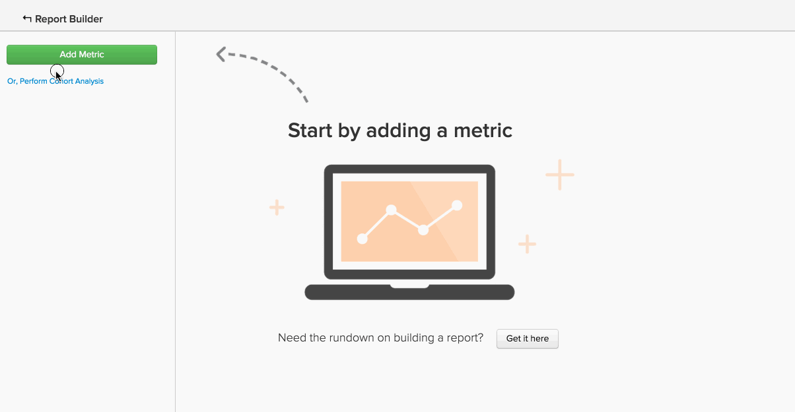

# 高級計算列類型

您可能會嘗試建立的許多分析，都涉及使用 **新欄** 你想要的 `group by` 或 `filter by`. 此 [建立計算列](../data-warehouse-mgr/creating-calculated-columns.md) 本教學課程涵蓋大多數使用案例的基本知識，但您可能想要的計算欄比「Data Warehouse管理員」可建立的要複雜得多。
{:#top

這些類型的欄可由我們的Data Warehouse分析團隊建立。 若要定義新的計算欄，請提供下列資訊：

1. 此 **`definition`** （包括輸入、公式或格式）
1. 此 **`table`** 您要在
1. 任何 **`example data points`** 說明欄應包含的內容

以下是使用者經常覺得有用的進階計算欄的常見範例：

* [順序（或排名）事件](#compareevents)
* [尋找兩個事件之間的時間](#twoevents)
* [比較循序事件值](#sequence)
* [轉換貨幣](#currency)
* [轉換時區](#timezone)
* [其他東西](#else)

## 我嘗試按順序排列事件 {#compareevents}

我們稱之為 **事件數** 計算欄。 這表示我們正嘗試尋找發生特定事件擁有者（例如客戶或使用者）之事件的順序。

以下是範例：

| **`event\_id`** | **`owner\_id`** | **`timestamp`** | **`Owner's event number`** |
|-----|-----|-----|-----|
| 1 | `A` | 2015-01-01 00:00:00 | 1 |
| 2 | `B` | 2015-01-01 00:30:00 | 1 |
| 3 | `A` | 2015-01-01 02:00:00 | 2 |
| 4 | `A` | 2015-01-02 13:00:00 | 3 |
| 5 | `B` | 2015-01-03 13:00:00 | 2 |

{style=&quot;table-layout:auto&quot;}

事件編號計算欄可用來觀察資料中首次事件、重複事件或第n個事件之間的行為差異。

想查看客戶訂單編號欄的實際運作嗎？ 按一下影像，查看其作為報表中的「群組依據」維度使用。

<!--{: style="max-width: 500px;"}-->

若要建立此類型的計算欄，我們需要知道：

* 要在其上建立此列的表
* 識別事件擁有者的欄位(`owner\_id` 在此範例中)
* 您要依此欄位排序事件(`timestamp` 在此範例中)

[返回頂端](#top)

## 我在努力尋找兩件事之間的時間。 {#twoevents}

我們稱之為 `date difference` 計算欄。 這表示我們正根據事件時間戳記，嘗試尋找屬於單一記錄之兩個事件之間的時間。

以下是範例：

| `id` | `timestamp\_1` | `timestamp\_2` | `Seconds between timestamp\_2 and timestamp\_1` |
|-----|-----|-----|-----|
| `A` | 2015-01-01 00:00:00 | 2015-01-01 12:30:00 | 45000 |
| `B` | 2015-01-01 08:00:00 | 2015-01-01 10:00:00 | 7200 |

{style=&quot;table-layout:auto&quot;}

日期差異計算欄可用來建立量度，以計算兩個事件之間的平均時間或中位數時間。 按一下下方的影像，查看 `Average time to first order` 量度用於報表。

<!--{: style="max-width: 500px;"}-->

若要建立此類型的計算欄，我們需要知道：

* 要在其上建立此列的表
* 您想知道兩者差異的兩個時間戳記

[返回頂端](#top)

## 我正嘗試比較循序事件值。 {#sequence}

我們稱之為 **循序事件比較**. 這表示我們正嘗試尋找值（貨幣、數字、時間戳記）與擁有者先前事件之對應值之間的差值。

以下是範例：

| **`event\_id`** | **`owner\_id`** | **`timestamp`** | **`Seconds since owner's previous event`** |
|-----|-----|-----|-----|
| 1 | `A` | 2015-01-01 00:00:00 | NULL |
| 2 | `B` | 2015-01-01 00:30:00 | NULL |
| 3 | `A` | 2015-01-01 02:00:00 | 7720 |
| 4 | `A` | 2015-01-02 13:00:00 | 126000 |
| 5 | `B` | 2015-01-03 13:00:00 | 217800 |

{style=&quot;table-layout:auto&quot;}

循序事件比較可用來尋找每個循序事件之間的平均時間或中位數時間。 按一下下方的影像，查看 **訂單間的平均時間和中位數時間** 量度的實際運作。

=<!--{: style="max-width: 500px;"}-->

若要建立此類型的計算欄，我們需要知道：

* 要在其上建立此列的表
* 識別事件擁有者的欄位(`owner\_id` )
* 您要查看每個循序事件之間差異的值欄位(`timestamp` 在此範例中)

[返回頂端](#top)

## 我試圖兌換貨幣。 {#currency}

A **貨幣轉換** 計算列根據事件時的匯率將事務處理金額從記錄幣種轉換為報告幣種。

以下是範例：

| **`id`** | **`timestamp`** | **`transaction\_value\_EUR`** | **`transaction\_value\_USD`** |
|-----|-----|-----|-----|
| `1` | 2015-01-01 00:00:00 | 30 | 33.57 |
| `2` | 2015-01-02 00:00:00 | 50 | 55.93 |

{style=&quot;table-layout:auto&quot;}

若要建立此類型的計算欄，我們需要知道：

* 要在其上建立此列的表
* 要轉換的交易金額列
* 指出資料記錄所在貨幣的欄（通常為ISO代碼）
* 首選報告貨幣

[返回頂端](#top)

## 我正在嘗試轉換時區。 {#timezone}

A **時區轉換** 計算欄會將特定資料來源的時間戳記從其記錄的時區轉換為報告時區。

以下是範例：

| **`id`** | **`timestamp\_UTC`** | **`timestamp\_ET`** |
|-----|-----|-----|
| `1` | 2015-01-01 00:00:00 | 2014-12-31 19:00:00 |
| `2` | 2015-01-01 12:00:00 | 2015-01-01 07:00:00 |

{style=&quot;table-layout:auto&quot;}

若要建立此類型的計算欄，我們需要知道：

* 要在其上建立此列的表
* 要轉換的時間戳記欄
* 記錄資料的時區
* 偏好的報表時區

[返回頂端](#top)

## 我想做點沒列在這裡的事。 {#else}

別擔心。 僅僅因為此處未列出，並不表示這是不可能的。 我們的Data Warehouse分析師團隊已為您提供支援。

要定義新的計算列， [提交支援票證](https://experienceleague.adobe.com/docs/commerce-knowledge-base/kb/troubleshooting/miscellaneous/mbi-service-policies.html?lang=en) 詳細列出您要建置的項目。

## 相關檔案

* [建立計算列](../data-warehouse-mgr/creating-calculated-columns.md)
* [計算的列類型](../data-warehouse-mgr/calc-column-types.md)
* [建置 [!DNL Google ECommerce] 包含訂單和客戶資料的維度](../data-warehouse-mgr/bldg-google-ecomm-dim.md)
