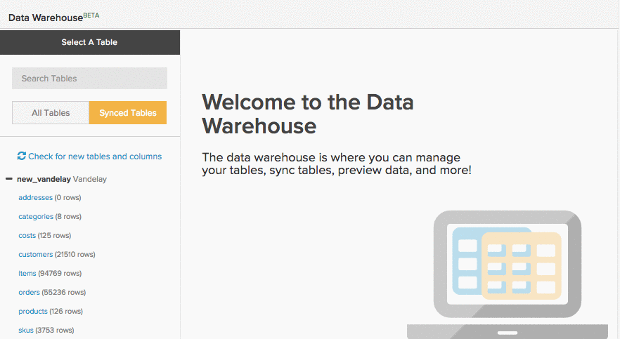
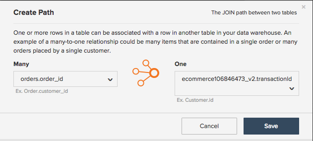
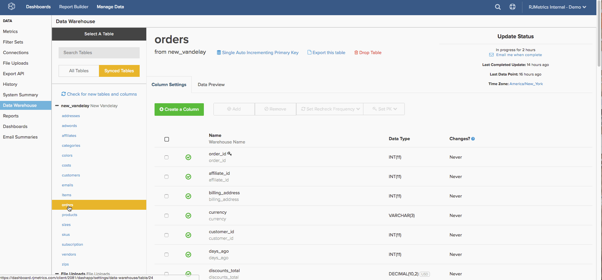
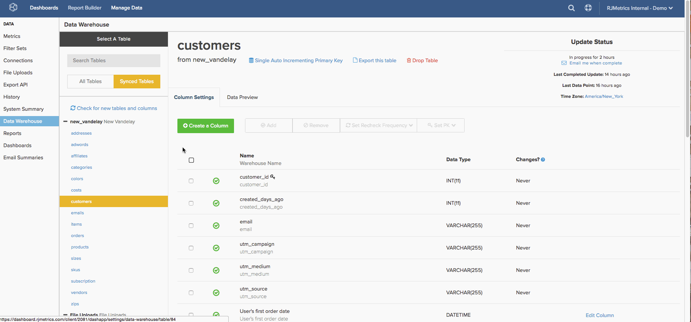

# 生成 [!DNL Google ECommerce] Dimension

>[!NOTE]
>
>需要 [管理權限](../../administrator/user-management/user-management.md)。

既然你完成了 [連接[!DNL Google ECommerce] 帳戶](../../data-analyst/importing-data/integrations/google-ecommerce.md)，在 [!DNL Commerce Intelligence]? 本主題將引導您完成構建維，這些維將電子商務資料與訂單和客戶資料相連結。

所覆蓋的尺寸使您能夠構建分析 [回答有關您的營銷渠道和營銷活動的重要問題](../../data-analyst/analysis/most-value-source-channel.md)。 每個來源的收入佔總收入的百分比是多少？ 生命週期值 [!DNL Facebook] 購入客戶與 [!DNL Google]?

## 先決條件和概述

要在本主題中建立維，需要 [!DNL Google ECommerce] 表 `orders` 和 `customers` 的子菜單。 這些表必須 [同步到Data Warehouse](../../data-analyst/data-warehouse-mgr/tour-dwm.md) 才能生成尺寸。 同步的表顯示在 `Synced Tables` 的下界 `Data Warehouse Manager`。

如果您需要刷新，請快速查看同步表和列的情況：

在建立 `orders` 的 [!DNL Google eCommerce] 表格中，可在下面的清單中建立前三個尺寸。 接下來，您可使用這些維在 `customers` 的子菜單。 要完成，請將這些列連接到 `orders` 的子菜單。

下面是所涵蓋的尺寸：

* **訂單表**

* 訂單 [!DNL Google Analytics] 源
* 訂單 [!DNL Google Analytics] 介質
* 訂單 [!DNL Google Analytics]活動
* 客戶的第一訂單 [!DNL Google Analytics] 源
* 客戶的第一訂單 [!DNL Google Analytics] 介質
* 客戶的第一訂單 [!DNL Google Analytics] 活動

* **客戶表**

* 客戶的第一訂單 [!DNL Google Analytics] 源
* 客戶的第一訂單 [!DNL Google Analytics] 介質
* 客戶的第一訂單 [!DNL Google Analytics] 活動

## 生成維

要建立維，請開啟 [Data Warehouse管理器](../data-warehouse-mgr/tour-dwm.md) 按一下 **[!UICONTROL Data]** > **[!UICONTROL Data Warehouse]**。

### 訂單表，第1輪

此示例生成 **訂單 [!DNL Google Analytics] 源** 維。

1. 在Data Warehouse中的表清單中，按一下該表(在本例中， `orders`)。
1. 按一下 **[!UICONTROL Create a Column]**。
1. 命名列。
1. 選擇 `Joined Column` 從 [定義下拉清單](../data-warehouse-mgr/calc-column-types.md)。 此示例適用於 [一對一關係](../data-warehouse-mgr/table-relationships.md)，匹配 `eCommerce.transactionID` 列到其中一行 `orders` 的子菜單。
1. 接下來，您需要定義路徑，或正在使用的表和列的連接方式。 按一下 `Select a table and column` 下拉清單。
1. 您所需的路徑不可用，因此您需要建立新路徑。 按一下 **[!UICONTROL Create new Path]**。
1. 在顯示的窗口中，設定 `Many` 側 `orders.order\_id`，或 `orders` 包含順序ID的表。
1. 在 `One` 邊，找到 `Google ECommerce` 表，然後將列設定為 `transactionID`。

   

1. 按一下 **[!UICONTROL Save]** 的子菜單。
1. 添加路徑後，按一下 **[!UICONTROL Select table and column]** 下拉。
1. 查找 `ECommerce` ，然後按一下 `Source` 的雙曲餘切值。 這將訂單與來源資訊關聯。
1. 返回表架構後，按一下 **[!UICONTROL Save]** 的下界。

下面是整個過程：

接下來，嘗試建立 **訂單 [!DNL Google Analytics] 介質** 和 `campaign`。 這些維度沒有太大變化，所以試一試。 但如果你被卡住了，你可以 [本文的結尾](#stuck) 看看有什麼不同。

### 客戶表 {#customers}

此示例生成 **客戶的第一訂單 [!DNL Google Analytics] 源** 維。

1. 在Data Warehouse中的表清單中，按一下該表(在本例中， `customers`)。
1. 按一下 **[!UICONTROL Create a Column]**。
1. 命名列。
1. 對於此示例，選擇 `is MAX` 定義 [定義下拉清單](../../data-analyst/data-warehouse-mgr/calc-column-types.md)。 的 `is MIN` 如果只應用於一個可能值的文本列，則定義也可能有效。 重要的部分是確保設定適當的過濾器，以後可以這樣做。
1. 按一下 **[!UICONTROL Select a table and column]** 下拉框，然後選擇 `orders` ，則 `Order's [!DNL Google Analytics] source` 的雙曲餘切值。
1. 按一下 **[!UICONTROL Save]**。
1. 返回表架構後，按一下 `Options` 下拉，然後 `Filters`。
1. 按一下 **[!UICONTROL Add Filter Set]** ，然後選擇 `Orders we count` 的下界。 您只希望將計數篩選器集的訂單包括在訂單中，因此選擇此篩選器集非常重要。
1. 按一下 **[!UICONTROL Add Filter]**。 您要查找客戶的第一訂單 [!DNL Google Analytics] 源，因此需要添加篩選器：

   _orders.客戶的訂單編號= 1

   _
1. 按一下 **[!UICONTROL Save]** 的子菜單。

接下來，嘗試建立 **客戶的第一訂單 [!DNL Google Analytics] 介質** 和 `campaign`。 這些維度沒有太大變化，所以試一試。 但如果你被卡住了，你可以 [本文末尾](#stuck) 看看有什麼不同。

### 獎金：訂單表，第2輪

如果需要，可以在此處停止，但此部分通過 **客戶的第一訂單 [!DNL Google Analytics] 尺寸** 建立的 [最後一節](#customers) 到 `orders` 的子菜單。 在本節中建立維允許您分析基於您的 `orders` 表格 `Revenue`。 `Number of orders`。 `Distinct buyers`、等 — 使用 [!DNL Google Analytics] 客戶第一訂單的屬性。

此示例連接 `Customer's first order's [!DNL Google Analytics] source` 維到 `orders` 的子菜單。

1. 在Data Warehouse中的表清單中，按一下該表(在本例中， `orders`)。
1. 按一下 **[!UICONTROL Create a Column]**。
1. 命名列。
1. 選擇 `Joined Column` 從定義下拉清單中。 這會將您在上一節中建立的客戶維連接到 `orders` 的子菜單。
1. 按一下 **[!UICONTROL Select a table and column]** 下拉清單，然後選擇 `customers` 和 `Customer's first order's [!DNL Google Analytics] source` 的雙曲餘切值。
1. 如果路徑未自動填充，請選擇最能連接客戶和訂單表的路徑。
1. 按一下 **[!UICONTROL Save]** 的子菜單。

下面是整個過程：

最後加入 `Customer's first order's` 中 `campaign` 維到 `orders` 的子菜單。 連接維，如果有問題，則檢出 [文章的結尾](#stuck) 如果你需要幫助。

### 包裝

您已完成維的建立，這意味著您現在可以建立功能強大的分析來跟蹤各種渠道和市場活動的績效。 記住 **新列在下次更新完成後才可用**。

本主題涉及一些較為流行的維，但天空是極限 — 嘗試建立自己的維，或者如果想在探索其他選項時獲得幫助，可以隨意ping我們。 

### 其他注釋

**`Orders`表#1**:建立 `Order's [!DNL Google Analytics]` 中 `campaign` 維，差異是步驟12中選擇的列。 在此示例中，列為 `Source`。

**`Customers`表**:建立 `Customer's first order's [!DNL Google Analytics]` 中 `campaign` 維，差異是在步驟5中選擇的列。 在此示例中，列為 `Order's [!DNL Google Analytics]` 源。

**`Orders`表#2**:加入 `Customer's first order's [!DNL Google Analytics]` 中 `campaign` 列 `orders` 表中，差異是步驟5中選擇的列。 在此示例中，列為 `Customer's first order's [!DNL Google Analytics]` 源。
