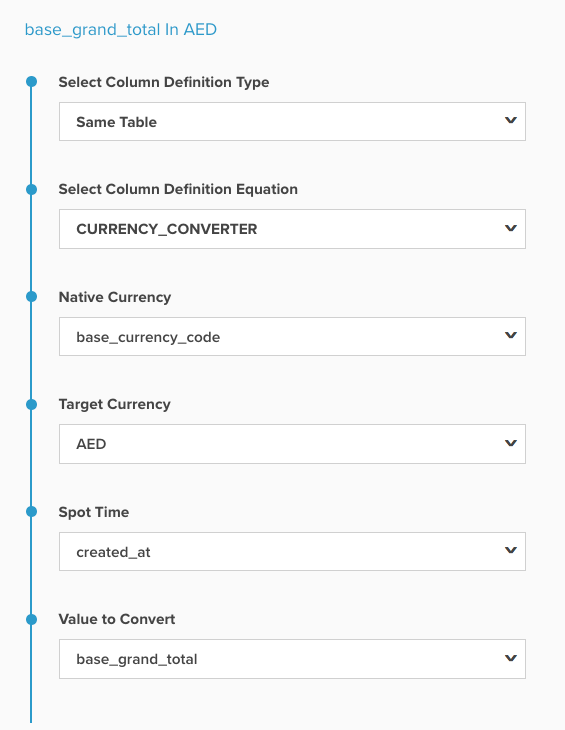
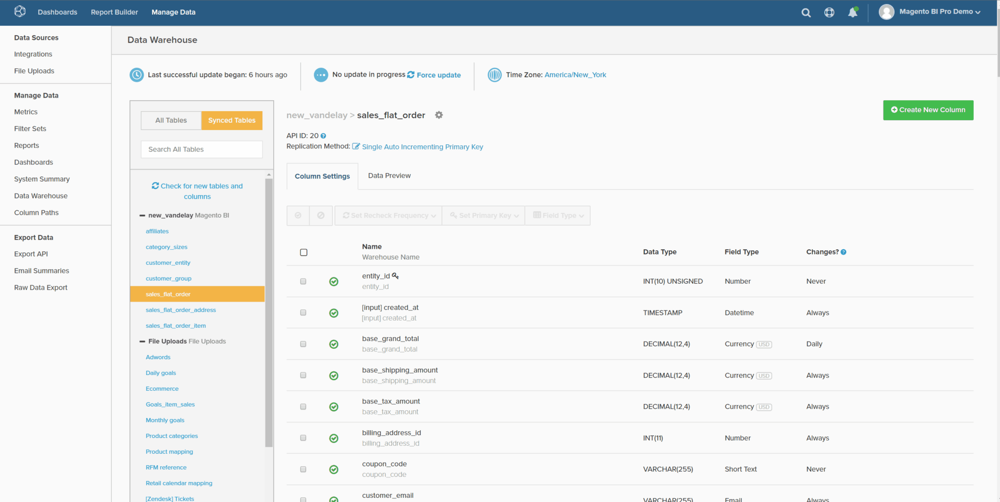
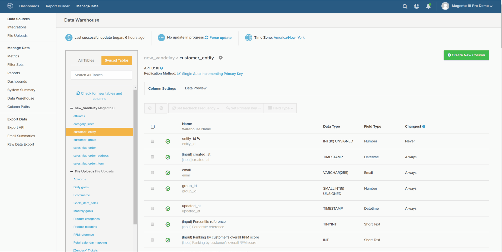
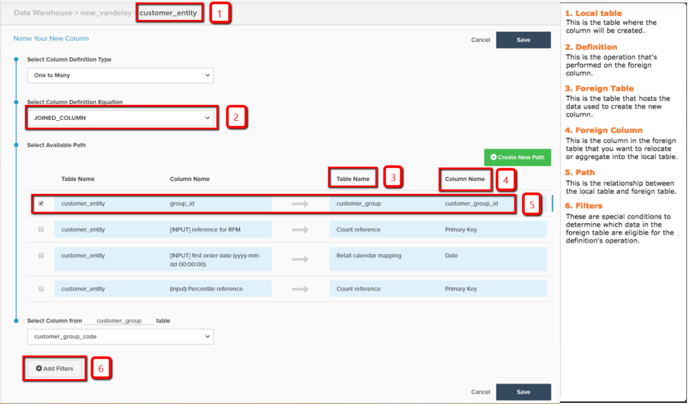

# 計算欄型別

* [相同的表格計算](#sametable)
* [一對多計算](#onetomany)
* [多對一計算](#manytoone)
* [方便的參考地圖](#map)
* [進階計算欄](#advanced)

在[Data Warehouse管理員](../data-warehouse-mgr/tour-dwm.md)內，您可以建立欄來增加和最佳化您的資料以進行分析。 [您可以選取Data Warehouse管理員中的任何資料表並按一下&#x200B;**[!UICONTROL Create New Column]**&#x200B;來存取此功能](../data-warehouse-mgr/creating-calculated-columns.md)。

本主題說明您可以使用「Data Warehouse管理員」建立的欄型別。 它也會涵蓋說明、該欄的視覺化逐步說明，以及建立欄所需的所有輸入的[參考地圖](#map)。 建立計算欄的方式有三種：

1. [相同表格計算欄](#sametable)
1. [一對多計算欄](#onetomany)
1. [多對一計算欄](#manytoone)

## 相同表格計算欄 {#sametable}

這些資料欄是使用相同資料表的輸入資料欄所建置。

### 年齡 {#age}

期限計算欄會傳回目前時間與某個輸入時間之間的秒數。

下列範例會在`customers`資料表中建立`Seconds since customer's most recent order`。 這可用來建構未在`X days`內進行購買（有時稱為流失）之客戶的使用者清單。

### 貨幣轉換工具

貨幣轉換器計算欄將欄的原生貨幣轉換為所需的新貨幣。

下列範例會建立`base\_grand\_total In AED`，將`base\_grand\_total`從`sales\_flat\_order`表格中的原生貨幣轉換為AED。 此欄適用於擁有多種貨幣，且想以當地貨幣報告的商店。

對於Commerce使用者端，`base\_currency\_code`欄位通常會儲存原生貨幣。 `Spot Time`欄位應該符合量度中使用的日期。

## 一對多計算欄 {#onetomany}

`One-to-Many`欄[使用兩個資料表之間的路徑](../../data-analyst/data-warehouse-mgr/create-paths-calc-columns.md)。 此路徑一律表示一個表格和一個多表格，前者是屬性所在的地方，後者是屬性「重新定位」到的地方。 路徑可描述為`foreign key--primary key`關聯性。

### 聯結欄 {#joined}

聯結資料行會重新定位一個資料表&#x200B;*到*&#x200B;多個資料表的屬性。 一個/多個典型範例是客戶（一個）和訂單（多個）。

在下列範例中，`Customer's group\_id`維度會向下連結至`orders`資料表。

## 多對一計算欄 {#manytoone}

這些欄使用的路徑與一對多欄相同，但它們指向相反方向的資料。 欄會建立在路徑的一側，而不是多側。 因為這種關係，欄中的值必須是彙總，也就是對許多側的資料點執行的數學運算。 這有許多使用案例，以下列出幾個。

### 計數 {#count}

此型別的計算資料行傳回許多資料表&#x200B;*上*&#x200B;一個資料表的值計數。

在下列範例中，維度`Customer's lifetime number of canceled orders`是在`customers`資料表上建立的（具有`orders.status`的篩選器）。

{： width=&quot;699&quot; height=&quot;351&quot;}

### Sum {#sum}

計算資料行的總和是`many`資料表的值加到一個資料表上的總和。

這可用來建立客戶層級的維度，例如`Customer's lifetime revenue`。

### 最小值或最大值 {#minmax}

最小或最大計算欄會傳回許多邊存在的最小或最大記錄。

這可用來建立客戶層級的維度，例如`Customer's first order date`。

### 存在 {#exists}

計算資料行是二進位測試，用來判斷多面記錄是否存在。 換言之，如果路徑在每個資料表中至少連線一列，則新資料行會傳回`1`，如果無法連線，則傳回`0`。

例如，此型別的維度可能決定客戶是否曾經購買特定產品。 使用`customers`資料表和`orders`資料表之間的聯結，可以建立特定產品的篩選器、維度`Customer has purchased Product X?`。

## 方便的參考地圖 {#map}

如果您在建立計算欄時無法記住所有輸入內容，請在建置時將此參照對映保持在方便的位置：

## 進階計算欄 {#advanced}

當您想要分析和回答有關業務的問題時，可能會遇到無法建立所需確切欄位的情況。

為了確保快速週轉，Adobe建議檢視[進階計算資料行型別](../../data-analyst/data-warehouse-mgr/adv-calc-columns.md)指南，以瞭解Adobe支援團隊可以建立哪些型別的資料行。 該主題也涵蓋您建立欄所需的資訊 — 將其包含在您的請求中。

## 相關檔案

* [建立計算欄](../../data-analyst/data-warehouse-mgr/creating-calculated-columns.md)
* [建立/刪除計算欄的路徑](../../data-analyst/data-warehouse-mgr/create-paths-calc-columns.md)
* [瞭解並評估表格關係](../../data-analyst/data-warehouse-mgr/table-relationships.md)
