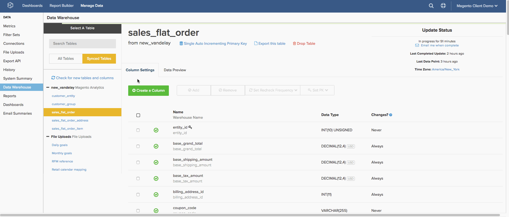

# 配置複製方法

`Replication` 方法和 [重新檢查](../data-warehouse-mgr/cfg-data-rechecks.md) 用於標識資料庫表中的新資料或更新的資料。 正確設定這些參數對於確保資料準確性和優化更新時間都至關重要。 本主題重點介紹複製方法。

在中同步新表時 [Data Warehouse管理器](../data-warehouse-mgr/tour-dwm.md)，將自動為表選擇複製方法。 瞭解各種複製方法、表的組織方式以及表資料的行為方式，使您能夠為表選擇最佳複製方法。

## 複製方法是什麼？

`Replication` 方法分為三組。 `Incremental`。 `Full Table`, `Paused`。

[**[!UICONTROL Incremental Replication]**](#incremental) 意味著 [!DNL Commerce Intelligence] 只複製每次複製嘗試中的新資料或更新的資料。 由於這些方法大大減少了延遲，Adobe建議盡可能使用它。

[**[!UICONTROL Full Table Replication]**](#fulltable) 意味著 [!DNL Commerce Intelligence] 複製每個複製嘗試的表的整個內容。 由於要複製的資料量可能很大，這些方法可以增加延遲和更新時間。 如果表包含任何時間戳或日期時間列，則Adobe建議改用Incremental方法。

**[!UICONTROL Paused]** 指示表的複製已停止或暫停。 [!DNL Commerce Intelligence] 在更新週期中不檢查新資料或更新資料；這意味著不會從表中複製任何資料，該表將此資料作為其複製方法。

## 增量複製方法 {#incremental}

### 修改時間（最理想）

的 `Modified At` 複製方法使用datetime列（建立行時填充該列，資料更改時更新該列）來查找要複製的資料。 此方法旨在處理滿足以下條件的表：

* 包含 `datetime` 在建立行時最初填充的列，並在修改行時更新；
* 這樣 `datetime` 列從不為空；
* 不會從表中刪除行

除了這些標準，Adobe建議 **索引** 這樣 `datetime` 列 `Modified At` 複製，因為這有助於優化複製速度。

運行更新時，通過搜索在中具有值的行來標識新資料或更改的資料 `datetime` 在最近更新後發生的列。 發現新行後，這些行將複製到您的Data Warehouse。 如果 [Data Warehouse管理器](../data-warehouse-mgr/tour-dwm.md)，它們將被當前資料庫值覆蓋。

例如，表可能具有名為 `modified\_at` 表示上次更改資料的時間。 如果最新更新在星期二中午運行，則更新將搜索具有 `modified\_at` 值大於星期二中午。 從星期二中午開始建立或修改的所有發現行都會複製到Data Warehouse。

**你知道嗎？**
即使您的資料庫當前不支援 `Incremental` 複製方法，您可能 [對資料庫進行更改](../../best-practices/mod-db-inc-replication.md) 可以使用 `Modified At` 或 `Single Auto Incrementing PK`。

`Modified At` 不僅是最理想的複製方法，而且速度最快。 此方法不僅在大型資料集上產生明顯的速度增加，而且不需要配置重新檢查選項。 其他方法需要循環訪問整個表以標識更改，即使資料的一小部分已經更改。 `Modified At` 只通過這一小部分。

### 單個自動遞增主鍵

`Auto Incrementing` 是按順序將主鍵分配給行的行為。 如果表是 `Auto Incrementing` 表中最高的主鍵是1,000，則下一個主鍵值為1,001或更高。 不使用的表 `Auto Incrementing` 行為可以指定小於1,000的主鍵值或跳轉到大得多的數字，但這並不是常用的。

此方法旨在從滿足以下條件的表中複製新資料：

* `single-column primary key`;和
* `primary key` 資料類型 `integer`;和
* `auto incrementing` 主鍵值。

表使用時 `Single Auto Incrementing Primary Key` 複製時，通過搜索高於Data Warehouse中當前最高值的主鍵值來發現新資料。 例如，如果Data Warehouse中最高的主鍵值為500，則下次運行更新時，將搜索主鍵值為501或更高的行。

### 添加日期

的 `Add Date` 方法函式與 `Single Auto Incrementing Primary Key` 的雙曲餘切值。 此方法不使用表的主鍵的整數，而是使用 `timestamped` 列，以檢查新行。

表使用 `Add Date` 複製時，通過搜索時間戳值發現新資料，這些值大於與您的Data Warehouse同步的最新日期。 例如，如果更新上次運行於20/12/2015 09:00:00，時間戳大於此值的任何行都將標籤為新資料並複製。

>[!NOTE]
>
>與 `Modified At` 方法 `Add Date` 不檢查現有行以獲取更新的資訊 — 它只會向前看新行。

## 完整表複製方法 {#fulltable}

### 完整表

`Full table` 在檢測到新行時，複製將刷新整個表。 這是迄今為止效率最低的複製方法，因為每次更新期間都必須重新處理所有資料，假設有新行。

在同步進程開始時查詢資料庫並計數行數，可檢測到新行。 如果本地資料庫包含的行數超過 [!DNL Commerce Intelligence]，則會刷新表。 如果行計數相同，或 [!DNL Commerce Intelligence] 包含 *更多* 將跳過表。

這就引出了一個重要問題 **`Full Table`複製在以下情況下不相容：**

* 在後續更新週期之間刪除的行數多於在本地資料庫表中建立的行數，或
* 列值已更改，但未建立其他行

在上述任何一種情形中， `Full Table` 複製不會檢測到任何更改，而且您的資料會失效。 由於這種複製方法效率低下，而且有上述要求， `Full Table` 僅建議將復製作為最後手段。

### 主鍵批

表使用 `Primary Key Batch` （PK批），通過計算主鍵值範圍或批內的行來發現新資料。 雖然您通常認為這與整數一起使用，但偶數文本值的排序方式允許系統定義常數範圍。

例如，假設更新運行並對1到100的鍵範圍執行行計數。 在此更新中，系統查找並記錄37行。 在下次更新中，在1-100範圍內再次執行行計數並查找41行。 由於行數與上次更新的行數存在差異，因此系統會更詳細地檢查該範圍（或批）。

此方法旨在從滿足以下條件的表中複製資料：

* 單列非整數；或
* 複合鍵（包含主鍵的多列） — 請注意，複合主鍵中使用的列永遠不能具有空值；或
* 單列、整數、非自動遞增主鍵值。

此方法不理想，因為由於檢查批和查找更改時必須進行大量處理，因此速度極慢。 Adobe建議不要使用此方法，除非無法進行必要的修改以支援其他複製方法。 如果必須使用此方法，預計更新時間會增加。

## 設定複製方法

複製方法是逐表設定的。 要為表設定複製方法，需要 [`Admin`](../../administrator/user-management/user-management.md) 權限，以便您可以訪問Data Warehouse管理器。

1. 進入「Data Warehouse管理器」後，從 `Synced Tables` 清單以顯示表的架構。
1. 當前複製方法列在表名下。 要更改它，請按一下連結。
1. 在顯示的彈出窗口中，按一下其中一個選項旁邊的單選按鈕 `Incremental` 或 `Full Table` 複製以選擇複製類型。
1. 接下來，按一下 **[!UICONTROL Replication Method]** 下拉清單以選擇方法。 比如說， `Paused` 或 `Modified At`。

   >[!NOTE]
   >
   >**某些增量方法要求您`Replication Key`**。 [!DNL Commerce Intelligence] 將使用此鍵確定下一更新週期的開始位置。
   >
   >例如，如果要使用 `modified at` 方法 `orders` 表，您需要設定 `date column` 作為複製密鑰。 可能存在多個複製密鑰選項，但您選擇 `created at`，或建立訂單的時間。 如果上次更新週期在12/1/2015 00停止:10:00，下一個週期將開始使用 `created at` 日期大於此。

1. 完成後，按一下 **[!UICONTROL Save]**。

看看整個過程：

<!--{: width="801" height="341"}-->

## 收尾

為了完成此操作，您將此表放在一起，比較各種複製方法。 為Data Warehouse中的表選擇方法時非常方便。

| **`Method`** | **`Syncing New Data`** | **`Processing Rechecks on Large Data Sets`** | **`Handle Composite Keys?`** | **`Handle Non-Integer PKs?`** | **`Handle Non-Sequential PK Population?`** | **`Handle Row Deletion?`** |
|-----|-----|-----|-----|-----|-----|-----|
| `Auto-Incrementing Primary Key` | 更快 | 慢 | 否 | 否 | 否 | 是 |
| `Primary Key Batch Monitoring` | 慢 | 慢 | 是 | 是 | 是 | 是 |
| `Modified At` | 更快 | 更快 | 是 | 是 | 是 | 否 |

{style="table-layout:auto"}

## 相關文檔

* [瞭解資料重新檢查](../data-warehouse-mgr/cfg-data-rechecks.md)
* [修改資料庫以支援 ](../../best-practices/mod-db-inc-replication.md)
* [優化資料庫以進行分析](../../best-practices/opt-db-analysis.md)
* [減少更新時間](../../best-practices/reduce-update-cycle-time.md)
