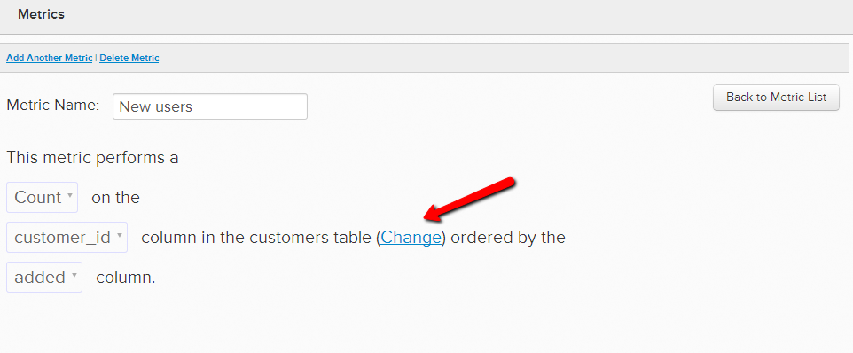
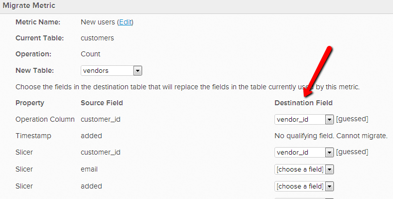
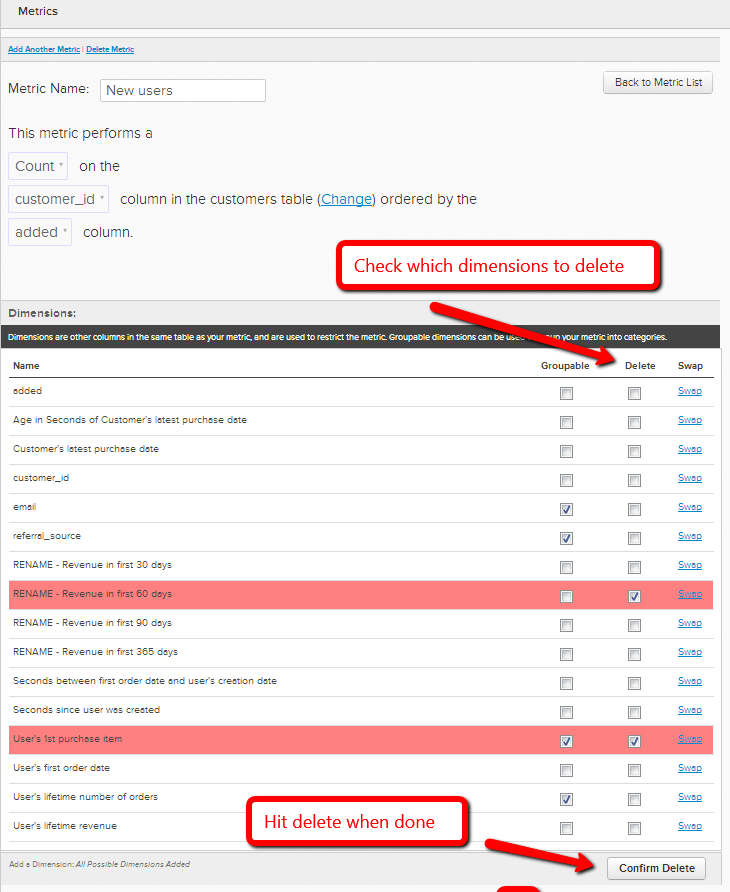

# 變更量度的操作表

在某些情況下，您可以決定變更量度用來執行其操作的資料表格。 例如，如果您有新的使用者表格，則想從「Users\_Old」表格移轉使用者相關量度，以改用「Users\_New」表格。

1. 前往 **[!UICONTROL Data]** > **[!UICONTROL Metrics]**
1. 按一下 **[!UICONTROL Edit]** 在您要切換 `operational` 表格。
1. 在編輯器中，按一下 **[!UICONTROL Change]**.

   
1. 現在，選取您要以此量度為基礎的新表格。
1. 接下來，您必須將現有資料維度與新表格中的對應維度相符。 例如，如果您有一個名為 `User's registration date`，只需選取新表格中哪個欄會記錄相同的日期資料即可。 （如果新表格中沒有相符的欄，請參閱下一步）

   

1. 如果新表格中沒有匹配列，則可以 **在資料表格中建立** 或 [聯絡支援](https://experienceleague.adobe.com/docs/commerce-knowledge-base/kb/troubleshooting/miscellaneous/mbi-service-policies.html?lang=en) 如果是由 [!DNL MBI])。 您也可以 **從量度中刪除維度**. 若要刪除您不再需要的維度，只需返回量度的編輯器，並選取要刪除的維度 `Dimensions`.

   
