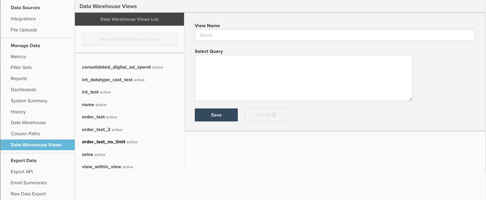

# 使用Data Warehouse檢視

本檔案概述可透過導覽至`Data Warehouse Views` > **[!UICONTROL Manage Data]**&#x200B;存取&#x200B;**[!UICONTROL Data Warehouse Views]**&#x200B;的用途與用途。 以下是其功用以及如何建立檢視的說明，以及如何使用`Data Warehouse Views`合併[!DNL Facebook]和[!DNL AdWords]支出資料的範例。

## 一般用途

`Data Warehouse Views`功能是藉由修改現有資料表，或使用SQL將多個資料表聯結或合併在一起，來建立新倉儲資料表的方法。 建立`Data Warehouse View`並由更新週期處理後，它就會在Data Warehouse中填入`Data Warehouse Views`下拉式清單下的新表格，如下所示：


從這裡，您的新檢視功能與任何其他表格一樣，讓您能夠建立新的計算欄，或在其上建立量度和報表。

`Data Warehouse Views`主要用於合併多個相似但不同的表格，以便所有報表都建立在單一新表格上。 常見的範例包括合併來自舊版資料庫和即時資料庫的表格，以結合歷史和目前的資料，或將多個廣告來源（如Facebook和AdWords）合併為單一`Consolidated ad spend`表格。

如果您熟悉SQL，這兩個合併範例都會使用`UNION`函式，但當您建立新檢視時，可以使用任何PostgreSQL語法和函式。

## 建立和管理Data Warehouse檢視

導覽至「`Data Warehouse Views` > **[!UICONTROL Manage Data]**」可以建立新的&#x200B;**[!UICONTROL Data Warehouse Views]**&#x200B;並刪除現有的檢視，如下所示：



您可以在此處依照下列範例說明建立檢視：

1. 如果觀察現有檢視，請按一下&#x200B;**[!UICONTROL New Data Warehouse View]**&#x200B;開啟空白查詢視窗。 如果已經開啟空白查詢視窗，請繼續進行下一個步驟。
1. 在`View Name`欄位中輸入，為檢視命名。 此處提供的名稱會決定Data Warehouse中檢視的顯示名稱。 `View names`僅限於小寫字母、數字和底線(_)。 所有其他字元皆禁止使用。
1. 在標題為`Select Query`的視窗中輸入查詢，使用標準PostgreSQL語法。

   >[!NOTE]
   >
   >您的查詢必須參考特定的欄名稱。 不允許使用`*`字元來選取所有資料行。

1. 完成時，按一下&#x200B;**[!UICONTROL Save]**&#x200B;以儲存檢視。 您的檢視暫時處於`Pending`狀態，直到下一次完整更新週期處理它為止，此時狀態會變更為`Active`。 經更新處理之後，您的檢視即可在報表中使用。

請務必注意，儲存後，無法編輯用來產生`Data Warehouse View`的基本查詢。 如果您需要調整`Data Warehouse View`的結構，則必須建立檢視，並手動將任何計算欄、量度或報表從原始檢視移轉到新檢視。 移轉完成後，您可以安全地刪除原始檢視。 由於`Data Warehouse Views`不可編輯，Adobe建議您在將查詢儲存為Data Warehouse檢視之前，使用`SQL Report Builder`測試查詢的輸出。

## 範例： [!DNL Facebook]和[!DNL Google AdWords]資料

請仔細檢視本文前面提到的其中一個範例：將[!DNL Facebook]和[!DNL AdWords]的支出資料合併到新的合併廣告表格中。 這通常涉及兩個表格的合併，範例資料集如下：

`Ad source: Google AdWords`

`Table name: campaigns67890`

`Sample data:`

| **`_id`** | **`campaign`** | **`adClicks`** | **`date`** | **`impressions`** | **`adCost`** |
|--- |--- |--- |--- |--- |--- |
| 1 | eee | 60 | 2017-05-05 00:00:00 | 2000 | 10.2 |
| 2 | ggg | 40 | 2017-05-23 00:00:00 | 900 | 4.6 |
| 3 | aaa | 22 | 2017-06-12 00:00:00 | 400 | 2.5 |
| 4 | eee | 350 | 2017-06-30 00:00:00 | 14500 | 35 |
| 5 | fff | 280 | 2017-07-10 00:00:00 | 10200 | 28.5 |

`Ad source: Facebook`

`Table name: facebook_ads_insights_12345`

`Sample data:`

| **`_id`** | **`campaign`** | **`adClicks`** | **`date`** | **`impressions`** | **`adCost`** |
|--- |--- |--- |--- |--- |--- |
| 1 | aaa | 25 | 2017-05-01 00:00:00 | 1200 | 5 |
| 2 | ddd | 12 | 2017-05-15 00:00:00 | 800 | 2.5 |
| 3 | aaa | 40 | 2017-05-22 00:00:00 | 2000 | 7 |
| 4 | aaa | 110 | 2017-06-08 00:00:00 | 6000 | 10 |
| 5 | ccc | 5 | 2017-07-06 00:00:00 | 300 | 1.2 |

若要建立包含[!DNL Facebook]和[!DNL Google AdWords]行銷活動的單一廣告支出表格，您必須撰寫SQL查詢並使用`UNION ALL`函式。 `UNION ALL`陳述式最常用來合併多個不同的SQL查詢，同時將每個查詢的結果附加至單一輸出。

`UNION`陳述式有一些需求值得一提，如PostgreSQL [檔案](https://www.postgresql.org/docs/8.3/queries-union.html)中所述：

* 所有查詢都必須傳回相同數目的欄
* 對應的欄必須具有相同的資料型別

執行`UNION`或`UNION ALL`陳述式時，最終輸出中的資料行名稱會反映您第一個查詢中的資料行命名。

通常，將您的[!DNL Facebook]和[!DNL Google AdWords]支出資料合併到`Data Warehouse View`中需要建立一個包含七欄的表格，其查詢類似於以下內容：

```sql
    SELECT
        "_id" as id,
        'AdWords' as ad_source,
        "date",
        "campaign",
        "adCost" as spend,
        "impressions",
        "adClicks" as clicks
    FROM campaigns67890
    UNION
    SELECT
        "_id" as id,
        'Facebook' as ad_source,
        "date_start" as date,
        "campaign_name" as campaign,
        "spend",
        "impressions",
        "clicks"
    FROM facebook_ads_insights_12345
```

關於上述的幾個要點：

* 為了清楚起見，所有欄都會加上上述的別名，以便名稱在所有查詢中相符。 但這並非必要條件。 在SELECT查詢中呼叫欄的順序指示了它們的排列方式。
* 已建立名為`ad_source`的新資料行，以便更輕鬆地篩選[!DNL AdWords]或[!DNL Facebook]資料。 請記住，此查詢會結合來自兩個表格的所有資料。 如果您沒有建立`ad_source`之類的欄，就很難識別來自特定來源的支出。

將以上查詢儲存為`Data Warehouse View`會建立同時包含[!DNL Facebook]和[!DNL AdWords]支出的表格，如下所示：

| **`id`** | **`ad_source`** | **`date`** | **`campaign`** | **`spend`** | **`impressions`** | **`clicks`** |
|--- |--- |--- |--- |--- |--- |--- |
| **1** | [!DNL Facebook] | 2017-05-01 00:00:00 | aaa | 5 | 1200 | 25 |
| **1** | [!DNL Google AdWords] | 2017-05-05 00:00:00 | eee | 10.2 | 2000 | 60 |
| **2** | [!DNL Facebook] | 2017-05-15 00:00:00 | ddd | 2.5 | 800 | 12 |
| **2** | [!DNL Google AdWords] | 2017-05-23 00:00:00 | ggg | 4.6 | 900 | 40 |
| **3** | [!DNL Facebook] | 2017-05-22 00:00:00 | aaa | 7 | 2000 | 40 |
| **3** | [!DNL Google AdWords] | 2017-06-12 00:00:00 | aaa | 2.5 | 400 | 22 |
| **4** | [!DNL Facebook] | 2017-06-08 00:00:00 | aaa | 10 | 6000 | 110 |
| **4** | [!DNL Google AdWords] | 2017-06-30 00:00:00 | eee | 35 | 14500 | 350 |
| **5** | [!DNL Facebook] | 2017-07-06 00:00:00 | ccc | 1.2 | 300 | 5 |
| **5** | [!DNL Google AdWords] | 2017-07-10 00:00:00 | fff | 28.5 | 10200 | 280 |

與其為每個廣告來源建立個別的行銷量度集，您可以利用上表建立單一量度集以擷取所有廣告。

**正在尋找其他說明嗎？**

技術支援不包含寫入SQL和建立`Data Warehouse Views`。 不過，[服務團隊](https://experienceleague.adobe.com/docs/commerce-knowledge-base/kb/troubleshooting/miscellaneous/mbi-service-policies.html?lang=zh-Hant)確實提供建立檢視的協助。 從使用新資料庫移轉舊版資料庫以建立單一Data Warehouse檢視進行特定分析的所有作業，支援團隊都能提供協助。

通常，為了合併2-3個類似結構的表格而建立新的`Data Warehouse View`需要五個小時的服務時間，這相當於大約1,250美元的工作。 不過，以下是一些可能會增加所需預期投資的常見因素：

* 將三個以上的表格合併為單一檢視
* 建立多個Data Warehouse檢視
* 複雜的聯結邏輯或篩選條件
* 兩個或多個資料結構不同的資料表的合併
