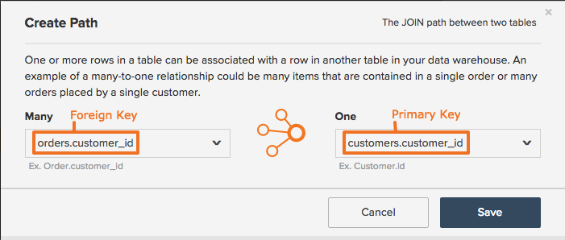

# 建立或刪除計算欄的路徑

## 計算欄重新整理程式

時間 [建立計算欄](../data-warehouse-mgr/creating-calculated-columns.md) 在您的Data Warehouse中，系統會要求您定義一個路徑，描述您正在建立欄的表格如何與您正在提取資訊的表格相關。 若要成功建立路徑，您必須知道兩件事：

1. 資料庫中的資料表如何相互關聯
1. 定義此關係的主要和外部索引鍵

如果您知道此資訊，可以依照本主題中的指示輕鬆建立路徑。 您可能需要向貴組織的技術專家諮詢，或聯絡 [Professional Services團隊](https://experienceleague.adobe.com/docs/commerce-knowledge-base/kb/troubleshooting/miscellaneous/mbi-service-policies.html).

## 重新整理表格關係和索引鍵型別 {#refresher}

### 表格關係 {#relationships}

本概念的說明請參閱 [瞭解並評估表格關係文章](../../data-analyst/data-warehouse-mgr/table-relationships.md)，但快速摘要不會傷害任何人，對嗎？

表格可以透過下列三種方式之一相互關聯：

| **`Relationship Type`** | **`Example`** |
|-----|-----|
| **`one-to-one`** | 人員與駕照號碼之間的關係。 一個人只能有一個駕駛執照號碼，而且一個駕駛執照號碼只屬於一個人。 |
| **`one-to-many`** | 訂單與料號之間的關係 — 一個訂單可以包含許多料號，但一個料號屬於單一訂單。 在這種情況下，訂單表格是一面，而料號表格是多面。 |
| **`many-to-many`** | 產品與類別之間的關係：產品可屬於許多類別，而類別可包含許多產品。 |

{style="table-layout:auto"}

瞭解兩個表格之間的關係時，就可使用它來決定應該建立哪個路徑，以將資訊從一個表格帶入另一個表格。 此下一個步驟需要瞭解有助於建立表格關係的主要和外部索引鍵。

### 主索引鍵和外部索引鍵 {#keys}

A `Primary Key` 是未變更的欄或欄集，會在表格中產生唯一值。 例如，當客戶在網站上訂購時，新的一列會新增至 `orders` 您的購物車中的表格（含新的） `order_id`. 這個 `order_id` 可讓客戶與企業追蹤該特定訂單的進度。 由於訂單ID是唯一的，因此通常會 `Primary Key` 的 `orders` 表格。

A `Foreign Key` 是在資料表內建立的資料行，連結至 `Primary Key` 另一個資料表的資料行。 外部索引鍵會建立表格之間的參考，讓分析師輕鬆查閱並連結記錄。 假設您想知道哪些訂單屬於您的每位客戶。 此 `customer id` 欄(`Primary Key` 的 `customers` 表格)和 `order_id` 欄(`Foreign Key` 在 `customers` 表格，參考 `Primary Key` 的 `orders` 表格)，讓我們連結及分析此資訊。 建立路徑時，系統會要求您同時定義 `Primary Key` 和 `Foreign Key`.

## 建立路徑 {#createpath}

在Data Warehouse中建立欄時，您必須定義將資訊從一個表格帶入另一個表格的路徑。 有時候，路徑會預先填入，因為表格之間存在路徑，但如果無法預先填入，則必須建立路徑。

使用關聯性 **客戶** 和 **訂購** 以向您說明如何完成此操作。 劃分：

* 關係為 `one-to-many`  — 客戶可以有多個訂單，但一個訂單只能有一個客戶。 這會告訴我們關係的方向，或是應該建立計算欄的位置。 在此案例中，它表示資訊來自 `orders` 表格可帶入 `customers` 表格。
* 此 `primary key` 您要使用的是 `customers.customerid`，或 `customer ID` 中的欄 `customers` 表格。
* 此 `foreign key` 您要使用的是 `orders.customerid`，或 `customer ID` 中的欄 `orders` 表格。

現在，您可以建立路徑。

1. 按一下 **[!UICONTROL Data > Data Warehouse]**.
1. 在表格清單中，按一下要建立欄的表格。 在此範例中，它是 `customers` 表格。
1. 表格結構描述隨即顯示。 按一下 **[!UICONTROL Create New Column]**.
1. 為欄命名，例如， `Customer's orders`.
1. 選取欄的定義。 檢視 [計算欄參考線](../data-warehouse-mgr/creating-calculated-columns.md) 方便備忘單。
1. 在 [!UICONTROL Select table and column] 下拉式清單，按一下 **[!UICONTROL Create new path]** 選項。

   

1. 使用下拉式清單，選取每個表格的主要和外部索引鍵。

   在 `Many` 側，您選取 `orders.customerid`  — 請記住，客戶可以有許多訂單。

   在 `One` 側，您選取 `customers.customerid`  — 訂單只能有一個客戶。

1. 按一下 **[!UICONTROL Save]** 以儲存路徑並完成欄的建立。

### 建立路徑的限制 {#limits}

* **[!DNL Commerce Intelligence]無法猜測主要/外部索引鍵關係**. 您不想將不正確的資料帶入帳戶，因此建立路徑必須手動完成。

* **目前只能在兩個不同的表格之間指定路徑**. 您嘗試重新建立的邏輯是否涉及兩個以上的表格？ 然後(1)先將欄聯結到中介表格，然後再聯結到「最終目的地」表格，或是(2)參閱 [Professional Services團隊](https://experienceleague.adobe.com/docs/commerce-knowledge-base/kb/troubleshooting/miscellaneous/mbi-service-policies.html) 以找出達成目標的最佳方法。

* **欄一次只能是ONE路徑的外來鍵參照**. 例如，如果 `order_items.order_id` 指向 `orders.id`，然後 `order_items.order_id` 無法指向任何其他專案。

* **`Many-to-many`技術上可建立路徑，但通常會產生不良資料，因為兩側都不是真 `one-to-many` 外部索引鍵**. 接近這些路徑的最佳方式一律取決於所需的特定分析。 請洽詢RJ分析人員團隊，找出最佳解決方案。

如果由於上述一個或多個限制而無法建立計算欄，請聯絡支援人員並提供您目前所在欄的說明

## 刪除計算欄路徑 {#delete}

在您的Data Warehouse中建立了不正確的路徑？ 或者你正在做一些春季清潔工作，想整理一下？ 如果您需要刪除帳戶的路徑，可以 [傳送票證給Adobe支援分析師](../../guide-overview.md#Submitting-a-Support-Ticket). **請務必加入路徑的名稱！**

## 正在結束 {#wrapup}

現在您已熟悉如何在Data Warehouse中建立計算欄的路徑。 如果您仍不確定特定路徑，請記得您隨時都可以按一下 **[!UICONTROL Support]** 在您的 [!DNL Commerce Intelligence] 帳戶以取得協助。

## 相關

* [瞭解並評估表格關係](../data-warehouse-mgr/table-relationships.md)
* [建立計算欄的路徑](../data-warehouse-mgr/create-paths-calc-columns.md)
* [計算欄型別](../data-warehouse-mgr/calc-column-types.md) 正在嘗試建立。
