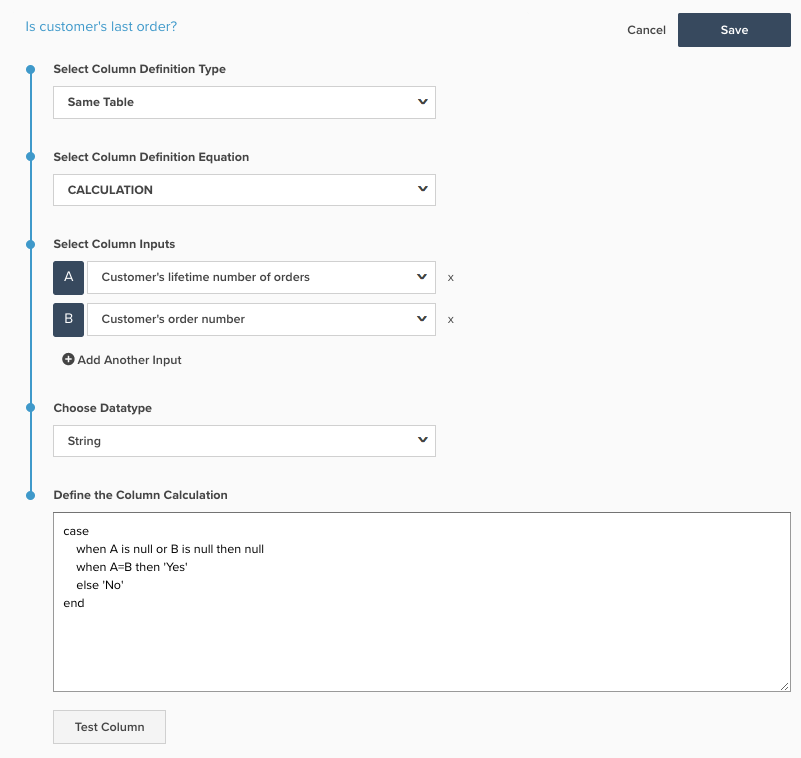

# 建立SQL計算資料行

此主題概述`Calculation`資料行型別的用途和用途，可以使用[Data Warehouse管理員](../data-warehouse-mgr/tour-dwm.md)將其新增到表格。 以下說明SQL計算的用途、使用它們的原因、建立SQL計算的程式，並包含兩個範例。

**說明**

在過去，被視為`advanced`的欄只能由位於[!DNL Adobe Commerce Intelligence]的客戶成功團隊分析師完成。 現在，所有功能都由一般使用者掌握，而且可以在新的`SQL Calculation`架構上以[!DNL Commerce Intelligence]欄的形式建立進階欄。

`Calculation`欄型別(現在可作為Data Warehouse Manager中的選項)與允許您使用PostgreSQL邏輯轉換表格上的欄的表格作業相同。 您可以在PostgreSQL網站`Calculation`此處[找到可以在](https://www.postgresql.org/docs/9.6/functions.html)資料行型別中使用的函式和運運算元的相關檔案。

可以使用`Calculation`資料行建立的不同資料行幾乎不受限制，但大部分的資料行可以使用IF-THEN陳述式與基本算術來建立，這可用於下列範例。

**範例1：客戶的上次訂單是否？**

大多數帳戶的`Is customer's last order?`表格中都有名為`orders`的欄，以分析重複購買率和流失的客戶。 如果您的帳戶使用新架構，則此欄是使用`Calculation`欄建置的，並可在以下熒幕擷取中看見：

`Is customer's last order?`資料行使用分別別為`Customer's lifetime number of orders`和`Customer's order number`的輸入`A`和`B`。

逐行，PostgreSQL的含義是：

* 案例：這會從一連串If - Then陳述式開始
* 當`A`為Null或`B`為Null時則為Null：如果任一輸入為空白，則輸出也應為空白。 這是為了防止SQL錯誤
* 當`A=B`然後`Yes`：如果這個資料列的`Customer's lifetime number of orders`等於`Customer's order number`，則傳回`Yes`。 因此，如果客戶已下四份訂單，則第四份訂單的列會傳回`Yes`的`Is customer's last order?`
* else `No`：如果其他陳述式都不符合，則傳回`No`
* end：這會結束If - Then陳述式

此資料行(`NULL`、`Yes`、`No`)可能傳回的值包含非數字字元，因此這裡的資料型別為String。

**範例2：訂單料號總計值（數量*價格）**

許多使用者端都喜歡在專案層級分析收入，並依`product name`或`category`之類的欄位進行分割。 大部分的資料庫實際上並不會提供您訂單中產品的收入，而是提供訂單中售出的數量及料號的價格。

若要啟用產品收入分析，大部分帳戶的`Order item total value (quantity * price)`表格中都有名為`Orders Items`的欄。 如果您的帳戶使用新架構，則此欄也是使用`Calculation`欄建置的，並可在以下熒幕擷圖中看到：

在Commerce結構描述中，`Order item total value (quantity * price)`資料行使用分別別為`qty ordered`和`base price`的輸入`A`和`B`。

此新欄傳回的值是美元和美分，因此正確的資料型別為`Decimal(10,2)`。

**機械**

導覽至`Calculation`，可將新的&#x200B;**[!DNL Manage Data > Data Warehouse]**&#x200B;資料行新增至資料表，如下所示：

您可以在此處執行下列步驟來建立`Calculation`欄：

1. 選取您要新增`Calculation`欄的資料表。
1. 在正確的表格上，按一下畫面右上方的&#x200B;**[!UICONTROL Create New Column]**。
1. 從`Select a definition`下拉式清單中選取`Same Table`。
1. 選取`Calculation`做為`column definition equation`。
1. 輸入欄名稱。
1. 從表格中選擇用於新欄邏輯的`input`欄。 您新增的每個欄都會取得字母別名，因此第一欄為`A`，第二欄為`B`，依此類推。
1. 在視窗中，使用輸入的字母別名輸入新欄的PostgreSQL邏輯。 SQL計算應限於單一資料行定義，包括SQL查詢的SELECT和FROM敘述句之間的所有邏輯。 使用任何輸入字母的SQL關鍵字都應使用小寫。 例如，使用`CASE`陳述式時，應以小寫 — `case`撰寫。 系統假設大寫`A`是指其中一個輸入。
1. 選擇適當的資料型別。
   * `Integer` — 整數
   * `Decimal(10,2)` — 總共10位數的十進位數字，其中2位在小數點的右側
   * `String` — 任何型別的文字或使用非數字的字元序列
   * `Datetime` - `yyyy-MM-dd hh:mm:ss`格式

1. 按一下&#x200B;**[!UICONTROL test column]**。 這會為每個輸入產生五個測試值的清單，並顯示每組測試值的步驟6邏輯結果。 如果SQL的任何部分產生錯誤，則會傳回適當的錯誤訊息。 只有當所有輸入欄都是原生欄位時，才能產生範例結果。 如果有任何輸入欄是計算欄，您必須將欄新增至量度，並在Visual Report Builder中檢視來驗證結果

1. 當您對結果感到滿意時，請按一下&#x200B;**[!UICONTROL Save]**。 欄可啟用以供使用。
