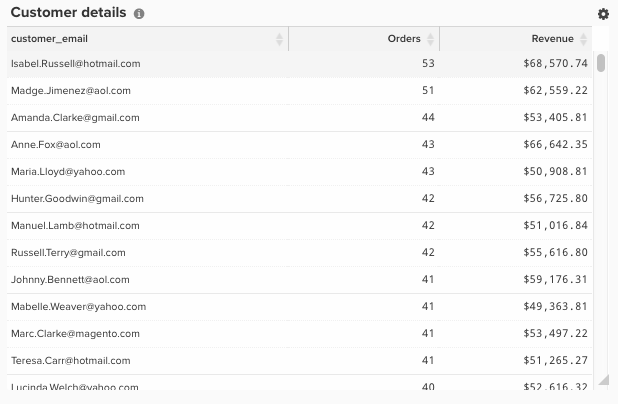

# 建立SQL計算資料行

本主題概述了 `Calculation` 欄型別，可使用新增至表格 [Data Warehouse管理員](../data-warehouse-mgr/tour-dwm.md). 以下說明SQL計算的用途、使用它們的原因、建立SQL計算的程式，並包含兩個範例。

**說明**

在過去，被視為 `advanced` 只能由這裡的客戶成功團隊分析師完成 [!DNL Adobe Commerce Intelligence]. 現在，所有功能都掌握在使用者手中，進階欄位可以以下列形式建立 `SQL Calculation` 新頁面上的欄 [!DNL Commerce Intelligence] 架構。

此 `Calculation` 欄型別(現在可作為「Data Warehouse管理員」中的選項)是相同的表格作業，可讓您使用PostgreSQL邏輯來轉換表格上的欄。 可用於的函式和運運算元的相關檔案 `Calculation` 欄型別可在PostgreSQL網站上找到 [此處](https://www.postgresql.org/docs/9.6/functions.html).

可使用建立的不同欄 `Calculation` 欄幾乎不受限制，但大部分的欄都可以使用IF-THEN陳述式和基本算術來建立，這些用於以下範例。

**範例1：是客戶的最後一個訂單嗎？**

大多數帳戶都有一個名為的欄 `Is customer's last order?` 在他們的 `orders` 此表格用於分析重複購買率和流失客戶。 如果您的帳戶位於新架構，此欄是使用 `Calculation` 欄，並可在以下熒幕擷圖中看到：

此 `Is customer's last order?` 欄使用輸入 `Customer's lifetime number of orders` 和 `Customer's order number` 別名為 `A` 和 `B` （分別）。

逐行，PostgreSQL的含義是：

* 案例：這會從一連串If - Then陳述式開始
* 當 `A` 為null或 `B` 為Null然後為Null：如果任一輸入為空，則輸出也應為空白。 這是為了防止SQL錯誤
* 當 `A=B` 則 `Yes`：如果 `Customer's lifetime number of orders` 等於 `Customer's order number` 針對此列，然後傳回 `Yes`. 因此，如果客戶下了四筆訂單，則第四筆訂單的列將會傳回 `Yes` 的 `Is customer's last order?`
* 否則 `No`：如果其他任何when陳述式都不符合，則傳回 `No`
* end：這會結束If - Then陳述式

此欄可傳回的可能值(`NULL`， `Yes`， `No`)包含非數字字元，因此這裡的資料型別是字串。

**範例2：訂單料號總計值（數量*價格）**

許多客戶喜歡在專案層級分析收入，依下列欄位進行分割 `product name` 或 `category`. 大部分的資料庫實際上並不會提供您訂單中產品的收入，而是提供訂單中售出的數量及料號的價格。

若要啟用產品收入分析，大部分帳戶都有一個名為的欄 `Order item total value (quantity * price)` 在他們的 `Orders Items` 表格。 如果您的帳戶位於新架構上，此欄也是使用 `Calculation` 欄，並可在以下熒幕擷圖中看到：

在商務結構描述中， `Order item total value (quantity * price)` 欄使用輸入 `qty ordered` 和 `base price` 別名為 `A` 和 `B` （分別）。

此新欄傳回的值是美元和美分，因此正確的資料型別為 `Decimal(10,2)`.

**力學**

新 `Calculation` 您可以導覽至「 」，將欄新增至表格 **[!DNL Manage Data > Data Warehouse]** 如下所示：

從這裡，您可以建立 `Calculation` 欄，請遵循以下步驟：

1. 選取您要新增的表格 `Calculation` 欄。
1. 在正確的表格上時，按一下 **[!UICONTROL Create New Column]** 在熒幕的右上方。
1. 從 `Select a definition` 下拉式清單，選取 `Same Table`.
1. 選取 `Calculation` 作為 `column definition equation`.
1. 輸入欄名稱。
1. 選擇 `input` 表格中用於新欄邏輯的欄。 您新增的每個欄都會有字母別名，因此第一欄為 `A`，第二個是 `B` 等等。
1. 在視窗中，使用輸入的字母別名輸入新欄的PostgreSQL邏輯。 SQL計算應限於單一資料行定義，包括SQL查詢的SELECT和FROM敘述句之間的所有邏輯。 使用任何輸入字母的SQL關鍵字都應使用小寫。 例如，使用 `CASE` 陳述式中，應該使用小寫字母來撰寫 —  `case`. 系統假設大寫 `A` 是指其中一個輸入。
1. 選擇適當的資料型別。
   * `Integer`  — 整數
   * `Decimal(10,2)`  — 十進位數字，總共10位數，其中2位在小數點的右側
   * `String`  — 任何型別的文字或使用非數字的字元序列
   * `Datetime` - `yyyy-MM-dd hh:mm:ss` 格式

1. 按一下 **[!UICONTROL test column]**. 這會為每個輸入產生五個測試值的清單，並顯示每組測試值的步驟6邏輯結果。 如果SQL的任何部分產生錯誤，則會傳回適當的錯誤訊息。 只有當所有輸入欄都是原生欄位時，才能產生範例結果。 如果有任何輸入欄是計算欄，您必須將欄新增至量度並在視覺Report Builder中檢視來驗證結果

1. 當您對結果滿意時，按一下 **[!UICONTROL Save]**. 欄可啟用以供使用。
