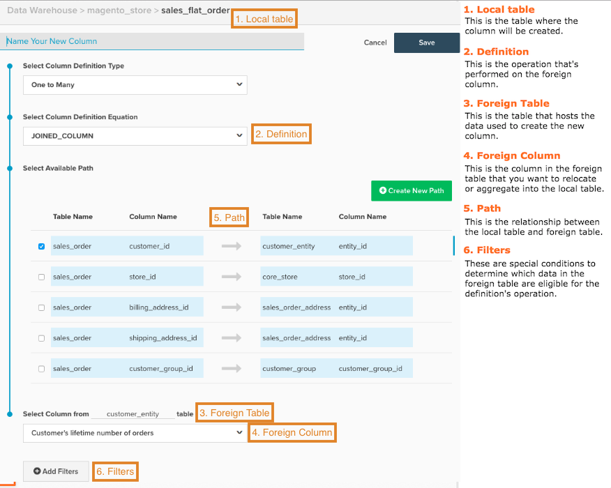

# 建立計算欄

在分析您的資料時，合併來自不同來源的資料會很有幫助。 想要依贏取來源將收入分組，連結以下來源的資料： `orders` 表格和 [!DNL Google Analytics] 資料？ 您可能想要依客戶性別將收入分組，或針對細分將客戶屬性加入交易資料。 本主題說明如何執行此操作。

開始之前，Adobe建議您先檢閱 [Calculated Column Types指南](../../data-analyst/data-warehouse-mgr/calc-column-types.md) 以取得您可以在「Data Warehouse管理員」中建立的欄型別相關資訊，以及其定義和範例。

1. 若要開始使用，請按一下 **[!DNL Manage Data > Data Warehouse]**.

1. 按一下要建立欄的表格。 例如，如果您想要建立 `Customer Gender` 欄中的收入細分，您可以選取 `sales_flat_order` 表格。

1. 表格配置隨即顯示。 按一下 **[!UICONTROL Create New Column]**.

1. 為欄命名。 例如， `Customer Gender`.

1. 選取欄的定義。 這就是 [Calculated Column Types指南](../data-warehouse-mgr/calc-column-types.md) 隨手可得！

1. 對於某些型別的欄，需要更多資訊才能正確建立欄：

   * 對象 `One to Many` （已加入）和 `Many to One` （彙總）欄，您必須選取表格和欄。

   * 對於 `Same Table calculation`，您需要從下拉式選單中選取所需的日期欄位。

如果您要建立 `One to Many` （已加入）或 `Many to One` （彙總）欄中，您必須選取一個路徑來連線兩個表格。 在此步驟中，您可以使用現有路徑或建立路徑。

>[!NOTE]
>
>請記得將表格正確定義為多個或一個！

* 如有需要，您可以套用 [篩選器](../../data-user/reports/ess-manage-data-filters.md) 至新欄。

* 完成後，按一下 **[!UICONTROL Save]**.

您的新欄會顯示在目前表格中，並帶有 `Pending` 狀態。 下次更新完成後，您的欄便可用於量度和報表。

## 便利的參考地圖 {#map}

如果您在建立計算欄時無法記住所有輸入內容，請嘗試在建立時讓此參考地圖方便使用：

## 相關檔案

* [計算欄型別](../data-warehouse-mgr/calc-column-types.md)
* [進階計算欄型別](../data-warehouse-mgr/adv-calc-columns.md)
* [建置 [!DNL Google ECommerce] 包含訂單和客戶資料的維度](../data-warehouse-mgr/bldg-google-ecomm-dim.md)
