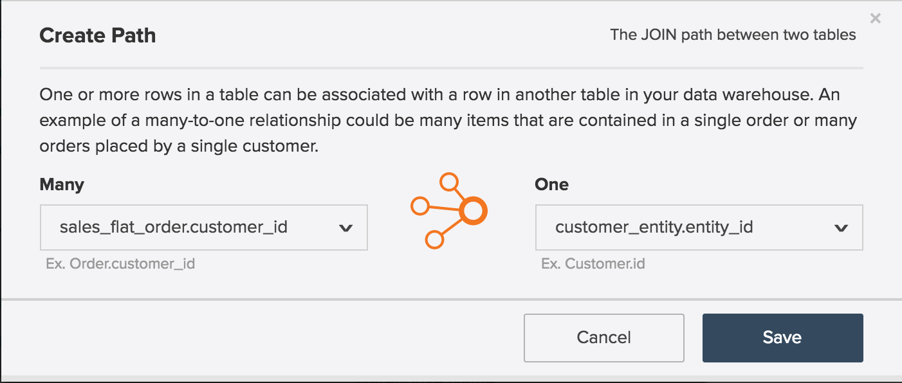
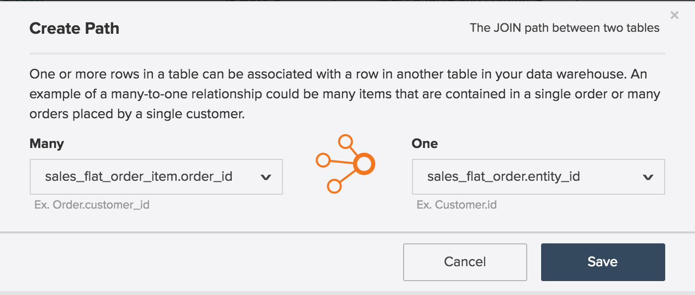
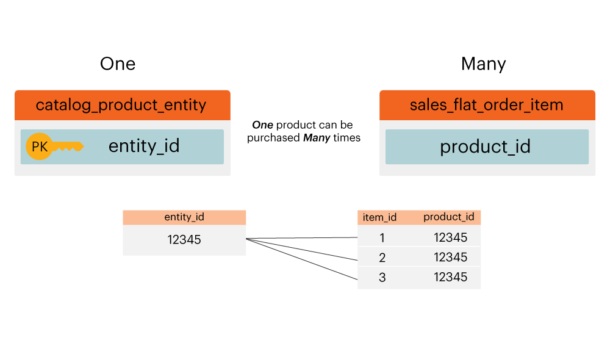

# 實體關係圖

什麼是&#x200B;**[!UICONTROL entity relationship (ER) diagram]**？ [!UICONTROL ER]圖表是資料庫中表格的視覺化效果以及它們彼此的關係。 此主題包含一些[!UICONTROL ER]圖表，可協助您視覺化一些常見的Adobe Commerce資料庫表格之間的關係。

>[!NOTE]
>
>在此主題中，您會看到&#x200B;**加入**、**關係**&#x200B;和&#x200B;**路徑**&#x200B;等字。 這些字詞都是用來描述兩個資料表的連線方式。

## 核心Commerce [!UICONTROL ER]圖表

此`ER`圖表代表Commerce資料庫中核心資料表之間的關係。 透過一次檢視多個關係，您可以檢視資料在多個表格間如何產生關聯。

下列段落包含一次兩個表格專用的`ER`圖表。 若要檢檢視表及其隨附的說明，請按一下該區段的標頭。

## `customer\_entity & sales\_flat\_order`

一位客戶可以下許多訂單。 這兩個資料表之間的關係是`customer\_entity.entity\_id = sales\_flat\_order.customer\_id`

>[!IMPORTANT]
>
>`customer\_entity.entity\_id`不等於`sales\_flat\_order.entity\_id`。 第一個可視為為`customer\_id`，第二個則可視為為`order\_id.`

在[!DNL Commerce Intelligence]內，如果這兩個資料表之間的路徑不存在，您可以在Data Warehouse索引標籤中[建立路徑](../data-warehouse-mgr/create-paths-calc-columns.md)。 當您準備好建立路徑時，其定義如下：

## `sales\_flat\_order & sales\_flat\_order\_item`

一個訂單可以包含許多專案。 這兩個資料表之間的關係是`sales\_flat\_order.entity\_id = sales\_flat\_order\_item.order\_id`。

在[!DNL Commerce Intelligence]內，如果這兩個資料表之間的路徑不存在，您可以在Data Warehouse索引標籤中[建立路徑](../data-warehouse-mgr/create-paths-calc-columns.md)。 當您準備好建立路徑時，請如下所示定義路徑。

## `catalog\_product\_entity & sales\_flat\_order\_item`

一個產品可以購買許多專案。 這兩個資料表之間的關係是`catalog\_product\_entity.entity\_id = sales\_flat\_order\_item.product`。

在[!DNL Commerce Intelligence]內，如果這兩個資料表之間的路徑不存在，您可以在Data Warehouse索引標籤中[建立路徑](../data-warehouse-mgr/create-paths-calc-columns.md)。 當您準備好建立路徑時，請如下所示定義路徑。

