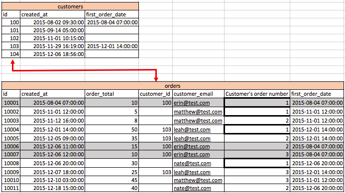
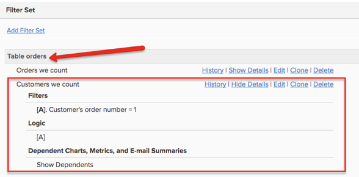

# 來賓訂單

在複查訂單時，如果您注意到 `customer\_id` 值為null或沒有值可重新連接到 `customers` 表，這表示您的商店允許客人訂購。 這意味著 `customers` 表很可能不包括所有客戶。

本主題討論來賓訂單對資料的影響，以及您必須正確計算來賓訂單在您的 [!DNL Commerce Intelligence] Data Warehouse。

## 來賓訂單對資料的影響

在典型的商業資料庫中 `orders` 連接到 `customers` 的子菜單。 上的每一行 `orders` 表 `customer\_id` 對於上的一行唯一的列 `customers` 的子菜單。

* **如果所有客戶都已註冊** 不允許客人訂單，這意味著每條記錄 `orders` 表在 `customer\_id` 的雙曲餘切值。 因此，每個訂單都重新連接到 `customers` 的子菜單。

   

* **如果允許來賓訂單**，這表示某些訂單在 `customer\_id` 的雙曲餘切值。 僅向註冊客戶賦值 `customer\_id` 列 `orders` 的子菜單。 未註冊的客戶將收到 `NULL` 此列的值（或空）。 因此，並非所有訂單記錄都在 `customers` 的子菜單。

   >[!NOTE]
   >
   >要標識作出訂單的唯一個人，需要在訂單旁邊有另一個唯一的用戶屬性 `customer\_id` 訂單。 通常，使用客戶的電子郵件地址。

## 如何在Data Warehouse設定中計算來賓訂單

通常，實施您帳戶的銷售工程師在構建您的Data Warehouse基礎時會考慮來賓訂單。

客戶訂單的最佳計算方式是，將客戶級別的所有指標都基於 `orders` 的子菜單。 此設定使用所有客戶都具有的唯一客戶ID，包括來賓（通常使用客戶電子郵件）。 這將忽略來自 `customers` 的子菜單。 使用此選項，只有至少購買了一次產品的客戶才會包括在客戶級別報告中。 尚未購買的註冊用戶不包括在內。 使用此選項， `New customer` 度量基於客戶在 `orders` 的子菜單。

你可能注意到 `Customers we count` 此類型設定中的篩選器集 `Customer's order number = 1`。

在沒有來賓訂單的情況下，每個客戶在客戶表中都作為唯一行存在（請參閱圖1）。 度量，如 `New customers` 只需根據 `created\_at` 瞭解新客戶的日期（基於註冊日期）。

在客戶訂單設定中，所有客戶指標都基於 `orders` 表以說明來賓訂單，您必須確保 `not counting customers twice`。 如果對訂單表的ID進行計數，則會對每個訂單進行計數。 如果您將ID計入 `orders` 並使用過濾器， `Customer's order number = 1`然後，您將計算每個唯一的客戶 `only one time`。 這適用於所有客戶級別指標，如 `Customer's lifetime revenue` 或 `Customer's lifetime number of orders`。

您可以看到上面有空 `customer\_ids` 的 `orders` 的子菜單。 如果使用 `customer\_email` 要識別獨特的客戶，您可以看到 `erin@test.com` 已經下了三(3)個訂單。 因此，您可以 `New customers` 度量 `orders` 表格，基於以下條件：

* `Operation table = orders`
* `Operation column = id`
* `Operation = count`
* `Timestamp = Customer's first order date`
* `Filter = Customer's we count (where Customer's order number = 1)`
