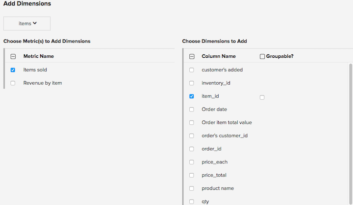

# 管理資料維度

>[!NOTE]
>
>需要 [管理員許可權](../../administrator/user-management/user-management.md).

維度是與量度位於相同表格中的欄位，可用來根據該量度篩選或劃分圖表。 例如，收入量度可能包含城市、州、國家/地區、訂單狀態、抵用券代碼和其他型別的維度。

## 將維度新增至多個量度

若要一次新增一或多個維度至多個量度：

1. 前往 **[!UICONTROL Manage Data > Metrics]**.

1. 按一下 **[!UICONTROL Add Dimensions To Metric(s)]**.

1. 選擇包含維度的表格。

1. 在 `Choose Metric(s) to Add Dimensions` 欄中，選取您要新增維度的量度。 選取後， `Choose Dimensions to Add` 欄會顯示在右側。 勾選您要新增至所選量度的維度。

   

1. 如果您想要依報表上的任何資料維度來劃分或分組，請務必指出這些維度是 _可分組_.

1. 按一下 **[!UICONTROL Add]**.

## 從多個量度中刪除維度

若要從多個量度中刪除一或多個維度：

1. 前往 **[!UICONTROL Data > Metrics]**.

1. 按一下 **[!UICONTROL Remove Dimensions From Metric(s)]**.

1. 選擇包含維度的表格。

1. 在左側選取您要移除的量度，並在右側選取您要移除的維度。

1. 按一下 **[!UICONTROL Remove]**.

1. 如果維度已在報表中使用，則會顯示警告與正在使用維度的圖表清單。 按一下 **[!UICONTROL Delete]** 刪除已核取的維度及其所有相依項，包括報表。

## 管理量度中的維度

**若要在量度中新增維度：**

1. 前往 **[!UICONTROL Data > Metrics]**.

1. 按一下 **[!UICONTROL Edit]** 在您想要新維度的量度上。

1. 在 `Dimensions` 區段，使用 `Add a dimension` 下拉式清單，以選取要新增的維度。

>[!NOTE]
>
>您想要篩選或分組依據的任何維度都必須已在下列位置進行追蹤： [!DNL Commerce Intelligence]. 如果您找不到所需的維度，您可能需要開始透過以下方式追蹤資料庫中的新資料欄： [Data Warehouse](../data-warehouse-mgr/tour-dwm.md) 頁面。

**若要從量度刪除維度：**

1. 前往 **[!UICONTROL Manage Data > Metrics]**.

1. 按一下 **[!UICONTROL Edit]** 在您想要新維度的量度上。

1. 在 `Dimensions` 區段中，選取您要移除之維度旁邊「刪除」欄中的核取方塊。

>[!NOTE]
>
>即使在刪除維度後，它仍會作為欄存在於您的Data Warehouse的表格中。 您可以將其新增回任何量度，並使用這些維度建立新量度。 若要移除維度對應的資料欄，請執行下列動作 [!DNL Commerce Intelligence]，只要取消追蹤資料欄，透過 [Data Warehouse](../data-warehouse-mgr/tour-dwm.md) 頁面。

## 相關檔案

* [細分和篩選的最佳實務](../../best-practices/segment-filter.md)
