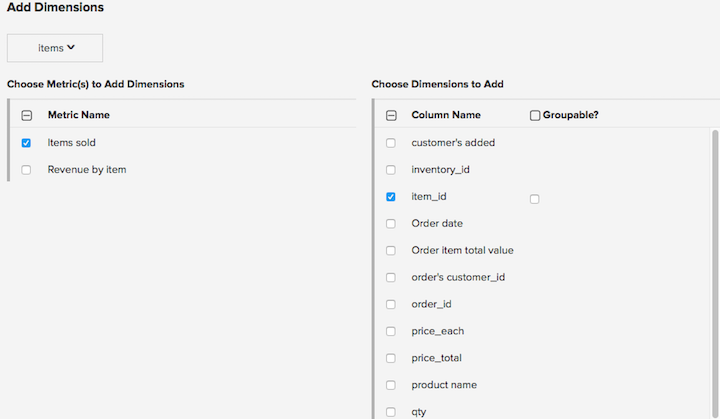

# 管理資料維度

>[!NOTE]
>
>需要[管理員許可權](../../administrator/user-management/user-management.md)。

維度是與量度位於相同表格中的欄位，可用來根據該量度篩選或劃分圖表。 例如，收入量度可能包含城市、州、國家/地區、訂單狀態、抵用券代碼和其他型別的維度。

## 將維度新增至多個量度

若要一次新增一或多個維度至多個量度：

1. 移至&#x200B;**[!UICONTROL Manage Data > Metrics]**。

1. 按一下&#x200B;**[!UICONTROL Add Dimensions To Metric(s)]**。

1. 選擇包含維度的表格。

1. 在`Choose Metric(s) to Add Dimensions`欄中，選取您要新增維度的量度。 選取後，`Choose Dimensions to Add`欄就會顯示在右側。 勾選您要新增至所選量度的維度。

   

1. 如果您想要依報表上的任何資料維度來劃分或分組，請務必指出它們是&#x200B;_可分組_。

1. 按一下&#x200B;**[!UICONTROL Add]**。

## 從多個量度中刪除維度

若要從多個量度中刪除一或多個維度：

1. 移至&#x200B;**[!UICONTROL Data > Metrics]**。

1. 按一下&#x200B;**[!UICONTROL Remove Dimensions From Metric(s)]**。

1. 選擇包含維度的表格。

1. 選取您要從左側移除維度的量度，以及您要從右側移除的維度。

1. 按一下&#x200B;**[!UICONTROL Remove]**。

1. 如果維度正在報表中使用，則會顯示警告與正在使用維度的圖表清單。 按一下「**[!UICONTROL Delete]**」以刪除核取的維度及其所有相依項，包括報表。

## 管理量度中的維度

**若要在量度中新增維度：**

1. 移至&#x200B;**[!UICONTROL Data > Metrics]**。

1. 在您要新維度的量度上按一下&#x200B;**[!UICONTROL Edit]**。

1. 在`Dimensions`區段中，使用`Add a dimension`下拉式清單來選取要新增的維度。

>[!NOTE]
>
>任何您想要篩選或分組依據的維度都必須已在[!DNL Commerce Intelligence]中追蹤。 如果您找不到所需的維度，您可能需要透過[Data Warehouse](../data-warehouse-mgr/tour-dwm.md)頁面開始追蹤資料庫中的新資料欄。

**若要從量度刪除維度：**

1. 移至&#x200B;**[!UICONTROL Manage Data > Metrics]**。

1. 在您要新維度的量度上按一下&#x200B;**[!UICONTROL Edit]**。

1. 在`Dimensions`區段下，選取您要移除之維度旁邊刪除欄中的核取方塊。

>[!NOTE]
>
>即使刪除維度後，它仍會作為欄存在於Data Warehouse的表格中。 您可以將其新增回任何量度，並使用這些維度建立新量度。 若要從[!DNL Commerce Intelligence]移除維度對應的資料欄，只要透過[Data Warehouse](../data-warehouse-mgr/tour-dwm.md)頁面取消追蹤資料欄即可。

## 相關檔案

* [細分和篩選的最佳作法](../../best-practices/segment-filter.md)
