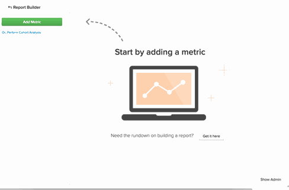

# [!DNL Google Analytics]使用贏取來源

## 什麼是管道？ {#channels}

建立自訂區段來檢視不同流量的表現和觀察趨勢，是[!DNL Google Analytics]最強大的用途之一。 [!DNL Google Analytics]中預設存在一個區段類別為`Channels`。 管道是人們造訪您網站的一組常見方式。  [!DNL Google Analytics]會自動排序您取得使用者的許多方式（無論是社群媒體、每次點按付費、電子郵件或轉介連結），並將其整合到貯體或頻道中。

## 為什麼在Commerce Intelligence中看不到我的`channels`？ {#nochannels}

`Channels`為簡單、彙總的資料貯體。 若要將您的贏取排序為管道貯體，[!DNL Google]會使用特定引數來設定不同的規則和定義：贏取[Source](https://support.google.com/analytics/answer/1033173?hl=en) （流量的來源）和贏取[Medium](https://support.google.com/analytics/answer/6099206?hl=en) （來源的一般類別）的組合。

雖然這些貯體可協助您瞭解流量的來源，但此資料不會透過管道進行標籤，而會透過Source和Medium的組合進行標籤。 因為[!DNL Google]以兩個個別的資料點傳送管道資訊，所以管道群組不會自動顯示在[!DNL Commerce Intelligence]中。

## 什麼是預設的管道群組？ 他們是如何建立的？

根據預設，[!DNL Google]會設定八個不同的管道。 決定如何建立管道的規則如下。

| **頻道** | **這是什麼？** | **它是如何建立的？** |
|---|---|---|
| 直接 | 直接進入您網站的人。 | Source = `Direct` 而Medium = `(not set); OR Medium = (none)` |
| 有機搜尋 | 已在無薪搜尋引擎中自然排名的流量。 | Medium = `organic` |
| 轉介 | 來自非有機搜尋的外部連結或非社交網路網站的流量。 | Medium = `referral` |
| 付費搜尋 | 具有UTM追蹤程式碼的流量，其中媒體為「cpc」、「ppc」或「paidsearch」，而且是不符合「內容」的廣告發佈網路。 | Medium = `^(cpc|ppc|paidsearch)$` 以及廣告發佈網路≠ `Content` |
| 社交 | 來自約[400個社交網路](https://www.annielytics.com/blog/analytics/sites-google-analytics-includes-in-social-reports/)中任何一個，且未標籤為廣告的轉介流量。 | 社交Source轉介= `Yes` 或Medium = `^(social|social-network|social-media|sm|social network|social media)$` |
| 電子郵件 | 來自以「電子郵件」媒體標籤的工作階段流量。 | Medium的UTM追蹤代碼= `email` |
| 顯示 | 具有UTM追蹤程式碼（媒體為顯示或cpm）的流量。 也包括廣告發佈網路符合「內容」的AdWords互動 | Medium = `^(display|cpm|banner)$` 或廣告發佈網路= `Content` 以及廣告格式≠ `Text` |
| 其他 | 其他廣告頻道（不包括付費搜尋）的工作階段，這些工作階段標示了媒體「cpc」、「ppc」、「cpm」、「cpv」、「cpa」、「cpp」、「affiliate」。 | Medium = `^(cpv|cpa|cpp|content-text)$` |

{style="table-layout:auto"}

## 如何在Data Warehouse中重新建立這些管道群組？ {#recreate}

現在您知道管道只是來源和媒體的組合，在Data Warehouse中重新建立這些分組是簡單的3步驟流程。

1. **啟用您的[!DNL Google ECommerce]整合**

   [啟用](../importing-data/integrations/google-ecommerce.md)時，請確定[同步]&#x200B;(../{{ site.baseurl }}/data-analyst/data-warehouse-mgr/tour-dwm.html#syncing) Data Warehouse中的&#x200B;**媒體**&#x200B;和&#x200B;**來源**&#x200B;欄位。 完成此程式後，媒體與來源贏取資料會匯入您的Data Warehouse。

1. **上傳Google頻道群組的對應**

   Adobe Commerce會建立表格，並將預設群組對應為檔案，您可以[下載](../../assets/ga-channel-mapping.csv)。

   如果您是[!DNL Google Analytics] Pro並建立自己的管道，您想要先將特定規則新增至對應表格，然後再將檔案上傳至[!DNL Commerce Intelligence]。

   將其作為[檔案上傳](../importing-data/connecting-data/using-file-uploader.md)帶入您的Data Warehouse。

   

1. **在[!DNL Google ECommerce]與對應檔案上傳**&#x200B;之間建立關係

   若要建立[!DNL Google ECommerce]與對應表之間的關係，[請向您的資料分析團隊提交支援要求](../../guide-overview.md#Submitting-a-Support-Ticket)並參考此主題。 分析師在電子商務表格中建立名為&#x200B;**Channel**&#x200B;的新計算欄。 **在完整的更新週期**&#x200B;之後，此資料行將在`Filter`或`Group by`中準備就緒。

您現在在Data Warehouse中有[!DNL Google Analytics Channel]個群組，這表示您可以從新的角度分析您的資料：

在此範例中，您一開始會以&#x200B;**管道**&#x200B;對&#x200B;**訂單數**&#x200B;量度進行分段來簡化操作。 測試您的新欄，看看您可以在[!DNL Google Analytics Channel]資料中辨識出哪些趨勢！

## 相關檔案

* [使用Report Builder](../../tutorials/using-visual-report-builder.md)
* [預期[!DNL Google ECommerce]資料](../importing-data/integrations/google-ecommerce-data.md)
* [使用訂單和客戶資料建置[!DNL Google ECommerce]維度](../data-warehouse-mgr/bldg-google-ecomm-dim.md)
* [您最寶貴的贏取來源和管道為何？](../analysis/most-value-source-channel.md)
