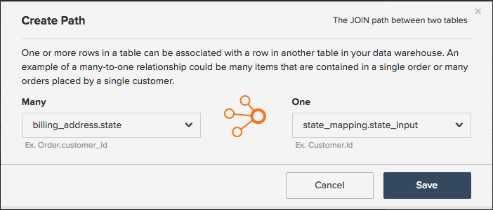
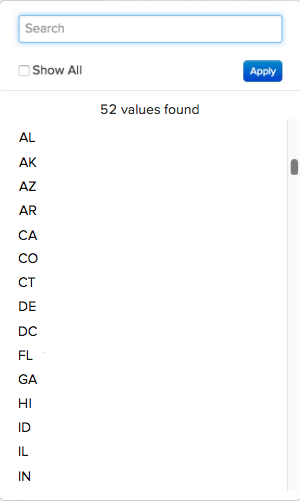

# 使用對應表格標準化資料

想像您正在`Report Builder`建置`Revenue by State`報告。 在您嘗試將`billing state`分組新增到您的報告並且看到以下內容之前，一切進展順利：

## 這怎麼會發生？

遺憾的是，缺乏標準化有時會導致資料混亂，並在構建報告時帶來麻煩。 在此範例中，可能沒有下拉式功能表或標準化方式可供您的客戶輸入其計費狀態資訊。 這會導致不同的值 — `pa`、`PA`、`penna`、`pennsylvania`和`Pennsylvania` — 都處於相同的狀態，這會導致`Report Builder`中出現一些奇怪的結果。

可能有技術資源可協助您清理資料，或直接將所需的欄插入資料庫。 如果沒有，則有其他解決方案 — **對應資料表**。 對應表格可讓您將資料對應至單一輸出，快速、輕鬆地清除任何雜亂的資料，並將其標準化。

>[!NOTE]
>
>如果沒有Adobe支援團隊的協助，您就無法建立統一表格的對映表。

## 如何建立？ {#how}

**資料格式重新整理程式：**

* 請確定您的試算表有標題列。
* 請避免使用逗號！ 它會在您上傳檔案時造成問題。
* 日期使用標準日期格式`(YYYY-MM-DD HH:MM:SS)`。
* 百分比必須以小數形式輸入。
* 請確定正確保留任何開頭或結尾的零。

在您深入之前，Adobe建議您[匯出原始資料表資料](../../tutorials/export-raw-data.md)。 先檢視原始資料，表示您可以探索您需要清理之資料的所有可能組合，進而確保對應表格涵蓋所有內容。

若要建立對應表格，您必須建立兩欄試算表，並遵循[檔案上傳的格式化規則](../../data-analyst/importing-data/connecting-data/using-file-uploader.md)。

在第一欄中，輸入儲存在資料庫中的值，每個資料列&#x200B;**中僅有一個值**。 例如，`pa`和`PA`不能在同一行 — 每個輸入必須有自己的列。 如需範例，請參閱下文。

在第二欄中，輸入這些值&#x200B;**應該是**&#x200B;的內容。 繼續以計費狀態範例為例，如果您希望`pa`、`PA`、`Pennsylvania`和`pennsylvania`只是`PA`，您應該在此欄位中輸入每個輸入值的`PA`。

## 我在[!DNL Commerce Intelligence]中需要做什麼才能使用它？ {#use}

完成建立對應資料表之後，您必須[將檔案](../../data-analyst/importing-data/connecting-data/using-file-uploader.md)上傳到[!DNL Commerce Intelligence]，然後[建立聯結資料行](../../data-analyst/data-warehouse-mgr/calc-column-types.md)，將新欄位重新定位到所要的資料表。 檔案同步至Data Warehouse後，您就可以執行此動作。

此範例使用聯結資料行將您在`mapping_state`資料表(`state_input`)上建立的資料行移至`customer_address`資料表。 這可讓我們在報表中依乾淨的`state_input`欄（而非`state`欄）來分組。

若要建立`joined`欄，請導覽至Data Warehouse管理員中要重新定位欄位的資料表。 在此範例中，這會是`customer_address`資料表。

1. 按一下&#x200B;**[!UICONTROL Create a Column]**。
1. 從`Definition`下拉式清單中選取`Joined Column`。
1. 請為資料行指定名稱，使其與資料庫中的`state`資料行不同。 為欄`billing state (mapped)`命名，以便您分辨在Report Builder中分段時要使用的欄。
1. 連線表格所需的路徑不存在，因此您需要建立一個路徑。 在`Select a table and column`下拉式清單中按一下&#x200B;**[!UICONTROL Create new path]**。

   如果您不確定資料表關聯性是什麼，或不確定如何正確定義主索引鍵和外索引鍵，請檢視[教學課程](../../data-analyst/data-warehouse-mgr/create-paths-calc-columns.md)以取得協助。

   * 在`Many`側，選取您要重新定位欄位的資料表（再次說明，它是`customer_address`）以及範例中的`Foreign Key`資料行或`state`資料行。
   * 在`One`側，選取`mapping`資料表和`Primary key`資料行。 在此情況下，您可以從`mapping_state`資料表選取`state_input`資料行。
   * 以下是該路徑的外觀：

     

1. 完成後，按一下&#x200B;**[!UICONTROL Save]**&#x200B;建立路徑。
1. 儲存後路徑可能不會立即填入 — 如果發生這種情況，請按一下`Path`方塊並選取您建立的路徑。
1. 按一下&#x200B;**[!UICONTROL Save]**&#x200B;以建立欄。

## 我現在該做什麼？ {#wrapup}

更新週期完成後，您將能夠使用新的聯結欄來正確地劃分您的資料，而不是從資料庫中劃分亂七八糟的欄。 立即檢視您的分組選項 — 不再有壓力混亂：

當您想要清除Data Warehouse中某些可能亂七八糟的資料時，隨時都能使用對應表格。 不過，對應表格也可以用於其他酷炫的使用案例，例如[在 [!DNL Commerce Intelligence]](../data-warehouse-mgr/rep-google-analytics-channels.md)中複製 [!DNL Google Analytics channels] 。

### 相關

* [瞭解並評估表格關係](../data-warehouse-mgr/table-relationships.md)
* [建立/刪除計算欄的路徑](../data-warehouse-mgr/create-paths-calc-columns.md)
