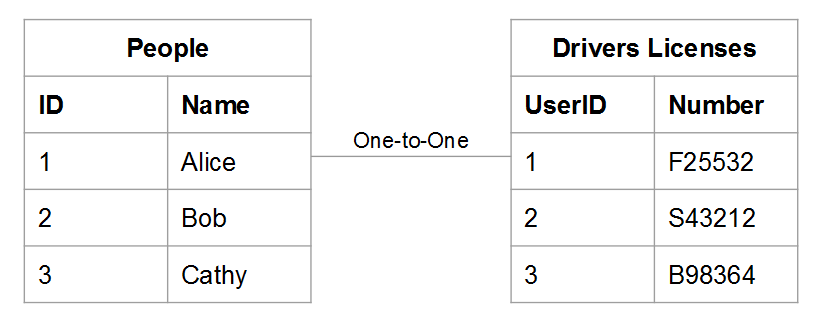
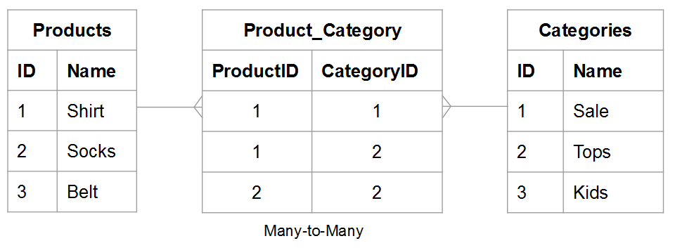
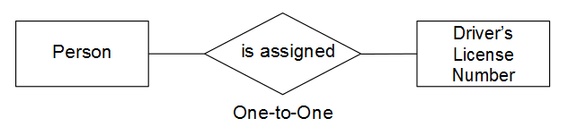
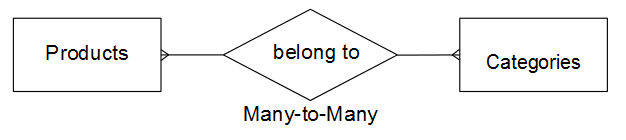
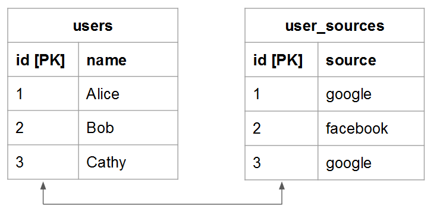
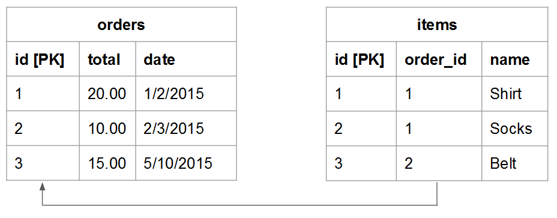
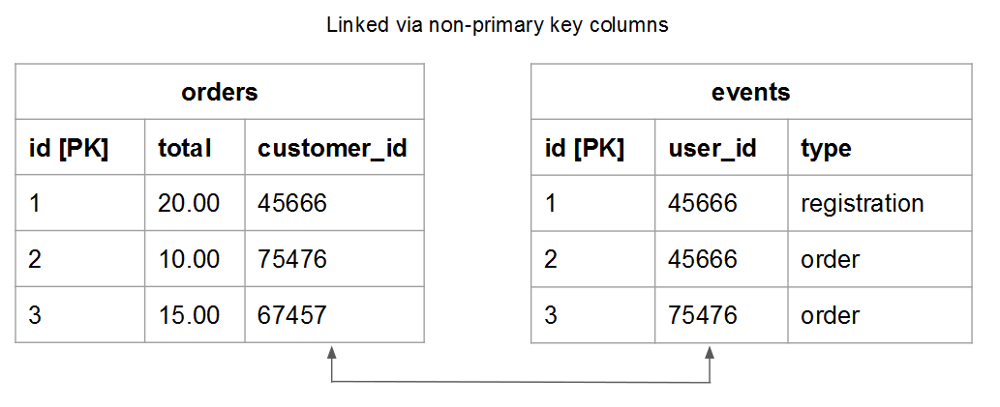
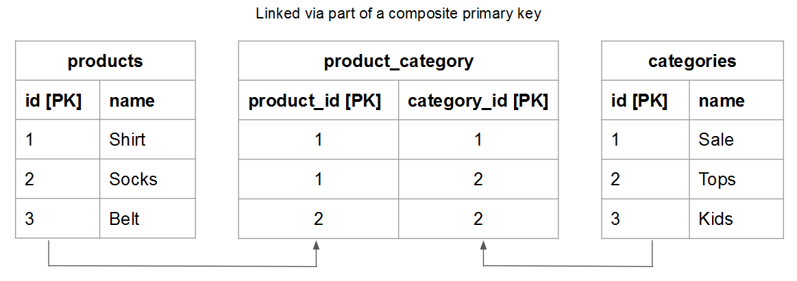

# 瞭解並評估表格關係

評估兩個給定表格之間的關係時，您需要瞭解一個表格中可能屬於另一個實體可能的出現次數，反之亦然。 例如，使用 `users` 表格和 `orders` 表格。 在此案例中，您想知道有多少個 **訂購** 給定 **使用者** 已放置以及可能的數量 **使用者** 一個 **訂購** 可能屬於。

瞭解關係對維護資料完整性至關重要，因為它會影響 [已計算的欄](../data-warehouse-mgr/creating-calculated-columns.md) 和 [維度](../data-warehouse-mgr/manage-data-dimensions-metrics.md). 若要深入瞭解，請參閱 [關係型別](#types) 和 [如何評估Data Warehouse中的表格。](#eval)

## 關係型別 {#types}

兩個資料表之間可以存在三種關聯性：

1. [&#39;一對一&#39;](#onetoone)
1. [&#39;一對多&#39;](#onetomany)
1. [&#39;多對多&#39;](#manytomany)

### `One-to-One` {#onetoone}

在 `one-to-one` 關聯，表格中的記錄 `B` 只屬於表格中的一個記錄 `A`. 和表格中的記錄 `A` 只屬於表格中的一個記錄 `B`.

例如，在人與駕照號碼之間的關係中，一個人只能有一個駕照號碼，而一個駕照號碼只屬於個人。

### `One-to-Many` {#onetomany}

在 `one-to-many` 關聯，表格中的記錄 `A` 可能屬於表格中的數個記錄 `B`. 考慮以下兩者的關係： `orders` 和 `items`  — 訂單可以包含許多料號，但料號屬於單一訂單。 在此案例中， `orders` 表格是一側而 `items` 表格是多面。

### `Many-to-Many` {#manytomany}

在 `many-to-many` 關聯，表格中的記錄 `B` 可能屬於表格中的數個記錄 `A`. 反之亦然，表格中的記錄 `A` 可能屬於表格中的數筆記錄 `B`.

考慮以下兩者的關係： **產品** 和 **類別**：一個產品可屬於許多類別，而一個類別可包含許多產品。

## 評估表格 {#eval}

根據表格之間存在的關係型別，您可以瞭解如何評估Data Warehouse中的表格。 由於這些關係決定多表格計算欄的定義方式，因此請務必瞭解如何識別表格關係以及哪一邊 —  `one` 或 `many`  — 資料表所屬的。

有兩種方法可用來評估Data Warehouse中指定表格對的關係。 第一個方法採用 [概念架構](#concept) 會考慮表格實體彼此互動的方式。 第二個方法使用 [表格的綱要](#schema).

### 使用概念架構 {#concept}

此方法使用概念架構來說明兩個表格中的實體如何彼此互動。 重要的是，要瞭解此框架會評估在給定關係下可能的情況。

例如，在考慮使用者和訂單時，考慮關係中可能的所有條件。 註冊使用者在存留期內不得下任何訂單、僅能下一份訂單或多份訂單。 如果您已啟動業務，但尚未下訂單，則特定使用者可以在其存留期內下許多訂單。 建置表格就是為了因應這種情況。

若要使用此方法：

1. 識別每個表格中描述的實體。 **提示：它通常是名詞**. 例如， `user` 和 `orders` 表格明確說明使用者和順序。

1. 識別一或多個描述這些實體如何互動的動詞。 例如，將使用者與訂單比較時，使用者會「下單」。 另一方面，訂單「屬於」使用者。

此型別的架構可套用至Data Warehouse中的任何表格配對。 這可讓您輕鬆識別關係的型別、哪個表格是一側而哪個表格是多側。

一旦確定了描述兩個表格如何互動的術語，就可以考慮第一個實體的一個特定例項如何與第二個實體相關，以雙向設定互動的框架。 以下是每種關係的一些範例：

### `One-to-One`

一個指定人員只能有一個駕駛執照號碼。 一個特定駕照號碼只屬於個人。

這是 `one-to-one` 每個資料表為單面的關係。

### `One-to-Many`

一個特定訂單可能包含許多專案。 一個指定專案只屬於一個訂單。

這是 `one-to-many` 訂單表格為一側，而料號表格為多側的關係。

### `Many-to-Many`

一個特定產品可能屬於多個類別。 一個指定類別可以包含許多產品。

這是 `many-to-many` 每個資料表為多面的關係。

### 使用表格的綱要 {#schema}

第二個方法使用表格結構描述。 此結構描述會定義哪些欄是 [`Primary`](https://en.wikipedia.org/wiki/Unique_key) 和 [`Foreign`](https://en.wikipedia.org/wiki/Foreign_key) 金鑰。 您可以使用這些鍵將表格連結在一起，並協助判斷關係型別。

識別將兩個表格連結在一起的欄之後，請使用欄型別來評估表格關係。 以下是一些範例：

### `One-to-one`

如果表格是使用 `primary key` 則每個表格中會說明相同的唯一實體，而且關聯性為 `one-to-one`.

例如， `users` 表格可能會擷取大部分的使用者屬性（例如名稱），而這是補充資料 `user_source` 表格會擷取使用者註冊來源。 在每個表格中，一列代表一位使用者。

### `One-to-many`

>[!NOTE]
>
>您接受客服訂單嗎？ 另請參閱 [賓客訂單](../data-warehouse-mgr/guest-orders.md) 以瞭解訪客訂單如何影響您的表格關係。

使用連結表格時 `Foreign key` 指向 `primary key`，此設定會說明 `one-to-many` 關係。 一側是包含 `primary key` 多面是包含 `foreign key`.

### `Many-to-many`

如果下列任一項為true，則關係為 `many-to-many`：

* `Non-primary key` 資料行用來連結兩個資料表
  
* 複合的一部分 `primary key` 用於連結兩個表格

## 後續步驟

正確評估表格關係是精確建立資料模型的關鍵。 現在您已瞭解表格如何相互關聯，請參閱 [您可以使用Data Warehouse管理員做什麼](../data-warehouse-mgr/tour-dwm.md).
