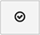
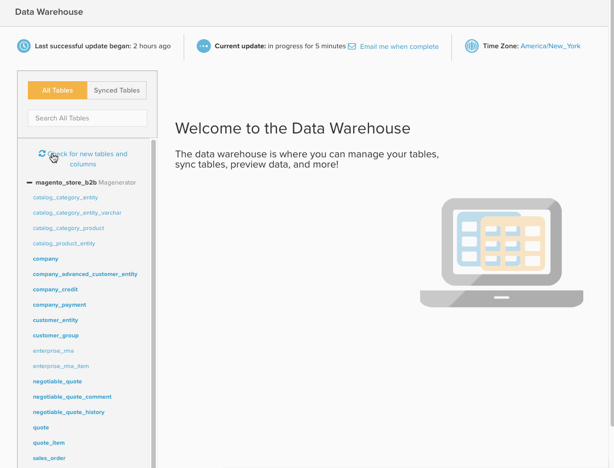
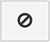

# Data Warehouse管理員

>[!NOTE]
>
>需要 [管理權限](../../administrator/user-management/user-management.md)

Data Warehouse管理員，按一下 **[!UICONTROL Manage Data > Data Warehouse]** 在側欄中，是 [!DNL MBI] Data Warehouse。 使用「Data Warehouse管理器」，您可以管理表和列同步設定、深入鑽研表的架構，以及建立要在報告中使用的計算列。

本文涵蓋：

* [學著走](#learning)
* [正在同步表和列](#syncing)
* [建立計算列](#calculated)
* [刪除表和刪除列](#delete)
* [正在後台同步新表](#syncnew)
* [那麼，何時可以使用新欄？](#when)

## 學著走 {#learning}

左側 `Data Warehouse Manager` 「頁面」包含「表格」清單，可讓您輕鬆在表格之間切換。 從清單中選擇表時，表管理區域將填充表的方案，您可在其中修改所選表。

在表清單中，表按其連接源分組。 這些來源會新增至 [!UICONTROL Manage Data > Integrations] 可以是資料庫， [API](https://developer.adobe.com/commerce/services/reporting/)，或協力廠商連接器。 表格清單頂端有一個搜尋方塊，可讓您輕鬆找到需要的表格。

在搜尋方塊下方，您會看到兩個選項： `All Tables` 和 `Synced Tables`. 此 `All Tables` 選項會列出您已讓Data Warehouse可用的所有表格，其中包括已同步和未同步的表格。

此 `Synced Tables` 選項顯示已添加到Data Warehouse中並且已從選定列複製資料的所有表。

請勿在 `All Tables` 清單？ 原因有幾個：

* 尚未添加資料源
* 資料源是資料庫，而 [!DNL MBI] 您建立的使用者沒有存取權。 在這種情況下，您或您的資料庫管理員必須授予訪問權限。
* 最近添加了資料源或表，但尚未同步

## 正在同步表和列 {#syncing}

### 同步新表和本機列

「Data Warehouse管理器」不僅讓您能夠輕鬆檢視和管理您的資料來源，還可以自由選取要同步的個別表格和欄。

1. 按一下 `All Tables` 選項，然後找到要同步的表。
1. 按一下表的名稱以預覽架構。 如果表格為新表格，則所有欄均顯示為 `Unsynced`.
1. 檢查您要同步的欄。

   >[!NOTE]
   >
   >表的本機列在 `Location` 欄。

1. 請務必檢查 `Primary Key` columns — 這些列在列名旁有鍵符號。 A `Primary Key` 需要，才能將資料正確同步至Data Warehouse。

   如果正在同步直接來自資料庫的表，則可能 `Primary Keys` 不得表示。 在這種情況下，請與資料庫管理員聯繫，請求將主鍵或密鑰添加到表中。
1. 完成後，按一下  按鈕。

A *成功！* 訊息隨即顯示，且狀態變更為 `Pending` ，則此欄不會顯示。 下次完整更新完成後，新同步的表和列將可用於報告；您也可以設定新 [複製方法](./cfg-replication-methods.md) 在初始同步後。

以下快速了解整個流程：

### 正在後台同步新表 {#syncnew}

第一次同步大型表時，您的Data Warehouse需要追溯性地捕獲表中的所有資料點，然後才能持續捕獲新資料。 如果表很大，則您可能不想讓初始同步與 **更新週期**. 在此情況下，您會希望初始同步在背景進行，位於 *平行* 任何當前正在運行的更新。

若要確定發生此情況，您應選取 `Save and Sync Data Immediately` 選項。

### 檢查新表和列 {#forceupdate}

您的Data Warehouse在新增新來源、表或欄時不會自動偵測。 同步進程會在整周內運行，以查找新添加項並使其可用，但如果要在進程運行之前訪問新添加的表和列，則可以強制執行結構同步。

表格清單中的搜尋列下方是 `Check for new tables and columns` 連結。 點擊此連結將強制啟動結構同步過程；新增內容通常會在10分鐘後提供。 刷新頁以查看新源、表或列。

## 建立計算列 {#calculated}

只要能夠查看和管理來自所有來源的資料，就能更輕鬆地洞察您的業務。 但在「Data Warehouse管理員」中，您可以在表格內建立計算欄，以進一步操作。 `Calculated` 欄會從現有資料衍生新資訊。

假設您想要 `user's lifetime revenue` 至 `users` 表格，查找高價值用戶。 或者，如果您想要依性別劃分收入，您可以新增 `customer's gender` 至 `orders` 表格。

如需詳細資訊，請查看此 [教學課程](../../data-analyst/data-warehouse-mgr/creating-calculated-columns.md).

## 刪除表和刪除列 {#delete}

正如您可以選擇要同步到Data Warehouse的表和列一樣，您也可以刪除或刪除它們。

>[!NOTE]
>
>在確認刪除後，刪除表格或移除欄會刪除任何相依報表、量度、篩選集和欄。 你一定想做。 **此動作無法復原。**

若按一下 **[!UICONTROL Delete]** 意外。 相依性檢查會在任何項目刪除前執行，因此您有機會在確認前檢閱所有項目。

要刪除列，請按一下列所屬的表。 勾選您要移除的欄，然後按一下  按鈕。

若要移除同步的表格，請選取表格中的所有欄，然後再按一下  按鈕。 這會從您的Data Warehouse中移除使用此表格的所有原生和計算欄。

### 確認變更

無論您是刪除表還是刪除列，刪除過程完成前都會運行相關性檢查。 相依性是指使用要移除的表格或欄的計算欄、量度、篩選器集和報表。 任何已發現的依賴項都會顯示 — 此時，您可以取消該進程或按一下 **[!UICONTROL Confirm Changes]** 刪除表/刪除列。

雖然刪除的相依性無法還原，但如果您將來需要重新同步任何原生欄，表和欄仍可供使用。

以下是移除欄的快速說明：

## 那麼，何時可以使用新欄？ {#when}

下次完整更新後，新同步的欄和新的/更新的計算欄即可使用。 如果更新尚未進行，可以按一下 **[!UICONTROL Force update]** 顯示於 `Data Warehouse` 或 `Integrations` 頁面。 您也可以按一下，在更新完成時排程電子郵件通知 **[!UICONTROL Email me when complete]**.

當您準備好在報表中使用新欄時， [您需要先將其新增至量度](../data-warehouse-mgr/manage-data-dimensions-metrics.md). 雖然更新完成前資料無法使用，但您仍可以在報表中使用新欄。 更新完成時，報表中的資料隨即顯示。

## 包裝

本教學課程涵蓋許多資料。 現在，您應該對資料庫是什麼、資料的組織方式、表之間的關係以及您可以如何使用Data Warehouse管理器有了紮實的了解。

太棒了！ 通過 [建立計算欄](../data-warehouse-mgr/creating-calculated-columns.md) 或 [做一些有趣的報告](../../tutorials/using-visual-report-builder.md).
