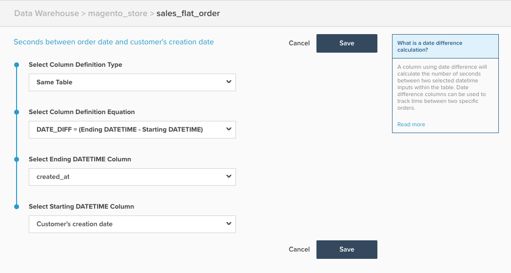

# 日期差異計算欄

本主題概述 `Date Difference` 可用的計算欄 **[!DNL Manage Data > Data Warehouse]** 頁面。 以下是其功能的說明，其後是範例，以及建立範例的機制。

**說明**

此 `Date Difference` 欄類型：根據事件時間戳記，找出屬於單一記錄的兩個事件之間的時間。 此欄中計算的原始值（以秒為單位），但會自動轉換為分鐘、小時、天等，以便顯示在報表上。 但是，當作為篩選器/群組時，您想以秒為單位使用值。

A `date difference` 計算欄可用來建立量度，以計算兩個事件之間的平均或中位數時間，例如客戶註冊與其首次訂購之間的平均時間。

**範例**

| **`id`** | **`timestamp_1`** | **`timestamp_2`** | **`Seconds between timestamp_2 and timestamp_1`** |
|--- |--- |--- |--- |
| `A` | 2015-01-01 00:00:00 | 2015-01-01 12:30:00 | 45000 |
| `B` | 2015-01-01 08:00:00 | 2015-01-01 10:00:00 | 7200 |

{style=&quot;table-layout:auto&quot;}

在上述範例中， `Date Difference` 欄是 `Seconds between timestamp_2 and timestamp_1` 欄。 執行計算 `timestamp_2 minus timestamp_1`.

**力學**

下列步驟說明如何建立 `Date Difference` 欄。

1. 導覽至 **[!DNL Manage Data > Data Warehouse]** 頁面。
1. 導覽至您要建立此欄的表格。
1. 按一下 **[!UICONTROL Create a Column]** 並依下列方式設定您的欄：
   * 選擇 `Column Definition Type` > `Same Table`
   * 選擇 `Column Definition Equation` > `DATE_DIFF = (Ending DATETIME - Starting DATETIME)`
   * 選擇 `Ending DATETIME` column >選擇結束日期時間欄位，通常是稍後發生的事件
   * 選擇 `Starting DATETIME` column** >選擇起始日期時間欄位，通常是先前發生的事件

1. 為欄提供名稱，然後按一下 **[!UICONTROL Save]**.
1. 欄將可供使用 *立即*.

作為範例，下列範例會設定為計算 `Seconds between order date and customer's creation date`:

