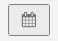
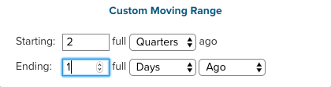
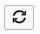

# 儀表板範圍篩選

使用全控制面板篩選功能，您可以對特定控制面板上的所有報告進行大量編輯。 您可以快速檢視不同時段或不同商店的相同分析。 您可以輕鬆比較每個商店前一年、一個月或一週的效能。 您可以更新整個儀表板，以因應新啟動的行銷活動。

## 日期篩選器

若要變更儀表板上報告的日期範圍或間隔，請按一下右上角的行事曆圖示（）。

您可以選擇使用`Fixed Date Range`或各種預先計算的`Moving Date Ranges`來檢視資料：

`Last Full...`移動範圍選項代表最近完成的範圍，而`This...`則是目前進行中的範圍。 例如，如果是6月，則`Last Full Month`為&#x200B;_5月1日至5月31日_，而`This Month`為&#x200B;_6月1日至Now_。

或建立您自己的`Custom Moving Range`\：

選擇以一併變更間隔。 選取預設按鈕（）表示只有日期範圍會變更：

若要將所有報告還原至其初始日期範圍和間隔，請按一下&#x200B;**[!UICONTROL Restore Defaults]**&#x200B;或按一下&#x200B;**[!UICONTROL Cancel]**。

當您為儀表板指定日期篩選器時，該篩選器只會套用到該儀表板。 當您導覽至其他儀表板時，系統不會套用此功能。

>[!NOTE]
>
>目前，在儀表板層級套用變更時，未包含`Cohort Reports`和`SQL Reports`。

## 存放區篩選器

若要分析特定商店的表現，請按一下右上角的商店圖示（）。 根據預設，`Store Filter`設為`All Stores`，這會顯示您Commerce網站中可用的所有[存放區檢視](https://experienceleague.adobe.com/docs/commerce-admin/stores-sales/site-store/store-views.html)中的資料。

>[!NOTE]
>
>已針對整個[!DNL Commerce Intelligence]帳戶啟用或停用存放區篩選器。 如果儀表板包含不受篩選器影響的報表（例如未建立在任何[!DNL Adobe Commerce]資料上的報表），則套用商店篩選器時，這些報表不會更新。 如果您認為報表應該根據存放區選擇進行更新，或是您認為您的帳戶存放區篩選器被錯誤停用，您可以[聯絡支援人員](https://experienceleague.adobe.com/docs/commerce-knowledge-base/kb/troubleshooting/miscellaneous/mbi-service-policies.html)。

當您從`Store Filter`中選取商店時，當您在儀表板之間導覽時，篩選器會保留您的選取。 保留您的選取專案可讓您檢視您選取之存放區的資料，直到您選取`All Stores`為止。

## 共用儀表板的篩選器

針對共用控制面板，如果有一位使用者設定日期篩選器，則具有該控制面板存取許可權的其他使用者會看到套用的相同篩選器。 不過，在此情況下不會套用商店篩選。 如果儀表板所有者設定商店篩選器並共用儀表板，則設定的商店篩選器不會保留給其他使用者。 使用者必須擁有儀表板的[編輯存取權](../../data-user/dashboards/share-dashboard-with-users.md)才能調整儀表板篩選器。
