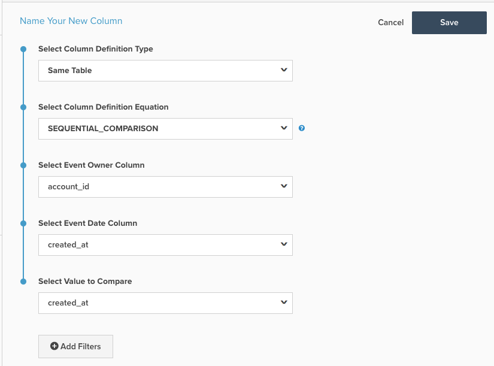

# 循序比較計算欄

本主題概述 `Sequential Comparison` 可用的計算欄 **[!DNL Manage Data > Data Warehouse]** 頁面。 以下是其功能的說明，其後是範例，以及建立範例的機制。

**說明**

此 `Sequential Comparison` 欄類型：找出連續事件之間的差異。 最常見的類型 `Sequential Comparison` 欄是 `Seconds since previous order` 欄。 此欄需要三項輸入：

1. `Event Owner`:此輸入將確定要對其分組的實體。 例如，在 `Seconds since previous order` 欄中，事件擁有者是客戶，因為我們想要尋找相同客戶上次訂單後的秒數。
1. `Event Date`:此輸入會強制執行事件的順序。 若 `Seconds since previous order`，包含訂單時間戳記的欄應為 `Event Date`. 此輸入一律為時間戳記。
1. `Value to Compare`:此輸入是要比較的實際值。 它會從目前列的值中減去前一列的值。 因此，會呼叫一個找出客戶連續訂單之間時間差的欄 `Seconds since previous order`. 此輸入不必是時間戳記。 非時間戳記的範例是找出客戶連續訂購之間的訂購值差異。

**範例**

| **`event_id`** | **`owner_id`** | **`timestamp`** | **`Seconds since owner's previous event`** |
|--- |--- |--- |--- |
| **`1`** | A | 2015-01-01 00:00:00 | NULL |
| **`2`** | B | 2015-01-01 00:30:00 | NULL |
| **`3`** | A | 2015-01-01 02:00:00 | 7200 |
| **`4`** | A | 2015-01-02 13:00:00 | 126000 |
| **`5`** | B | 2015-01-03 13:00:00 | 217800 |

在上述範例中， `Seconds since owner's previous event` 是 `Sequential Comparison` 計算欄。 若 `owner_id = A`，會先根據 `timestamp` 欄，然後減去上一個事件的 `timestamp` 從目前事件的時間戳記。 在表格的第三列 — 的第二列 `owner_id A`  — 之價值 `Seconds since owner's previous event` 是介於&#39;2015-01-01 02:00&#39;和&#39;2015-01-01 00之間的秒數:00:00&#39;。 此差異等於2小時= 7200秒。

對於此計算的列類型，與所有者的第一個事件相對應的行具有 `NULL` 值。

**力學**

若要建立 **事件編號** 欄：

1. 導覽至 **[!DNL Manage Data** > **Data Warehouse]** 頁面。
1. 導覽至您要建立此欄的表格。
1. 按一下 **[!UICONTROL Create New Column]** 在畫面右上角。
1. 選擇 `Same Table` 作為 `Definition Type` （如果要比較的列不在同一個表中，則可能需要重新定位這些列）。
1. 選擇 `SEQUENTIAL_COMPARISON` 作為 `Column Definition Equation`.
1. 如上所述，選擇輸入：
   - `Event Owner`
   - `Event Date`
   - `Value to Compare`
1. 您也可以新增篩選器，以排除不會考慮的列。 此列的排除行將具有NULL值。
1. 提供頁面頂端欄的名稱，然後按一下 **[!UICONTROL Save]**.
1. 欄將可供使用 *立即*.

