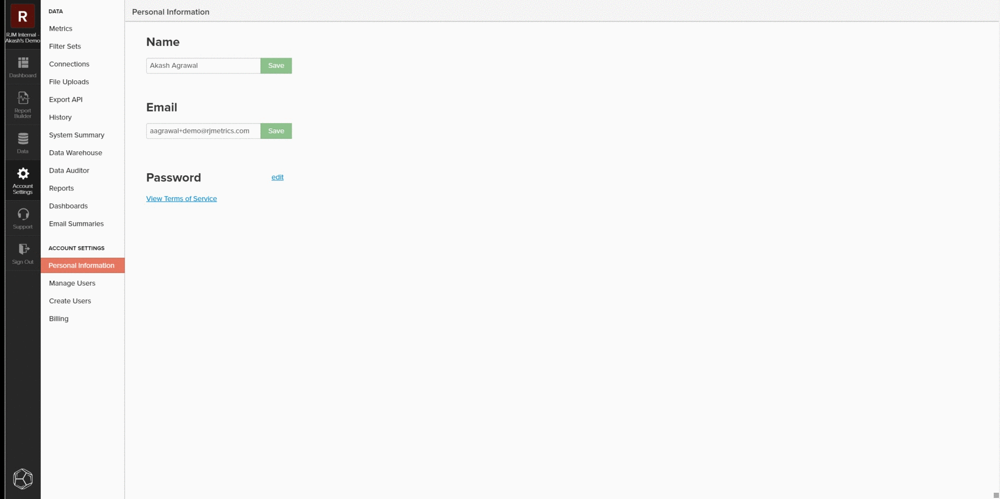
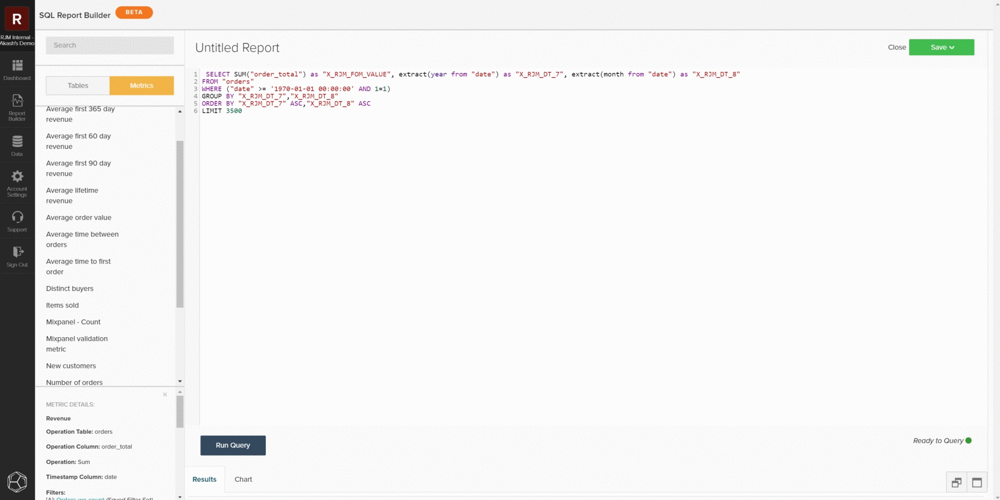
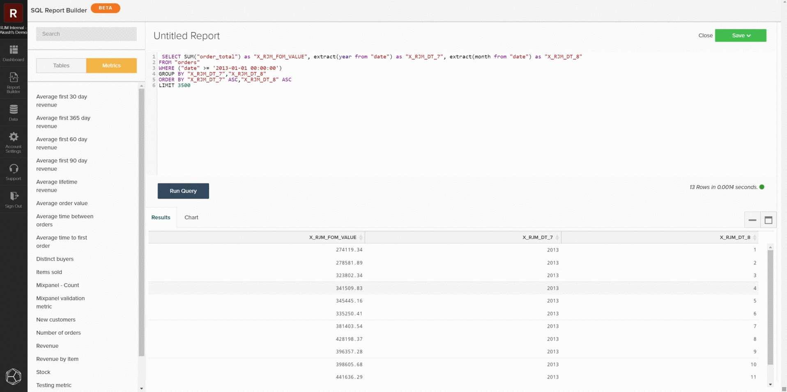

# [!DNL SQL Report Builder]

此 [!DNL SQL Report Builder] 主要用於建立新報告和疊代分析，但也可用於有效稽核資料和量度。 下列資訊說明如何使用 [!DNL SQL Report Builder] 以便將結果與本機資料庫的資料進行比較。

## 查詢量度

若要開始使用，請開啟 [!DNL SQL Report Builder] 瀏覽至 **[!UICONTROL Report Builder > SQL Report Builder > Create Report]**. 您可以使用中的側欄 [!DNL SQL] 編輯器將游標移至量度上，然後按一下「 」，將量度直接插入查詢 **[!UICONTROL Insert]**. 這會將該量度的查詢定義新增到編輯器中。 定義包括下列元件：

- 此 **量度作業** 正在執行，指示為 `SUM()` 在以下範例中。
- 此 **表格於** 建立量度的位置，由 `FROM` 子句。
- 任何 **篩選器（和篩選器集）** 已新增至量度的專案，由以下專案表示： `WHERE` 子句的範例。
- 的元件 **timestamp** 要排序資料的（年、月），以 `ORDER BY` 子句的範例。

若要更清楚的檢視查詢，您可以重新格式化查詢欄位中的顯示方式。 準備就緒後，選擇 `Run Query`. 結果會在查詢下方的報表面板中填入為表格。

## 限制查詢

如果您嘗試查明特定差異或資料集，您應該將查詢限製為特定範例，以對照您的本機資料庫進行檢查。 您可以編輯查詢以符合所需的限制來完成此操作。 在下列範例中，您將查詢限製為僅包含自2013年1月1日或之後開始的收入。 更新查詢後，選取 **[!UICONTROL Run Query]** 以更新結果。

## 儲存和匯出

當報表符合您的需求時，請為報表指定不同的名稱，然後按一下 **[!UICONTROL Save]**，並選取您要儲存的報表型別和控制面板。 在稽核度量時，Adobe建議將報表另存為 `Table` 並儲存至測試儀表板。

在儲存報告後，選取「 」以導覽至該儀表板 `Go to Dashboard`. 從那裡，您可以尋找報告並選取 **[!UICONTROL Options gear > Full `.csv`匯出]** 或 **[!UICONTROL Full Excel Export]**.

## 自訂查詢

您也可以撰寫自訂查詢並匯出結果，以便與本機資料庫進行比較。 遵循 [查詢最佳化准則](../../best-practices/optimizing-your-sql-queries.md)，在SQL編輯器中編寫查詢。 您可以使用側邊欄頂端的按鈕，在表格清單與可用於的量度之間切換 [!DNL SQL Report Builder] 並將它們新增至您的查詢。 當自訂查詢符合您的需求時，您可以儲存報告並從儀表板匯出該資料。

>[!NOTE]
>
>如果稽核資料後發現不一致，請檢視 [聯絡支援：資料差異](https://experienceleague.adobe.com/docs/commerce-knowledge-base/kb/troubleshooting/miscellaneous/mbi-data-discrepancies.html) 支援主題，以取得後續動作的詳細資訊。
