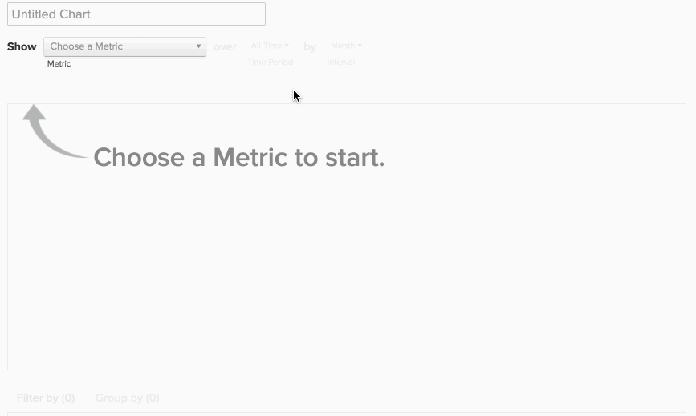

# 同類群組Report Builder

您是否曾希望研究用戶的不同子集隨時間的變化如何？ 例如，您是否曾想過，在促銷期間註冊的使用者的平均期限收入是否比沒有註冊的使用者高？ 如果答案是 `Yes`，則 `Cohort Report Builder` 是你的完美工具。 [!DNL MBI] 已經過專門優化，以執行此分析並使其與您的業務相關。

## 同類群組分析是什麼？ {#what}

`Cohort` 分析可廣義定義為對在其生命週期中具有相似特徵的用戶組的分析。 它可讓您識別不同使用者群組的行為趨勢。

如需更深入的入門 `cohort` 分析， [看這裡](https://www.cohortanalysis.com/)  — 我們在上面寫了網站！

在 [!DNL MBI] 控制面板，可輕鬆建立使用者 `cohorts` 根據 `cohort` 日期和量度。

## 同類群組分析為何重要？ {#important}

如上所述， `cohort` analysis可讓您識別不同使用者群組之間的行為趨勢。 只要對特定群體的行為有紮實的了解，您就可以量身定製決策和支出，以實現銷售的最大化。 以終身收入為例 `cohort` 分析 — 雖然這種分析有很多好處，但最直接的是更好地做出客戶收購決策。

## 如何建立自己的 `cohort` 分析？

### 新架構

以下是使用 `Cohort Report Builder` 在 [新架構](../../administrator/account-management/new-architecture.md).

1. 按一下 **[!UICONTROL Report Builder]** 在左側標籤或 **[!UICONTROL Add Report** > **Create Report]** 在任何控制面板中。

1. 在 `Report Builder` 選取畫面，按一下 **[!UICONTROL Create Report]** 旁邊 `Visual Report Builder` 選項。

**新增量度**

既然我們在 `Report Builder`，我們會新增要執行分析的量度(範例： `Revenue` 或 `Orders`)。

>[!NOTE]
>
>原生 [!DNL Google Analytics] 量度與 `Cohort Report Builder`.

**將「量度檢視」切換為`Cohort`**

這會開啟新視窗，供我們設定 `Cohort` 報告。

### 需要5個規格才能建立 `Cohort` 報告：

1. 如何將 `cohorts`
1. 此 `cohort` 時段
1. 數量 `cohorts` 檢視
1. 每個 `cohort` 必須包含
1. 之後的時間範圍 `cohort` 發生次數

#### 1.分組 `cohorts`

`Cohorts` 會依時間戳記分組，例如 **註冊日期** 或 **首次訂購日期**.

>[!NOTE]
>
>您無法使用與 `cohort` 日期。 若為需要此項目的分析，您可以使用 `Standard report builder` 。

#### 2. `Cohort` 時段

選擇要分組的時段 `cohorts` 。 換句話說，您上面選取的時間戳記中哪部分最重要；the `week`, `month`, `quarter`，或 `year`?  您的報表會以您在此選取的任何間隔顯示資料

#### 3.和4。 設定 `cohorts` 檢視及各自的資料量 `cohort` 必須

這些參數可協助您僅檢視 `cohorts` 你感興趣的，還有 `Preview` 方塊，顯示報表中將顯示的確切同類群組。

依預設，目前 `cohort` 除非您變更每個項目所需的最少資料量，否則不會包含 `cohort` to `0`. 在此情況下， `cohort` 目前時段僅包含部分資料。

#### 5.之後時間範圍 `Cohort` 發生次數

此功能可讓您設定您為所選項目檢視的資料時間範圍 `cohorts`. 例如，如果您想每月檢視24次 `cohorts` 根據 `customer's first order date`，但您只對每個報表的前3個月資料感興趣 `cohort`，您可以設定 `number of cohorts to view` to `24` 和 `time range after cohort occurrence` to `3`.

此值的間隔會隨您在 `cohort time period` 而值則設為 `12` 預設；除非按一下日曆圖示加以編輯，否則值不會變更。

#### 其他附註

* [!UICONTROL Filters]:當您切換 `Standard` 和 `Cohort` 檢視。

* 請參閱 [`Perspectives`](#perspectives).

#### 範例

以下是將所有項目整合在一起的範例。 在此範例中，我想在 `cohort`首次購買，看看該同類群組是否會在未來6個月內回來重複購買。

### 舊式架構

#### 舊式架構 {#personalinfo}

以下是舊版的專屬指示 `Cohort Report Builder`. 如果您有興趣使用新版本，請參閱 [新架構](../../administrator/account-management/new-architecture.md) ，以了解有關遷移到 [!DNL MBI] 新架構帳戶。

#### 如何建立自己的 `cohort` 分析？ {#create}

`Cohort` 實際分析！ 在此，我們可以看到收入依累積和每位使用者計算，會隨著時間而增長。

在本節中，我們會逐步引導您建立自己的 `cohort` 分析。 如需範例(以及說明此程式的動畫GIF)，請參閱 [範例區段](#examples) 這篇文章。

1. 按一下 **[!UICONTROL Report Builder]** 在左側標籤或 **[!UICONTROL Add Report** > **Create Report]** 在任何控制面板中。

1. 在 `Report Builder Selection` 按一下 **[!UICONTROL Create Report]** 旁邊 `Cohort Analysis` 選項。

#### 新增量度

既然我們在 `Cohort Report Builder`，讓我們新增量度(範例： `Revenue` 或 `Number of orders`)，以便執行分析。

>[!NOTE]
>
>原生 [!DNL Google Analytics] 量度與 `Cohort Report Builder`.

#### 選取同類群組日期 {#date}

下一步是指定 `cohort date`. 這是將使用者分組的日期。 例如，這可能是 `User's first order date` 或 `User's registration date`.

>[!NOTE]
>
>您無法使用與量度建立所在的相同日期(範例： `created at`)作為 `cohort date`.

#### 設定間隔和時段

接下來，我們設定 `Interval` 和 `Time Period`.

`Interval`
此 `Interval` 選項可讓您設定 `length` 您的 `cohorts`. 例如，如果此值設為 `Month`，您的報表將以月為單位測量。

您可以使用 **持續時間** 功能表。

`Time Period`
使用 `Time Period` 功能表來選擇特定使用者 `cohorts` 來分析。 您可以顯示 `cohort`，從清單中選擇，指定時間範圍，或定義滾動時間範圍 `cohorts` 包括。 例如，如果我們使用 `Specific Cohorts` 選項，我們可以選取要納入分析的特定月份：

如果我們將 `cohorts` 在 `Specific Cohorts` 清單中，所有在這些月中註冊的用戶都將包括在內。

#### 定義X軸

在 `duration`，您可以定義圖表的X軸設定。 也就是說，每個資料點代表多少個時段，以及要納入分析中的資料點數。

#### 選取 `counting members` 表格

如果您選擇透過 `cohort date` 已從另一個表格連結，您可能會看到 `counting members in the … table` 選項。

讓我們來看一個範例，以了解此設定。 假設您建立報表， `Revenue` 量度依據 `Customer's registration date`. 你也想用這個觀點 `Average value per cohort member` 以查看一段時間內每位購買者的收入。 為了找出每個買家的平均價值，我們需要決定要除以的買家數量。 是否為 `customers` 表格，或是您的 `orders table` 同一時期？

這個設定回答了這個問題。 計算 `customers` 表格包含平均中的所有客戶（無論他們是否曾購買）。 計算 `orders` 表格僅包含購買的客戶。

#### 選擇透視 {#perspective}

定義量度及分析量度的方式後，您可以選取 `perspective` 您想要使用。

報表視覺效果上方是 `perspective` 設定。

請參閱 [觀點](#perspectives).

## 同類群組分析範例 {#examples}

現在，我們已逐步了解如何 `cohort` 分析，讓我們看一些例子。

### 我想知道我的使用者 `cohorts` 會隨著時間而增長。

在此範例中，我們分析 `Revenue` 量度，按 `customer's first order date`，並選取最近8個 `cohorts` (定義於 `Time Period` 功能表)來納入分析。 為了觀察群體在一段時間內如何成長，我們使用 `Cumulative Average Value per Cohort Member` `perspective`.

### 我想知道，平均而言，使用者在有生命週期中不同時間點的訂購量。

!

在此範例中，我們分析 `Number of orders` 量度，按 `customer's first order date`，並包含8個最近的同類群組(定義於 `Time Period` 功能表)。 若要查看每個同類群組的平均訂購數，我們已變更 `perspective` to `Average Value per Cohort Member`.

### 我想要了解使用者未來的購買活動與其第一個月的業務活動有何不同。

## `Perspectives` {#perspectives}

`Standard`
這會顯示指定同類群組在其生命週期的任何指定時間點的遞增貢獻。 (範例：「第6週」點會顯示使用者在其第6週內提出的所有資料點。)

`Average Value per Cohort Member`
這會將 `Standard cohort` (1)中的分析，依每個 `cohort` 群組。 這在比較同類群組效能時很實用，因為並非所有同類群組都可能包含相同的使用者數量。 例如，某個特定 `cohort`.

`Cumulative`
此 `perspective` 顯示了 `cohort` 分析 `cumulative` 基準。 換言之，它會顯示指定同類群組在生命週期中任何指定時間點迄今的總貢獻。 例如，特定同類群組使用者6週後的累計收入。

`Cumulative Average Value per Cohort Member`
這會將 `Cumulative` (3)中的分析，依每個 `cohort` 群組。 它會顯示每個 `cohort` 成員 `cohort's` 生命。 例如，6月加入之使用者6個月後的平均期限收入。

`Percent of First Value (show first value)`
這會分析匯總 `cohort` 在 `cohort's` 生命週期中佔其在第一個期間貢獻的百分比。 例如，第6個月收入除以6月加入之使用者第1個月的收入。

`Percent of First Value (hide first value)`
這與 `perspective` 除了隱藏第一個100%時段值。

## 包裝 {#finish}

此 `Cohort Report Builder` 目前已針對依公用程式將使用者分組而最佳化 `cohort date`. 您可能有興趣依類似的活動或屬性將使用者分組，如果是這種情況，我們很想提供協助！ 建議您簽出 [關於定性同類群組的本教學課程](../dev-reports/create-qual-cohort-analysis.md) 開始使用。
