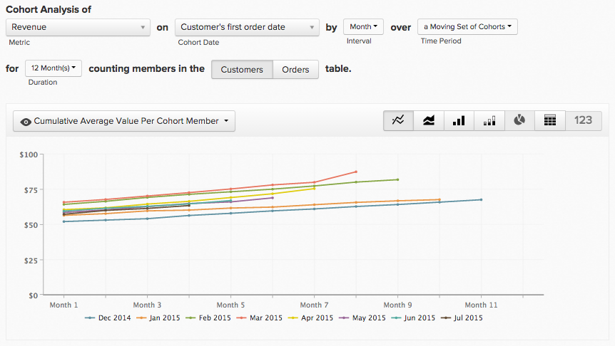
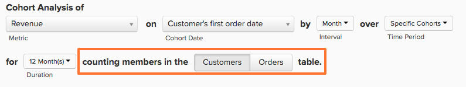
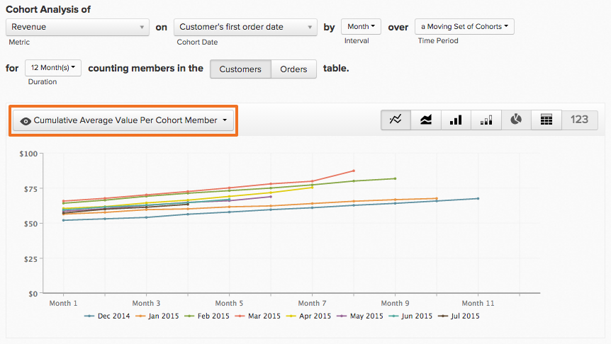

# 同類群組Report Builder

您是否曾想要研究使用者的不同子集在一段時間內的行為？ 例如，曾經想知道在促銷期間註冊的使用者是否擁有比未註冊的使用者更高的平均終身收入？ 如果答案為`Yes`，則`Cohort Report Builder`是您的最佳工具。 [!DNL Adobe Commerce Intelligence]已最佳化以執行此分析，並使其與您的業務相關。

## 同類群組分析是什麼？ {#what}

`Cohort`分析可大致定義為分析在其生命週期內具有類似特性的使用者群組。 它可讓您識別不同使用者群組中的行為趨勢。

如需`cohort`分析的深入入門課程，請檢閱[此頁面](https://www.cohortanalysis.com/)。

在您的[!DNL Commerce Intelligence]儀表板中，可以輕鬆根據您帳戶中的`cohorts`日期和量度建立使用者`cohort`。

## 那麼，同類群組分析為何如此重要？ {#important}

如上所述，`cohort`分析可讓您識別不同使用者群組之間的行為趨勢。 瞭解特定群組的行為之後，您就可以量身打造自己的決策與支出，將銷售量最大化。 例如，進行終身收入`cohort`分析 — 雖然這種分析對許多原因有益，但直接的分析是更好的客戶贏取決定。

## 如何建立我自己的`cohort`分析？

### 新架構

以下是在`Cohort Report Builder`新架構[上使用](../../administrator/account-management/new-architecture.md)的指示。

1. 按一下左側標籤上的&#x200B;**[!UICONTROL Report Builder]**&#x200B;或任何儀表板中的&#x200B;**[!UICONTROL Add Report** > **Create Report]**。

1. 在`Report Builder`選取畫面中，按一下&#x200B;**[!UICONTROL Create Report]**&#x200B;選項旁的`Visual Report Builder`。

**新增量度**

現在您已進入`Report Builder`，請新增您要對其執行分析的量度（範例： `Revenue`或`Orders`）。

>[!NOTE]
>
>原生[!DNL Google Analytics]量度與`Cohort Report Builder`不相容。

**將量度檢視切換為`Cohort`**

這將開啟一個新視窗來設定`Cohort`報告的詳細資料。

### 建置`Cohort`報告需要五個規格：

1. 如何將`cohorts`分組
1. `cohort`時段
1. 要檢視的`cohorts`數目
1. 每個`cohort`必須包含的最小資料量
1. `cohort`發生次數之後的時間範圍

#### 1.分組`cohorts`

`Cohorts`依時間戳記分組，例如&#x200B;**註冊日期**&#x200B;或&#x200B;**首次訂購日期**。

>[!NOTE]
>
>您不能使用針對`cohort`日期建立量度的相同時間戳記。 對於需要此專案的分析，您可以改用`Standard report builder`。

#### &#x200B;2. `Cohort`時段

選擇分組`cohorts`所依據的時段。 換言之，您在上方選取的時間戳記中哪一個是最重要的；`week`、`month`、`quarter`或`year`？ 您的報告會以您在此處選取的任何間隔顯示資料

#### 3.和4. 設定要檢視的`cohorts`數目以及每個`cohort`必須有多少資料

這些引數可協助您僅檢視感興趣的`cohorts`，而視窗底部的方便使用`Preview`方塊會準確顯示報表中顯示的同類群組。

依預設，除非您將每個`cohort`所需的最小資料量變更為`cohort`，否則不會包含目前的`0`。 在此情況下，目前時段的`cohort`僅包含部分資料。

#### 5.發生`Cohort`次之後的時間範圍

此功能可讓您設定所選`cohorts`檢視資料的時間範圍。 例如，如果您想要根據`cohorts`檢視24個月的每月`customer's first order date`，但您只對每個`cohort`的前3個月資料感興趣，您可以將`number of cohorts to view`設定為`24`，並將`time range after cohort occurrence`設定為`3`。

此值的間隔會隨著您在`cohort time period`中選取的專案而變更，而且預設值會設為`12`；除非您按一下行事曆圖示進行編輯，否則此值不會變更。

#### 其他附註

* [!UICONTROL Filters]：當您在`Standard`和`Cohort`檢視之間切換時，套用至量度的功能會維持不變。

* 請參閱[`Perspectives`](#perspectives)。

#### 範例

以下是整合所有元素的範例。 在此範例中，我想檢視`cohort`首次購買後的訂單行為，以瞭解該同類群組是否會在未來六個月回來重複購買。

### 舊版架構

#### 舊版架構 {#personalinfo}

以下是`Cohort Report Builder`舊版的特定指示。 如果您有興趣使用新版本，請參閱[新架構](../../administrator/account-management/new-architecture.md)以取得移轉至[!DNL Commerce Intelligence]新架構帳戶的詳細資訊。

#### 如何建立我自己的`cohort`分析？ {#create}

`Cohort`分析正在進行中！ 在這裡，您可以看到收入以累積和每個使用者的基礎隨著時間增長。

本節將逐步引導您建立自己的`cohort`分析。 如需範例（以及示範程式的動畫GIF），請參閱本主題的[範例區段](#examples)。

1. 按一下左側標籤上的&#x200B;**[!UICONTROL Report Builder]**&#x200B;或任何儀表板中的&#x200B;**[!UICONTROL Add Report** > **Create Report]**。

1. 在`Report Builder Selection`畫面中，按一下&#x200B;**[!UICONTROL Create Report]**&#x200B;選項旁的`Cohort Analysis`。

#### 新增量度

現在您已進入`Cohort Report Builder`，新增您要執行分析的量度（範例： `Revenue`或`Number of orders`）。

>[!NOTE]
>
>原生[!DNL Google Analytics]量度與`Cohort Report Builder`不相容。

#### 選取同類群組日期 {#date}

下一步是指定`cohort date`。 這是對使用者進行分組的日期。 例如，這可能是`User's first order date`或`User's registration date`。

>[!NOTE]
>
>您不能使用與`created at`建立量度相同的日期（範例： `cohort date`）。

#### 設定間隔和時間週期

接下來，設定`Interval`和`Time Period`。

`Interval`
`Interval`選項可讓您設定`length`的`cohorts`。 例如，如果此值設定為`Month`，則您的報告會以月為單位測量。

您可以使用&#x200B;**持續時間**&#x200B;功能表變更這些間隔在x軸上的顯示方式。

`Time Period`
使用`Time Period`功能表選擇要分析的特定使用者`cohorts`。 您可以每`cohort`顯示一次、從清單中選擇、指定時間範圍，或定義要包含的`cohorts`滾動時間範圍。 例如，如果您使用`Specific Cohorts`選項，您可以選取要納入分析的特定月份：

如果您依註冊日期將您`cohorts`分組，然後在`Specific Cohorts`清單中選取四月、五月和六月，則包含這些月份中註冊的任何使用者。

#### 定義X軸

在`duration`底下，您可以定義圖表的X軸設定。 也就是說，每個資料點代表多少時段，以及分析中要包含多少資料點。

#### 選取`counting members`資料表

如果您選擇依從其他資料表加入的`cohort date`來群組使用者，您可能會看到`counting members in the … table`選項。

檢視範例以瞭解此設定。 假設您建立了依`Revenue`將`Customer's registration date`量度分組的報告。 您也想要使用角度`Average value per cohort member`來檢視一段時間中每個買家的收入。 若要找出每個購買者的平均值，您必須決定要除以的購買者數目。 是您`customers`表格中的註冊客戶數目，還是同一期間`orders table`中的不同買家數目？

此設定可回答該問題。 計算`customers`表格中的成員時，平均會納入所有客戶（無論他們是否購買）。 計算`orders`表格中的成員只包括購買過的客戶。

#### 選取透視 {#perspective}

定義量度以及要如何分析量度後，您可以選取要使用的`perspective`。

報表視覺效果上方是`perspective`設定的下拉式清單。

請參閱[觀點](#perspectives)。

## 同類群組分析的範例 {#examples}

您已逐步瞭解如何建立`cohort`分析，請檢視一些範例。

### 我想瞭解我的使用者`cohorts`如何隨著時間增長。

在此範例中，您已分析`Revenue`量度、依`customer's first order date`將您的同類群組分組，並選取要納入分析中的8個最近`cohorts` （定義於`Time Period`功能表）。 若要檢視同類群組在一段時間內的成長情況，您使用了`Cumulative Average Value per Cohort Member` `perspective`。

### 我想要瞭解使用者在其期限內的不同時間點平均下了多少訂單。

(../../assets/cohort2.gif

在此範例中，您已分析`Number of orders`量度、依`customer's first order date`將您的同類群組分組，並在分析中包含最近的8個同類群組（在`Time Period`功能表中定義）。 若要檢視每個同類群組的平均訂單數，您將`perspective`變更為`Average Value per Cohort Member`。

### 我想要瞭解使用者的未來購買活動與他們在業務中的第一個月活動相較之下的結果。

## `Perspectives` {#perspectives}

`Standard`
這會顯示指定同類群組在其生命週期中任一指定點的增量貢獻。 （範例：「第6週」點會顯示使用者在其第六週提出的所有資料點。）

`Average Value per Cohort Member`
這會將(1)中的`Standard cohort`分析除以每個`cohort`群組中的使用者人數。 這對於根據蘋果對蘋果來比較同類群組效能非常有用，因為並非所有同類群組都可能包含相同數量的使用者。 例如，來自特定`cohort`的每位使用者平均每週6收入。

`Cumulative`
此`perspective`以`cohort`為基礎顯示傳統`cumulative`分析。 換言之，它會顯示指定同類群組在其生命週期中任何指定時間點至今的總貢獻。 例如，某個同類群組中使用者連續六週後的累計收入。

`Cumulative Average Value per Cohort Member`
這會將(3)中的`Cumulative`分析除以每個`cohort`群組中的使用者人數。 它顯示`cohort`生命中每個期間每個`cohort's`成員的平均期限貢獻（通常是平均期限收入）。 例如，在6月加入的使用者六個月後的平均期限收入。

`Percent of First Value (show first value)`
這會分析`cohort`生命週期中特定時間的彙總`cohort's`貢獻，以作為其第一個週期中貢獻的百分比。 例如，第6個月收入除以6月加入的使用者第1個月收入。

`Percent of First Value (hide first value)`
除了第一個時段值100%已隱藏以外，此專案與上述`perspective`相同。

## 正在結束 {#finish}

`Cohort Report Builder`已最佳化，可依一般`cohort date`來分組使用者。 您可能想要依類似的活動或屬性來分組使用者。 Adobe建議您檢視[此質化同類群組](../dev-reports/create-qual-cohort-analysis.md)教學課程以開始。
