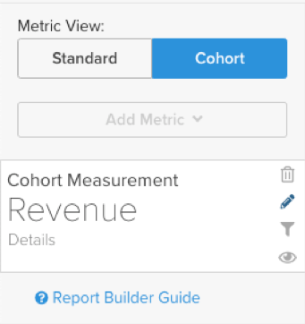
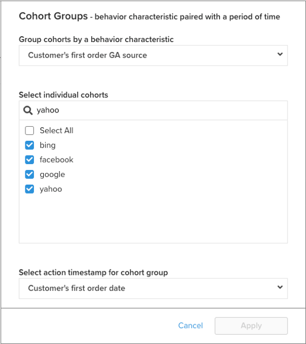
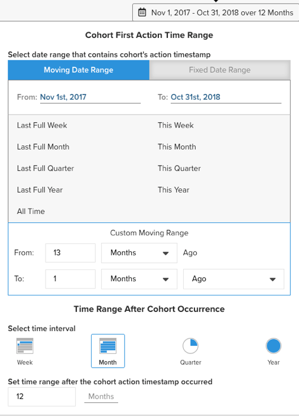

# 非日期型同類群組的[!DNL Cohort Report Builder]

[`Cohort Report Builder`](../dev-reports/cohort-rpt-bldr.md)很適合協助商戶研究使用者的不同子集在一段時間內的行為。 在過去，`Cohort Report Builder`已依照通用`cohort date`針對使用者進行分組最佳化（例如，指定月份中首次購買的所有客戶集）。 `Non-Date Based Cohort`功能現在可讓您依照類似的活動或屬性來群組使用者。 檢視此功能的一些使用案例。

## 使用案例

這不是一份完整的清單，但以下是一些可使用此功能完成的潛在分析。

* 正在檢查從[!DNL Google]取得的客戶收入與[!DNL Facebook]的收入
* 分析首次購買在美國與加拿大的客戶
* 檢視從各種廣告行銷活動取得的客戶行為

## 如何建立分析

1. 按一下左側標籤上的&#x200B;**[!UICONTROL Report Builder]**&#x200B;或任何儀表板中的&#x200B;**[!UICONTROL Add Report** > **Create Report]**。

1. 在`Report Builder Selection`畫面中，按一下`Visual Report Builder`選項旁的&#x200B;**[!UICONTROL Create Report]**。

### 新增量度

現在您已進入`Report Builder`，您已新增要對其執行分析的量度（範例： `Revenue`或`Orders`）。

>[!NOTE]
>
>原生[!DNL Google Analytics]量度與`Cohort Report Builder`不相容。 此範例的目標是檢視透過不同[!DNL Google Analytics]來源取得的首次訂購客戶在一段時間內的收入。

### 將`Metric View`切換為`Cohort`

將

這會開啟一個新視窗，供您設定同類群組報表的詳細資料。

建立同類群組報表需要五種規格：

1. 如何將同類群組分組
1. 選取同類群組
1. 動作時間戳記
1. 同類群組首次動作時間範圍
1. 同類群組發生後的時間範圍

<!--{: width="200" height="224"}-->

#### 1.分組`cohorts`

`Cohorts`依行為特徵分組，在此範例中為`Customer's first order GA source`。 此處可用的選項是已被指定為量度`groupable`的欄。

#### 2.選取同類群組

您可以顯示給定特徵的所有結果。 由於這會產生許多`cohorts`，因此您可以選取您所需的特定`cohorts` （對應至`Customer's first order GA source`可用的各種值）。

<!--{: width="300" height="338"}-->

#### 3. `Action timestamp`

這可讓您選擇以日期為基礎的欄，而不是建立量度的欄。 在下方，您會檢視選取套用至指定`action timestamp`的時間範圍。

#### 4. `Cohort first action time range`

您在此處選取包含`cohorts action timestamp`的日期範圍（也就是首次訂購介於2017年11月至2018年10月的客戶）。 這可以是移動日期範圍或固定日期範圍。

#### 5. `Time range after cohort occurrence`

您想要依月、周或年檢視一段時間的`cohorts`嗎？ 您可在以下位置進行這些選取。 在該區段底下，您將會在`cohort action timestamp`發生後選取`time range`。 例如，對於在動作時間範圍內下第一筆訂單的客戶，這會向您顯示12個月的資料。

<!--{: width="400" height="557"}-->

>[!NOTE]
>
>當您在`Standard`和`Cohort`檢視之間切換時，套用至量度的[!UICONTROL Filters]將維持不變。

### 相關

請參閱[`Perspectives`](../../data-analyst/dev-reports/cohort-rpt-bldr.md)。
